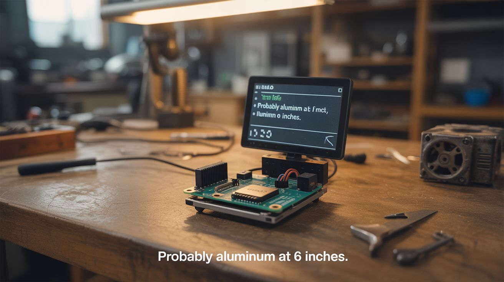

# #147 — AI Metal Detector

  

> A metal detector circuit with an Arduino and Pi running machine learning — not just beep, but "probably aluminum at 6 inches."

## Ratings

     

## 🧪 What Is It?

Traditional metal detectors beep and you dig. You don't know if it's a gold ring or a bottle cap until the shovel hits it. An AI-enhanced detector changes the game. The basic metal detector circuit (a coil of wire that detects changes in inductance from nearby metal) feeds its analog signal to an Arduino, which digitizes the waveform and sends it to a Raspberry Pi running a machine learning classifier. Different metals produce different signal signatures — amplitude, decay curve, frequency response. Train the model on known metal samples (aluminum, copper, iron, gold, zinc), and the detector doesn't just beep — it tells you what the metal probably is and how deep it is. Discriminating metal detectors exist commercially for $500+. Build one with ML for under $30.

<strong>🧰 Ingredients</strong>

- [ ] Magnet wire — 26-30 gauge, for the search coil *(electronics supplier)*
- [ ] Arduino Nano — for signal digitization *(electronics supplier)*
- [ ] Raspberry Pi — for ML inference *(electronics supplier)*
- [ ] Op-amp (LM358 or TL072) — for signal amplification *(electronics supplier)*
- [ ] Capacitors — to tune the coil's resonant frequency *(electronics supplier)*
- [ ] PVC pipe — for the detector shaft and coil form *(hardware store)*
- [ ] Speaker or buzzer — for audio feedback *(electronics supplier)*
- [ ] OLED display — for metal type and depth readout *(electronics supplier)*
- [ ] Various metal samples — for training data (coins, foil, nails, wire, jewelry) *(junk drawer)*
- [ ] Battery pack — for portable operation *(electronics supplier)*

## 🔨 Build Steps

1. **Wind the search coil.** Wrap 20-30 turns of magnet wire around a circular form (8-10 inch diameter PVC ring). This is an LC oscillator coil — its inductance changes when metal enters its field. Secure the winding with tape and mount to the end of a PVC shaft.
2. **Build the oscillator circuit.** Connect the coil with a capacitor to form an LC tank circuit. Drive it with an oscillator (Colpitts or similar). The oscillation frequency shifts when metal disrupts the coil's electromagnetic field. Different metals shift the frequency differently.
3. **Amplify and digitize.** Feed the oscillator output through an op-amp gain stage to bring the signal into the Arduino's ADC range (0-5V). The Arduino samples the signal at high speed and extracts features: frequency shift magnitude, decay envelope, phase response.
4. **Build the training dataset.** Systematically pass known metal samples (aluminum can, copper penny, iron nail, zinc washer, gold ring, stainless steel spoon) over the coil at known distances. Record the Arduino's signal features for each metal type and distance. Collect hundreds of samples.
5. **Train the ML model.** On the Pi, use scikit-learn to train a Random Forest or simple neural network classifier on the collected data. Features are the signal characteristics; labels are metal type and depth. Split data into training and test sets. Evaluate accuracy.
6. **Implement real-time inference.** The Arduino streams signal features to the Pi over serial. The Pi runs the trained model on each reading and outputs the predicted metal type and estimated depth. Display results on the OLED screen.
7. **Add audio discrimination.** Different beep tones for different metals: high pitch for non-ferrous (potential treasure), low pitch for ferrous (probably junk), special tone for gold-range signals. Volume increases as the signal strengthens (closer/bigger target).
8. **Package for field use.** Mount the electronics in a weatherproof box on the shaft. Run wires inside the PVC pipe. Add a comfortable handle with the display and controls within thumb reach. Balance the weight so it's comfortable to swing.
9. **Field test and iterate.** Take it to a park or beach and test. Compare predictions to actual finds. Add new training data from real-world discoveries to improve the model over time. The model gets better with use.

## ⚠️ Safety Notes

- Be aware of local laws regarding metal detecting. Many parks, beaches, and historical sites prohibit or require permits for metal detecting. Always research and follow local regulations.
- Never dig near utility lines. Call 811 (in the US) before digging in any area where underground utilities might exist. Gas lines, electrical cables, and water pipes are all conductive and will trigger the detector.
- The search coil generates a weak electromagnetic field. While harmless to humans, keep it away from pacemakers, hearing aids, and magnetic storage media as a precaution.

## 🔗 See Also

- [Automated Microscope](148-automated-microscope.md)
- [Earthquake Detector](146-earthquake-detector.md)

**References:**

- [Electronics & Microcontrollers Guide](../../docs/reference/electronics-and-microcontrollers.md)
