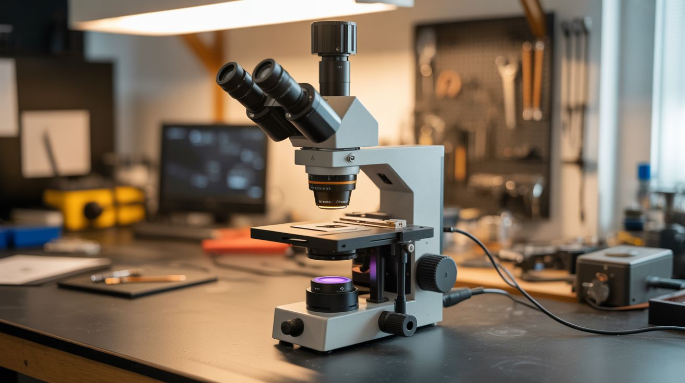

# #148 — Automated Microscope

  

> A USB microscope on a stepper-driven XY stage captures a grid of images — Python stitches them into gigapixel panoramas.

## Ratings

| Jaw Drop Rating | Brain Melt Level | Wallet Damage | Spicy Level | Clout Potential | Time to Build |
|---|---|---|---|---|---|
| ⭐⭐⭐⭐ | ⭐⭐⭐⭐ | ⭐⭐ | ⭐ | ⭐⭐⭐ | ⭐⭐⭐ |

## What Is It?

A microscope shows you a tiny area at high magnification. An automated microscope shows you EVERYTHING at high magnification. Mount a USB microscope on an XY stage built from printer stepper motors and linear rails (all salvaged from dead printers). Python tells the stage to move in a grid pattern, capturing an image at each position. Then it stitches all the images together into a single massive panorama — a gigapixel image where you can zoom from the full view down to cellular detail. A microscope slide that shows 1mm² per frame becomes a 100mm² panorama at full microscopic resolution. This is how pathologists scan tissue samples and how chip designers inspect silicon wafers.

## Ingredients

- [ ] USB microscope — 50-200x magnification *(electronics supplier, ~$20)*
- [ ] Stepper motors — 2, for X and Y axes *(salvaged from printers)*
- [ ] Linear rails and carriages — salvaged from printers *(e-waste)*
- [ ] Stepper drivers (A4988) — 2 *(electronics supplier)*
- [ ] Arduino — to control the stage *(electronics supplier)*
- [ ] 3D printed or machined stage platform — holds the sample *(workshop)*
- [ ] Raspberry Pi or laptop — for image capture and stitching *(already own)*
- [ ] Python with OpenCV, PIL, image stitching libraries *(pip install)*
- [ ] 12V power supply *(old laptop charger)*
- [ ] Microscope slides and cover slips — for samples *(pharmacy, science supply)*

## Build Steps

1. **Build the XY stage.** Mount two linear rail assemblies perpendicular to each other (one for X motion, one for Y). Use salvaged printer rails, carriages, and timing belts. Each axis is driven by a stepper motor through a timing belt, giving sub-millimeter positioning accuracy.
2. **Mount the microscope.** Secure the USB microscope above the XY stage pointing downward at the sample platform. The microscope should be fixed — the sample moves underneath it. Focus is set once and stays constant across the scan (assuming a flat sample).
3. **Wire the stepper drivers.** Connect each A4988 driver to the Arduino. STEP and DIR pins to digital outputs. Wire motors to driver outputs. Power from 12V. Set microstepping to 1/8 or 1/16 for smooth, precise movement.
4. **Write the scan pattern.** Python sends commands to the Arduino over serial to move the stage in a grid pattern: move right one frame width, capture, repeat across the row, step down one frame height, scan back in the opposite direction (serpentine pattern for speed). Calculate the grid size based on the total area to scan and the microscope's field of view.
5. **Capture images at each position.** At each grid position, pause briefly (200ms for vibration to settle), capture a frame from the USB microscope, and save with coordinates in the filename. Use OpenCV for capture: `cv2.VideoCapture().read()`.
6. **Stitch the panorama.** Use OpenCV's image stitching or a simple grid-based approach: since you know the exact position of each frame, you can place them in a canvas at their pixel coordinates. For better results, use feature-based alignment to correct for small positioning errors.
7. **Handle large images.** A 20x20 grid of 1MP images produces a 400MP panorama. Regular image viewers choke on this. Use OpenSlide-compatible formats (deep zoom tiles) or convert to Google Maps-style tile pyramids for smooth zooming.
8. **Add autofocus (advanced).** For uneven samples, add a Z-axis stepper. Before each capture, sweep through Z positions and find the sharpest focus (maximum Laplacian variance in the image). This creates fully focused panoramas of non-flat surfaces.
9. **Scan interesting samples.** Try insect wings, flower petals, circuit boards, fabric weave, coin surfaces, leaf veins, paper fibers, and printed text. Each reveals incredible detail at microscopic resolution that's invisible to the naked eye.

## Safety Notes

- Printer linear rails can have sharp edges from cut metal. Wear gloves when disassembling printers and handling raw rail stock. File any sharp edges smooth before assembly.
- The XY stage has pinch points where the carriage meets the rail end stops. Keep fingers clear of moving parts during scan operations. Add limit switches to prevent crashes at travel limits.
- Some microscope samples (biological, chemical) may require handling precautions. Use proper lab safety when preparing slides of unknown materials.

## See Also

- [Printer Robot Arm](../pi-and-arduino/129-printer-robot-arm.md)
- [Generative Art Plotter](142-generative-art-plotter.md)

**References:**
- [Appliance Teardown Guide](../../reference/appliance-teardown-guide.md)
- [Technical Glossary](../../reference/glossary.md)
- [Electronics & Microcontrollers Guide](../../reference/electronics-and-microcontrollers.md)
