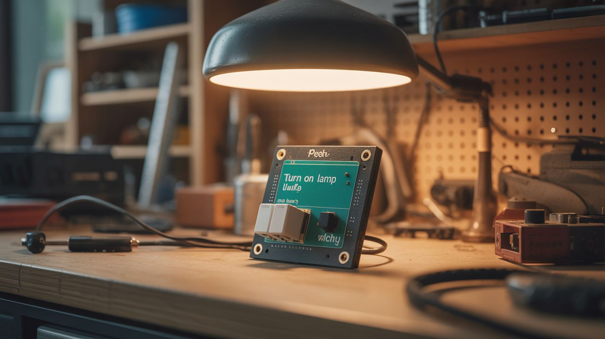

# #149 — Voice Home Automation

  

> Python speech recognition and a relay board — say "turn on lamp" and the relay clicks. No Alexa, no cloud, fully local.

## Ratings

     

## 🧪 What Is It?

Alexa and Google Home are convenient but they send every word you say to corporate cloud servers. Build a voice-controlled home automation system that runs entirely on your local network. A Raspberry Pi with a USB microphone runs Vosk (offline speech recognition) — it listens for wake words and commands without ever connecting to the internet. When it hears "turn on the lamp," it triggers a relay that switches the lamp's power outlet. Add more relays for more devices: fan, heater, lights, TV, coffee maker. You get the convenience of voice control without the privacy invasion. Everything stays in your house.

<strong>🧰 Ingredients</strong>

- [ ] Raspberry Pi 3 or 4 *(electronics supplier)*
- [ ] USB microphone — omnidirectional *(electronics supplier)*
- [ ] Relay module — 4 or 8 channel, 5V *(electronics supplier)*
- [ ] Extension cords or outlet boxes — to wire relays into the power circuit *(hardware store)*
- [ ] Speaker — for voice responses *(junk drawer)*
- [ ] Vosk speech recognition model — downloaded for offline use *(free, vosk.ai)*
- [ ] Python with vosk, pyaudio, pyttsx3 *(pip install)*
- [ ] Wire nuts and electrical tape *(hardware store)*
- [ ] Junction box — for housing relay connections to mains power *(hardware store)*

## 🔨 Build Steps

1. **Set up offline speech recognition.** Install Vosk on the Pi: `pip install vosk`. Download a language model (English small model is ~50MB). Write a Python script that captures audio from the USB mic and feeds it through the Vosk recognizer. Test that it correctly transcribes speech without internet connection.
2. **Define your command vocabulary.** Create a dictionary of commands and their actions: "turn on lamp" -> relay 1 on, "turn off lamp" -> relay 1 off, "fan on" -> relay 2 on, etc. Keep commands short and distinct. Vosk can be configured with a limited vocabulary for better accuracy.
3. **Implement wake word detection.** Add a wake word ("Hey computer," "Hey house," or something custom) before commands are processed. The system ignores speech until the wake word is detected, then listens for a command within a 5-second window. This prevents accidental activations.
4. **Wire the relay module.** Connect relay control pins to the Pi's GPIO. Test each relay by toggling the GPIO pin — you should hear the relay click and see the LED indicator change. Keep the relay module close to the Pi for clean wiring.
5. **Wire the relay to mains power.** THIS IS THE DANGEROUS STEP. Wire each relay's normally-open contacts in series with one conductor (hot wire) of the device's power cord. When the relay closes, the circuit completes and the device powers on. Use a proper junction box and wire nuts. If you're uncomfortable with mains wiring, use relay-controlled smart plugs instead.
6. **Add voice feedback.** Install pyttsx3 (offline text-to-speech) and a speaker. The Pi confirms commands: "Turning on the lamp." "Fan is now off." Feedback confirms the system heard correctly before acting.
7. **Add status tracking.** Keep track of each relay's state (on/off). Respond to queries: "Is the lamp on?" -> "The lamp is currently on." Add a "turn off everything" command for convenience.
8. **Build a web dashboard (optional).** A Flask web app shows all devices and their states. Toggle devices from your phone on the local network as a backup to voice control.

## ⚠️ Safety Notes

- Relays switching mains voltage (120V/240V) can kill you. If you are not confident wiring mains electricity, use pre-made relay-controlled smart plugs instead of wiring directly into outlets. All mains wiring should be inside an approved junction box with proper strain relief.
- Never exceed the relay's current rating. A standard 10A relay can handle lamps and fans but NOT space heaters, air conditioners, or other high-draw appliances. Check the relay's rating and the device's current draw before connecting.
- The Pi and relay module must be kept away from water and mounted in a location where they won't be bumped or knocked into. A relay that's physically jostled while switching mains power is a shock and fire hazard.

## 🔗 See Also

- [Sentiment Room Lighting](144-sentiment-room-lighting.md)
- [Pi-hole Ad Blocker](../pi-and-arduino/139-pi-hole-ad-blocker.md)

**References:**
- [Electronics & Microcontrollers Guide](../../reference/electronics-and-microcontrollers.md)
