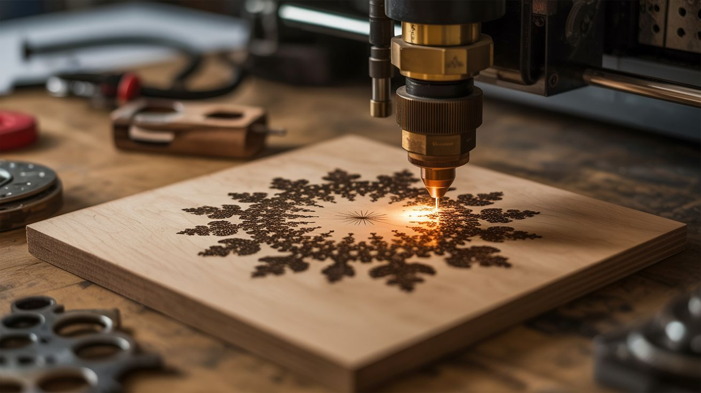

# #150 — Fractal Laser Engraver

  

> Render Mandelbrot and Julia fractals at extreme resolution in Python, then burn them into wood or leather with a laser engraver.

## Ratings

     

## 🧪 What Is It?

Fractals are infinitely detailed mathematical structures — the Mandelbrot set, Julia sets, Sierpinski triangles, Koch snowflakes. Rendered at extreme resolution, they contain an infinite amount of detail: spirals within spirals within spirals. Now burn them into physical material with a laser engraver. The laser's power modulation maps to the grayscale of the fractal image — darker areas get more burn, lighter areas get less. The result is mathematical art permanently etched into wood, leather, or anodized aluminum. Each piece is literally a visual representation of an equation, burned into matter with coherent light. Math, physics, and art fused into a single object.

<strong>🧰 Ingredients</strong>

- [ ] Computer with Python and numpy *(already own)*
- [ ] Laser engraver — diode laser (5W+) or CO2 laser *(electronics supplier, ~$200 for entry-level diode)*
- [ ] Wood blanks — birch plywood, basswood, or maple coasters *(craft store, hardware store)*
- [ ] Leather pieces — vegetable-tanned leather engraves best *(craft store)*
- [ ] Python with numpy, PIL/Pillow, numba (for speed) *(pip install)*
- [ ] Laser control software — LaserGRBL or LightBurn *(free/paid software)*
- [ ] Safety goggles — rated for your laser wavelength *(laser supplier)*
- [ ] Ventilation — fume extractor or outdoor setup *(hardware store)*

## 🔨 Build Steps

1. **Write the fractal renderer.** Use Python with numpy to calculate Mandelbrot or Julia sets. For each pixel, iterate the equation z = z² + c and count how many iterations before the value escapes. Map iteration count to grayscale. Use numba's @jit decorator for 100x speedup.
2. **Explore interesting regions.** The beauty of fractals is in the edge regions. Zoom into the boundary of the Mandelbrot set to find spirals, seahorses, elephant valleys, and mini-brots. Adjust the coordinate window and maximum iteration count to find stunning compositions.
3. **Render at engrave resolution.** Laser engravers typically work at 250-500 DPI. For a 6x6 inch piece, you need 1500x1500 to 3000x3000 pixels. Render the fractal at this resolution. Save as a high-quality PNG with full grayscale range.
4. **Post-process the image.** Adjust contrast and brightness for the specific material. Wood needs more contrast than leather. Invert if needed (lasers burn dark, so dark pixels = more burn). Apply a slight Gaussian blur to prevent the laser from chasing single-pixel noise.
5. **Set up the laser engraver.** Mount the material on the engraver bed. Focus the laser at the material surface. Import the fractal image into LaserGRBL or LightBurn. Set power, speed, and DPI parameters for a test area.
6. **Test engrave.** Run a small section (1x1 inch) to calibrate. Adjust power (too high = charring, too low = faint image) and speed (slower = darker/deeper). Different materials need different settings — wood, leather, and anodized aluminum each respond differently.
7. **Full engrave.** Once settings are dialed in, run the full image. Large pieces at high resolution can take 30-90 minutes. Watch the first few passes to verify quality, then let it run. The fractal builds up line by line.
8. **Finish the piece.** Sand lightly if there's smoke residue on wood. Apply a clear coat or finishing oil to enhance contrast and protect the engraving. For coasters, apply a food-safe sealant. Frame pieces for wall display.
9. **Create a series.** Generate a sequence of images zooming progressively into one region of the fractal. Engrave each zoom level on a separate piece for a gallery installation showing infinite zoom in physical form.

## ⚠️ Safety Notes

- Laser engravers produce invisible beams that cause INSTANT permanent eye damage. Always wear safety goggles rated for your laser's wavelength (typically OD5+ at 445nm for diode lasers, OD5+ at 10600nm for CO2). Never look at the laser dot without goggles.
- Laser engraving produces toxic fumes, especially on wood (smoke), leather (burned protein), and plastics (toxic gases). Always operate with active ventilation — a fume extractor or outdoors. Never engrave PVC or vinyl, which release chlorine gas.
- Keep a fire extinguisher nearby. Wood and leather can ignite if the laser dwells too long in one spot (due to a software glitch or mechanical jam). Never leave a running laser engraver unattended.

## 🔗 See Also

- [Generative Art Plotter](142-generative-art-plotter/)
- [Glow Resin River Table](../pyro-and-chemistry/117-glow-resin-river-table/)
