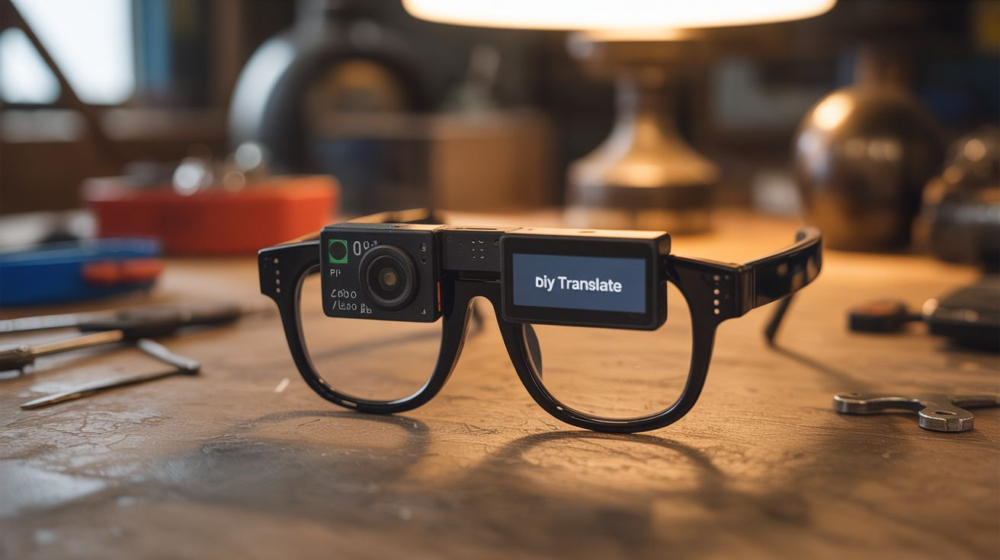

# #151 — Translator Glasses

  

> A Pi Zero camera reads text, OCR translates it, and a tiny display near the eye shows the translation — DIY Google Translate glasses.

## Ratings

| Jaw Drop Rating | Brain Melt Level | Wallet Damage | Spicy Level | Clout Potential | Time to Build |
|---|---|---|---|---|---|
| ⭐⭐⭐⭐⭐ | ⭐⭐⭐⭐⭐ | ⭐⭐⭐ | ⭐ | ⭐⭐⭐⭐⭐ | ⭐⭐⭐⭐ |

## What Is It?

Look at a sign in a foreign language. Within seconds, the translated text appears on a tiny display mounted near the corner of your glasses. A Pi Zero with a small camera module captures what you're looking at. Tesseract OCR extracts the text. A translation library converts it to your language. The result is displayed on a micro OLED screen positioned just below your line of sight. The entire system fits on a pair of glasses (bulky glasses, but wearable). This is essentially what Google Lens does on your phone, but without needing to pull out your phone — the translation is always in your peripheral vision. Perfect for travel, language learning, or feeling like a cyberpunk character.

## Ingredients

- [ ] Raspberry Pi Zero 2 W — small, light, wireless *(electronics supplier)*
- [ ] Pi Camera Module — v2 or v3 mini *(electronics supplier)*
- [ ] Micro OLED display — 0.49" or 0.66" I2C OLED *(electronics supplier)*
- [ ] Safety glasses or thick-framed glasses — frame for mounting *(hardware store)*
- [ ] LiPo battery — 3.7V 500-1000mAh, small and light *(electronics supplier)*
- [ ] Boost converter — 5V output for Pi Zero *(electronics supplier)*
- [ ] Tesseract OCR — open source text recognition *(apt install)*
- [ ] Python with pytesseract, googletrans or argostranslate (offline) *(pip install)*
- [ ] Thin wire and hot glue — for mounting components to frames *(workshop)*
- [ ] Button — to trigger capture/translation *(electronics supplier)*

## Build Steps

1. **Set up OCR on the Pi Zero.** Install Tesseract: `sudo apt install tesseract-ocr`. Install language packs for the source languages you want to translate. Install pytesseract Python wrapper. Test by feeding a photo of text to Tesseract and verifying the output.
2. **Set up translation.** For offline translation, install Argos Translate: `pip install argostranslate`. Download language packs. For online translation (requires WiFi), use the googletrans library. Test the full pipeline: image -> OCR -> translation.
3. **Configure the camera.** Connect the Pi Camera Module and enable it in raspi-config. Write a Python script to capture frames on demand (button press) or continuously at low frame rate. Use a small resolution (640x480) to keep processing time under 2 seconds.
4. **Wire the micro OLED.** Connect the tiny OLED to the Pi Zero via I2C. Install the SSD1306 library. Test by displaying text strings. The display is small, so use a readable font at 8-10px size. Show 2-3 lines of text maximum.
5. **Build the glasses frame.** Mount the Pi Zero on one temple (side arm) of the glasses. Mount the camera facing forward at the hinge. Mount the OLED display at the bottom corner of one lens, positioned just below your line of sight. All connections run along the frame. This is ugly but functional.
6. **Add the battery.** Mount the LiPo battery on the opposite temple for weight balance. Wire through the boost converter to provide 5V to the Pi Zero. A 1000mAh battery gives about 1-2 hours of operation.
7. **Implement the pipeline.** Button press triggers: camera captures frame, Tesseract extracts text, translator converts to target language, result displays on the OLED. The entire pipeline should complete in 1-3 seconds on a Pi Zero 2 W.
8. **Add continuous mode (optional).** Instead of button-triggered, capture and process frames every 3-5 seconds. This is more battery-intensive but provides a seamless experience. Only update the display when new text is detected to avoid flickering.
9. **Optimize for wearability.** Minimize weight by trimming circuit boards, using thin wiring, and choosing the smallest battery that provides acceptable runtime. Apply sugru or hot glue to smooth edges and secure components. The glasses should be wearable for at least 30 minutes without discomfort.

## Safety Notes

- Do not wear these while driving, cycling, or operating machinery. The display obstructs peripheral vision, and the processing delay means you're looking at the camera frame from seconds ago, not the current view.
- LiPo batteries near your face require careful handling. Use a battery with built-in protection circuit. If the battery is damaged, swells, or gets hot, remove the glasses immediately. Never charge while wearing.
- The micro OLED is positioned near your eye. Use the lowest brightness setting that's readable to avoid eye strain. The display should be in peripheral vision, not direct gaze. Take breaks every 20-30 minutes.

## See Also

- [AI Photo Booth](143-ai-photo-booth.md)
- [Deepfake Mirror](153-deepfake-mirror.md)

**References:**
- [Electronics & Microcontrollers Guide](../../reference/electronics-and-microcontrollers.md)
