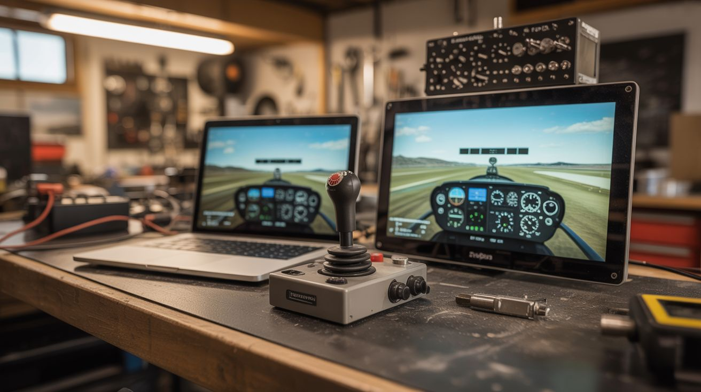

# #154 — Flight Sim Cockpit

  

> FlightGear on salvaged laptop screens, a physical joystick from old peripherals, and an Arduino-driven instrument panel.

## Ratings

     

## 🧪 What Is It?

Flight simulators are incredible software — FlightGear is free and open source, with realistic physics, global scenery, and dozens of aircraft. But playing on a single monitor with a keyboard feels nothing like flying. Build a multi-screen cockpit with salvaged laptop screens (using LVDS controller boards to turn them into standalone monitors), a physical joystick and throttle from old gaming peripherals or custom-built from potentiometers, and an Arduino-driven instrument panel with real gauges showing airspeed, altitude, heading, and engine RPM. Sit down, flip switches, advance the throttle, and pull back on the stick. The immersion transforms a screen into a window.

<strong>🧰 Ingredients</strong>

- [ ] Computer capable of running FlightGear — mid-range GPU *(already own)*
- [ ] Salvaged laptop screens — 2-3, 15" *(e-waste bin)*
- [ ] LVDS controller boards — one per laptop screen, matched to the panel *(online, ~$15 each)*
- [ ] Old joystick — USB, or build from potentiometers *(thrift store, junk drawer)*
- [ ] Potentiometers — for throttle, mixture, trim controls *(electronics supplier)*
- [ ] Arduino Leonardo or Pro Micro — for custom controller (uses HID library) *(electronics supplier)*
- [ ] Toggle switches — for gear, flaps, lights *(electronics supplier, hardware store)*
- [ ] Servo motors — for physical instrument gauges *(electronics supplier)*
- [ ] MDF or plywood — for the cockpit frame *(hardware store)*
- [ ] 12V power supplies — for the LVDS boards *(electronics supplier)*

## 🔨 Build Steps

1. **Set up the screens.** Match each salvaged laptop screen to the correct LVDS controller board (you need the exact panel model number). Connect the board, power supply, and HDMI input. Each converted laptop screen becomes a standalone HDMI monitor. Test each one works.
2. **Build the cockpit frame.** Construct an angled frame from MDF that holds the screens in a wrap-around arrangement: center screen straight ahead, left and right screens angled 30-45 degrees inward. This creates peripheral vision like looking out cockpit windows.
3. **Configure multi-monitor in FlightGear.** FlightGear supports multiple views across multiple monitors. Configure each screen to show a different viewing angle: left window, front windshield, right window. The result is a panoramic cockpit view.
4. **Build the joystick (if custom).** Mount a potentiometer at the base of a stick for pitch, another for roll. A third pot on a separate lever makes the throttle. Wire all pots to an Arduino Leonardo, which reports as a USB HID game controller to the computer. FlightGear sees it as a joystick.
5. **Add switches and controls.** Mount toggle switches for landing gear (up/down), flaps (multiple positions via rotary switch), lights (landing, nav, beacon), and starter. Wire each to the Arduino. Map them to FlightGear key commands via the HID interface.
6. **Build the instrument panel.** Mount small servo motors behind a panel with printed gauge faces. FlightGear exports instrument data via its telnet interface or property tree. A Python script reads airspeed, altitude, heading, RPM, etc., and sends commands to an Arduino that drives the servos to the corresponding gauge positions.
7. **Add a trim wheel.** Mount a rotary encoder as the elevator trim wheel. Turning it adjusts trim in FlightGear. Physical trim wheels are deeply satisfying and one of the most-used controls in real aviation.
8. **Wire the instrument lighting.** Add small LEDs behind translucent panel labels (GEAR, MASTER, BATT). Control them from the Arduino based on FlightGear state data. When the gear is down, the gear light illuminates green. Master caution lights flash for warnings.
9. **Test fly.** Start with a simple aircraft (Cessna 172). Verify all controls respond correctly. Adjust joystick sensitivity curves in FlightGear. Practice takeoffs and landings. The physical controls make flying dramatically easier and more intuitive than keyboard input.

## ⚠️ Safety Notes

- LVDS controller boards run on 12V and the inverter section can produce high voltage for the screen backlight. Never touch the board while powered on. Ensure all boards are mounted securely and wiring is insulated.
- The cockpit frame should be stable and can't tip over. A multi-screen setup with frame weighs considerable pounds. Ensure the desk or structure can handle the weight. Secure screens to prevent them from falling.
- Extended flight sim sessions can cause eye strain from close-range multi-screen viewing. Position screens at a comfortable distance (arm's length minimum) and take breaks every 45-60 minutes.

## 🔗 See Also

- [Retro Arcade Cabinet](../pi-and-arduino/126-retro-arcade-cabinet/)
- [MIDI Stepper Organ](../pi-and-arduino/135-midi-stepper-organ/)

