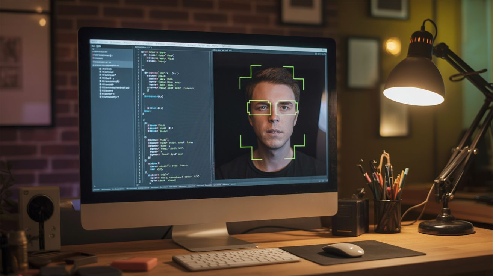

# Python Projects

  

> A webcam is a webcam. A webcam running OpenCV is a face-tracking sentry turret. Python is the difference.

Python is the duct tape of the programming world — it holds everything together. Computer vision with OpenCV, machine learning with TensorFlow, audio processing with librosa, hardware control with GPIO libraries, web dashboards with Flask. The language itself is free. The libraries are free. The hardware is salvaged junk. The only cost is your time learning, and the return on that investment is unlimited.

These projects combine physical hardware (cameras, sensors, motors, LEDs) with Python intelligence. A webcam becomes a face-tracking system. A microphone becomes a sentiment analyzer. A laser pointer becomes an automated targeting system. The software is where the magic happens.

---

## Builds

| # | Build | Jaw Drop | Brain Melt | Wallet | Spicy | Clout | Time |
|---|---|---|---|---|---|---|---|
| 141 | [Face Tracking Laser](141-face-tracking-laser.md) | ⭐⭐⭐⭐ | ⭐⭐⭐ | ⭐ | ⭐⭐ | ⭐⭐⭐⭐ | ⭐⭐ |
| 142 | [Generative Art Plotter](142-generative-art-plotter.md) | ⭐⭐⭐⭐ | ⭐⭐⭐ | ⭐ | ⭐ | ⭐⭐⭐⭐ | ⭐⭐ |
| 143 | [AI Photo Booth](143-ai-photo-booth.md) | ⭐⭐⭐⭐ | ⭐⭐⭐ | ⭐⭐ | ⭐ | ⭐⭐⭐⭐⭐ | ⭐⭐ |
| 144 | [Sentiment Room Lighting](144-sentiment-room-lighting.md) | ⭐⭐⭐⭐ | ⭐⭐⭐⭐ | ⭐⭐ | ⭐ | ⭐⭐⭐⭐ | ⭐⭐⭐ |
| 145 | [Music Visualizer LED Wall](145-music-visualizer-led-wall.md) | ⭐⭐⭐⭐⭐ | ⭐⭐⭐ | ⭐⭐⭐ | ⭐ | ⭐⭐⭐⭐⭐ | ⭐⭐⭐ |
| 146 | [Earthquake Detector](146-earthquake-detector.md) | ⭐⭐⭐ | ⭐⭐⭐ | ⭐ | ⭐ | ⭐⭐⭐ | ⭐⭐ |
| 147 | [AI Metal Detector](147-ai-metal-detector.md) | ⭐⭐⭐⭐ | ⭐⭐⭐⭐ | ⭐ | ⭐ | ⭐⭐⭐⭐ | ⭐⭐⭐⭐ |
| 148 | [Automated Microscope](148-automated-microscope.md) | ⭐⭐⭐⭐ | ⭐⭐⭐⭐ | ⭐⭐ | ⭐ | ⭐⭐⭐ | ⭐⭐⭐ |
| 149 | [Voice Home Automation](149-voice-home-automation.md) | ⭐⭐⭐ | ⭐⭐⭐ | ⭐⭐ | ⭐⭐ | ⭐⭐⭐ | ⭐⭐ |
| 150 | [Fractal Laser Engraver](150-fractal-laser-engraver.md) | ⭐⭐⭐⭐⭐ | ⭐⭐⭐ | ⭐⭐ | ⭐ | ⭐⭐⭐⭐⭐ | ⭐⭐⭐ |
| 151 | [Translator Glasses](151-translator-glasses.md) | ⭐⭐⭐⭐⭐ | ⭐⭐⭐⭐⭐ | ⭐⭐⭐ | ⭐ | ⭐⭐⭐⭐⭐ | ⭐⭐⭐⭐ |
| 152 | [Body Pose Music](152-body-pose-music.md) | ⭐⭐⭐⭐⭐ | ⭐⭐⭐⭐ | ⭐ | ⭐ | ⭐⭐⭐⭐⭐ | ⭐⭐⭐ |
| 153 | [Deepfake Mirror](153-deepfake-mirror.md) | ⭐⭐⭐⭐⭐ | ⭐⭐⭐⭐ | ⭐⭐ | ⭐ | ⭐⭐⭐⭐⭐ | ⭐⭐⭐ |
| 154 | [Flight Sim Cockpit](154-flight-sim-cockpit.md) | ⭐⭐⭐⭐ | ⭐⭐⭐⭐ | ⭐⭐⭐ | ⭐ | ⭐⭐⭐⭐ | ⭐⭐⭐⭐ |
| 155 | [AI Dungeon Master](155-ai-dungeon-master.md) | ⭐⭐⭐⭐ | ⭐⭐⭐⭐ | ⭐⭐ | ⭐ | ⭐⭐⭐⭐⭐ | ⭐⭐⭐⭐ |
