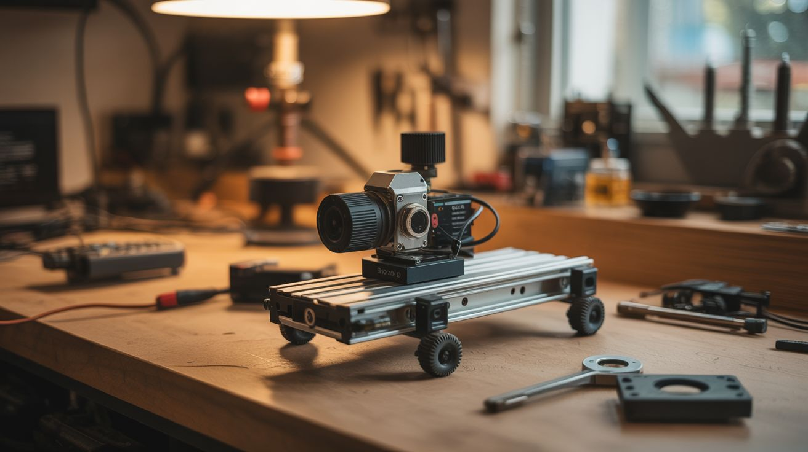

# #089 — Motorized Camera Slider

  

> Stepper motor + drawer slides + Arduino. Smooth, cinematic tracking shots. Professional sliders cost $200+. Build this for $15.

## Ratings

     

## 🧪 What Is It?

A camera slider creates smooth, linear tracking shots — the kind of cinematic movement you see in documentaries, product videos, and real estate tours. Professional motorized sliders cost $200-800. But a camera slider is just a linear rail with a carriage that moves a camera at a controlled speed. Salvage a stepper motor from a printer, use full-extension drawer slides as the linear rail, drive the carriage with a belt or lead screw, and control the speed with an Arduino. The result is buttery-smooth tracking shots that transform amateur video into professional-looking content. Add a second motor for pan control and you have a motion-controlled rig that rivals gear costing 10x more.

<strong>🧰 Ingredients</strong>

- [ ] Stepper motor (NEMA 17) — salvaged from a printer *(e-waste bin)*
- [ ] Full-extension drawer slides (18-24 inches) — as the linear rail *(salvage from old furniture, or ~$8)*
- [ ] Arduino Nano *(~$5, electronics supplier)*
- [ ] A4988 stepper driver *(~$2, electronics supplier)*
- [ ] Timing belt + pulleys — salvaged from a printer *(e-waste bin)*
- [ ] 1/4"-20 bolt — standard camera tripod thread *(hardware store)*
- [ ] Small ball head or phone mount — to attach camera/phone to the carriage *(~$5, camera store)*
- [ ] 12V power supply or battery pack *(old charger or batteries)*
- [ ] Plywood or aluminum extrusion — for the base *(hardware store)*
- [ ] Potentiometer — for speed control *(~$1, electronics supplier)*

## 🔨 Build Steps

1. **Build the rail base.** Cut a piece of plywood or aluminum extrusion to your desired slider length (18-24 inches is typical). This is the foundation. It needs to be straight and rigid — any flex or bow translates into wobbly footage.
2. **Mount the drawer slides.** Attach the fixed part of the drawer slides to the base, running the full length. Use one or two drawer slides depending on the weight of your camera. Full-extension ball-bearing slides provide the smoothest motion. Ensure they're perfectly parallel if using two.
3. **Build the camera carriage.** Attach a small platform to the moving part of the drawer slides. This platform carries the camera. Drill a 1/4"-20 threaded hole (or bolt a 1/4"-20 bolt through the platform) for the standard camera tripod mount. Or attach a small ball head for angle adjustment.
4. **Install the belt drive.** Mount the stepper motor at one end of the base with a timing belt pulley on its shaft. Mount an idler pulley at the other end. Run the timing belt between them and attach the belt to the camera carriage. When the stepper turns, the belt moves the carriage along the slides.
5. **Wire the electronics.** Connect the stepper motor to the A4988 driver. Connect the driver to the Arduino. Add a potentiometer to an analog input pin for speed control. Power the driver from 12V and the Arduino from USB or a voltage regulator.
6. **Write the control code.** Program the Arduino to drive the stepper at a speed determined by the potentiometer position. Add buttons for direction (left/right), start/stop, and optionally time-lapse mode (move one step, pause for a photo, repeat). Libraries like AccelStepper make smooth acceleration easy.
7. **Calibrate the speed.** For smooth video tracking, the carriage should move at about 1-3 inches per second. For time-lapse, it moves in tiny increments (one step per photo interval). Adjust the potentiometer range in code to cover useful speeds.
8. **Add tripod mounting.** Drill a 1/4"-20 threaded hole in the base so you can mount the entire slider on a tripod. Alternatively, add rubber feet for tabletop use. A stable mount is essential — any vibration from the base ruins the smooth slider motion.
9. **Test with your camera.** Mount the camera (or phone), set focus, hit record, and start the slider. Review the footage. If you see jitter, the stepper is stepping too coarsely — enable microstepping on the A4988 driver (set the MS1/MS2/MS3 pins for 1/16 or 1/32 microstepping).
10. **Optional: add pan motor.** Mount a second stepper motor on the camera carriage with a small geared turntable. This rotates the camera while it slides, creating sweeping pan-and-track shots. Coordinate both motors in code for complex camera movements.

## ⚠️ Safety Notes

- Camera equipment is expensive and fragile. Test the slider with a weighted dummy (water bottle, bag of rice) before mounting your camera. Verify that the carriage stops at the rail ends and doesn't run off — add end stops (limit switches or physical bumpers).
- The stepper motor and driver generate heat during extended time-lapse sequences (hours). Ensure ventilation and don't wrap electronics in insulating material. Consider reducing motor current during pauses.

## 🔗 See Also

- [Electric Winch](090-electric-winch.md)
- [Printer Stepper CNC](../printer-and-scanner/069-printer-stepper-cnc.md)

**References:**
- [Appliance Teardown Guide](../../reference/appliance-teardown-guide.md)
- [Technical Glossary](../../reference/glossary.md)
- [Electronics & Microcontrollers Guide](../../reference/electronics-and-microcontrollers.md)
