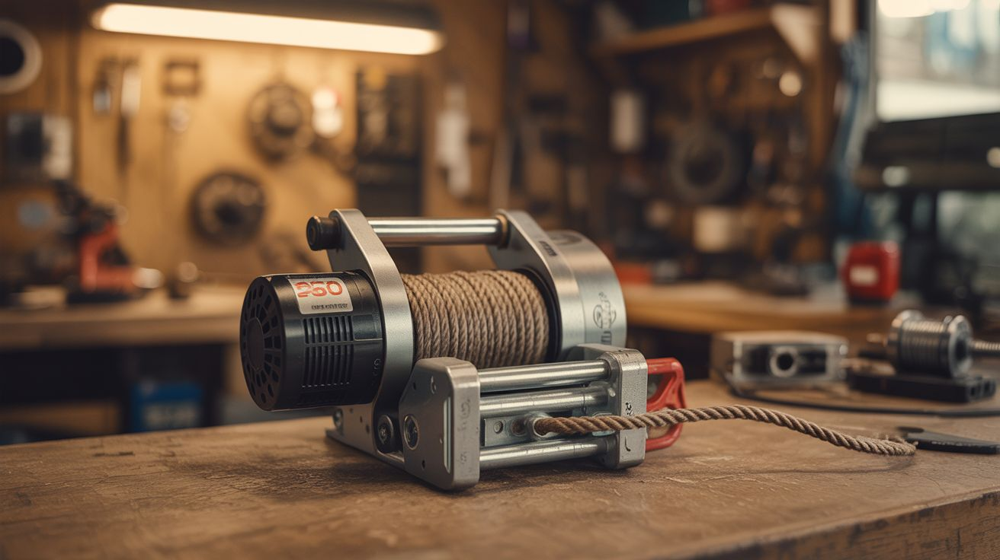

# #090 — Electric Winch

  

> Scooter motor + spool + rope. A 250W motor lifts ~50 lbs. Portable electric winch for pulling, lifting, and hauling.

## Ratings

     

## 🧪 What Is It?

A winch is a motor connected to a spool that winds rope or cable. Electric scooter motors are geared for torque (they need to move a person up hills), making them ideal winch motors. Connect the motor to a spool, wrap it with rope, add a mounting bracket, and you have a portable electric winch capable of pulling or lifting 50-100+ lbs depending on the motor size. Use it for hauling gear into a treehouse, pulling a stuck car, lifting materials to a roof, dragging logs, or any task where you need to pull something with more force than your arms provide. Commercial electric winches cost $80-300. This one costs scrap parts and an afternoon.

<strong>🧰 Ingredients</strong>

- [ ] Electric scooter motor — geared motors provide more torque than hub motors *(dead scooter)*
- [ ] ESC or motor controller — to control speed and direction *(salvage from scooter, or ~$10)*
- [ ] Spool/drum — thick PVC pipe coupling, wooden disc, or metal cylinder *(hardware store or workshop)*
- [ ] Rope or cable — rated for your intended load (paracord for light loads, steel cable for heavy) *(hardware store)*
- [ ] Battery pack — scooter battery or salvaged 18650 pack *(dead scooter or laptop batteries)*
- [ ] Steel plate or thick plywood — for mounting bracket and base *(hardware store)*
- [ ] Bolts, nuts, bearings *(hardware store)*
- [ ] Switch or remote control — for operation *(electronics supplier or salvage)*

## 🔨 Build Steps

1. **Select the motor.** Geared scooter motors are best for winch duty — they trade speed for torque, which is exactly what you want. A 250W geared motor provides roughly 50 lbs of pulling force at the spool. Larger 350W-500W motors pull proportionally more.
2. **Build the spool.** The spool must attach to the motor shaft and hold enough rope for your needs. Use a PVC pipe coupling (4-6 inch diameter) with plywood end flanges screwed on to keep the rope from sliding off. Drill a center hole matching the motor shaft diameter. Secure the spool to the shaft with a set screw or keyway.
3. **Build the frame.** Mount the motor and spool on a sturdy base plate (1/4" steel plate for heavy loads, 3/4" plywood for lighter duty). The motor must be firmly bolted down — the torque reaction force tries to spin the motor body instead of the spool. Add mounting holes or a clamp system so you can secure the winch to a tree, vehicle hitch, or workbench.
4. **Install a shaft bearing.** Support the far end of the spool shaft with a bearing mounted to the frame. This prevents the shaft from wobbling under load and reduces stress on the motor bearings.
5. **Wind the rope.** Thread the rope through a small hole in the spool drum and tie a secure knot. Wind the rope evenly onto the spool by hand. Leave enough free rope for your working distance. Attach a hook, carabiner, or loop at the free end.
6. **Wire the controller.** Connect the motor to the ESC or motor controller. Connect the controller to the battery pack. Wire a switch for power and direction control (forward to wind/pull, reverse to release). If using the scooter's original ESC and throttle, the throttle controls speed — very useful for precise positioning.
7. **Add a mounting system.** Bolt a cleat, clamp, or carabiner bracket to the base plate so you can anchor the winch to a solid attachment point. The anchor point must withstand the full pulling force — the winch is only as strong as what it's bolted to.
8. **Load test.** Start with a light load (10-20 lbs) and verify the motor, spool, rope, and anchor all perform correctly. Gradually increase the load to your target. Listen for motor strain (slowing, overheating) — that's your practical limit. Never exceed 80% of the motor's stall torque.

## ⚠️ Safety Notes

- Ropes and cables under tension store enormous energy. If a rope breaks or an anchor point fails, the rope snaps back violently and can cause severe injury. Never stand in the line of a loaded rope. Use rope rated for at least 3x your maximum load (safety factor of 3).
- Never put your fingers near the spool while the motor is running. A winch spool can crush or amputate fingers in an instant. Use a dead-man switch (winch only runs while you hold the button) so it stops immediately when released.
- The motor draws high current under load, generating heat. Monitor motor temperature during heavy pulls. Let it cool between lifts. Continuous high-load operation can burn out motor windings.

## 🔗 See Also

- [Electric Skateboard](088-electric-skateboard.md)
- [Wind Phone Charger](091-wind-phone-charger.md)

**References:**

- [Appliance Teardown Guide](../../docs/reference/appliance-teardown-guide.md)
- [Technical Glossary](../../docs/reference/glossary.md)
