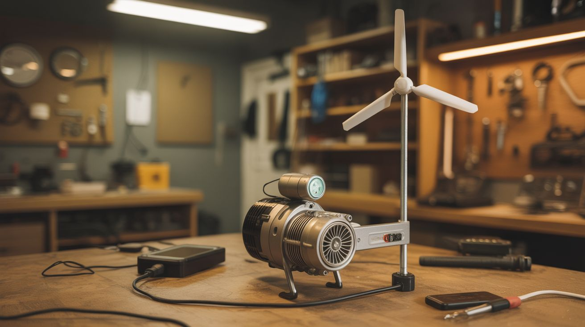

# #091 — Wind Phone Charger

  

> A scooter motor run in reverse is a generator. Add PVC pipe blades and a charge controller. An actual tiny wind turbine. Free electricity from the sky.

## Ratings

     

## 🧪 What Is It?

Every electric motor is also a generator — spin the shaft externally and it produces electricity. Electric scooter motors are particularly good generators because they're brushless (efficient, no wear parts) and produce usable voltage at relatively low RPM. Cut airfoil-shaped blades from PVC pipe, mount them on a hub attached to the motor shaft, add a charge controller and a small battery, and you have a legitimate wind turbine that charges phones, powers LED lights, or runs small electronics. It won't power your house, but it absolutely will charge a phone in moderate wind — and the engineering principles are identical to the 100-meter turbines in commercial wind farms.

<strong>🧰 Ingredients</strong>

- [ ] Brushless DC motor from electric scooter — high pole count motors generate at lower RPM *(dead scooter)*
- [ ] PVC pipe (6-8 inch diameter) — for cutting airfoil blades *(hardware store)*
- [ ] Hub/flange — to attach blades to the motor shaft *(fabricate from plywood or metal, or 3D print)*
- [ ] Charge controller — solar charge controllers work (they regulate voltage from any DC source) *(~$5, electronics supplier)*
- [ ] 12V battery — small SLA, or salvaged 18650 pack *(old UPS, laptop batteries)*
- [ ] USB buck converter (12V to 5V) — for phone charging output *(~$2, electronics supplier)*
- [ ] Rectifier — 3-phase bridge rectifier for brushless motors *(~$2, electronics supplier)*
- [ ] PVC pipe and fittings — for the tower/mast and tail vane *(hardware store)*
- [ ] Sheet metal or plywood — for the tail vane (keeps turbine facing into wind) *(hardware store)*
- [ ] Bolts, bearings, pipe clamps *(hardware store)*

## 🔨 Build Steps

1. **Test the motor as a generator.** Chuck the motor shaft in a drill and spin it. Measure the voltage output with a multimeter across the motor's phase wires. A good scooter motor should produce 12-20V at moderate RPM (500-1000 RPM). If the voltage is too low, the motor has too few poles for wind generator use — try a different motor.
2. **Build the rectifier.** Brushless motors produce 3-phase AC when used as generators. Wire a 3-phase bridge rectifier (6 diodes in a bridge configuration, or buy a pre-made 3-phase bridge) to convert AC to DC. Connect the motor's three phase wires to the AC inputs and take DC output from the rectifier's + and - terminals.
3. **Cut the blades.** Cut a PVC pipe lengthwise into 3-4 sections. Each section's natural curve approximates an airfoil shape. Trim each blade to about 12-18 inches long and 3-4 inches wide. Shape the leading edge to be rounded and the trailing edge to be thin. Sand smooth.
4. **Build the hub.** Create a hub plate from plywood, metal, or 3D print. The hub must have a center hole for the motor shaft and mounting holes for the blades, equally spaced. Drill blade mounting holes at a consistent angle (about 15-20 degrees pitch) — this angle determines how much wind energy converts to rotation.
5. **Assemble the rotor.** Bolt the blades to the hub at equal spacing (120 degrees apart for 3 blades). Attach the hub to the motor shaft securely. Spin the assembled rotor by hand and check for balance — an unbalanced rotor vibrates destructively at speed. Add small weights to lighter blades until balanced.
6. **Build the nacelle.** Mount the motor on a platform with the shaft pointing forward (upwind) or backward (downwind, simpler but less efficient). Attach a tail vane — a flat piece of sheet metal or plywood on a long arm extending behind the motor. The tail keeps the turbine facing into the wind.
7. **Build the yaw mount.** The nacelle needs to rotate freely on the tower to face changing wind directions. Use a pipe fitting as a bearing — the nacelle's base pipe fits over the tower's top pipe and rotates freely. Grease the joint for smooth rotation.
8. **Erect the tower.** Mount the yaw assembly on top of a pole or pipe mast. Higher is better — wind speed increases with height. A 10-foot pole on a rooftop or fence post works. Secure the tower with guy wires or a heavy base to prevent toppling.
9. **Wire the electrical system.** Connect the rectifier output to the solar charge controller's input (it doesn't care that it's wind, not solar — DC is DC). Connect the charge controller's battery terminals to your 12V battery. Connect the USB buck converter to the battery output for phone charging.
10. **Test in wind.** Wait for a breezy day (10+ mph). The blades should spin up and the charge controller should show charging current. Measure the output at the USB port — you should get a steady 5V capable of charging a phone. In moderate wind (15-20 mph), expect 5-15 watts of power.

## ⚠️ Safety Notes

- Spinning blades are dangerous. A 3-foot diameter rotor at 500 RPM has blade tips moving at 50+ mph. Keep hands, faces, and pets clear. Mount the turbine high enough that nobody can walk into the blades. Never work on the rotor while it can spin — tie the blades or disconnect the motor.
- In high winds (30+ mph), the turbine can overspeed, damaging the blades, motor bearings, or throwing a blade. Add a furling mechanism (tail folds, turning the rotor out of the wind) or a braking resistor (shorts the motor leads through a high-wattage resistor, slowing the rotor electromagnetically).
- The tower must be secured against toppling. A falling turbine mast can cause serious injury or property damage. Use guy wires at 120-degree intervals, or a heavy weighted base. Check all fasteners periodically.

## 🔗 See Also

- [Electric Skateboard](088-electric-skateboard.md)
- [Electric Winch](090-electric-winch.md)

**References:**
- [Appliance Teardown Guide](../../reference/appliance-teardown-guide.md)
- [Technical Glossary](../../reference/glossary.md)
