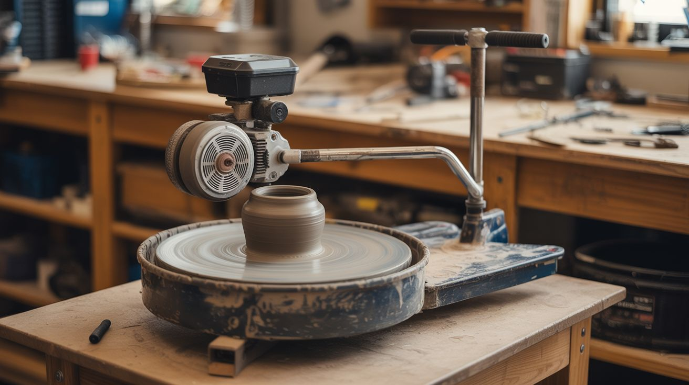

# #292 — Motor-Powered Pottery Wheel

  

> Hub motor + speed controller + foot pedal. Throw clay on a dead scooter's guts for $0 vs $300+ for a commercial wheel.

## Ratings

     

## 🧪 What Is It?

A pottery wheel is a flat disc that spins at a controlled speed while you shape wet clay on top of it.
Commercial pottery wheels cost $300-800 and use a dedicated motor with a speed controller and foot pedal.
Here's the thing: an electric scooter hub motor is already almost a pottery wheel.
It's a flat, disc-shaped motor designed to produce high torque at low RPM.
The outer housing spins while the axle stays still.
Flip it upside down, mount the axle to a base, and the spinning housing becomes your wheel head.
It's even somewhat water-resistant from the factory, since scooters are designed to survive puddles and rain.

The speed controller that came with the scooter handles variable speed out of the box.
Replace the thumb throttle with a foot pedal potentiometer so your hands stay free to work the clay.
Add a splash pan underneath to catch water and slip (the clay-water mixture that flies off a spinning wheel), and you have a fully functional pottery wheel built from e-waste.

The beauty of hub motors for this application is the speed range.
Pottery wheels typically spin between 0-300 RPM.
Most scooter hub motors top out around 200-400 RPM unloaded, and the ESC provides smooth speed control from zero to max.
That's exactly the range you need.
The motor also has more than enough torque to resist the pressure of your hands shaping clay — centering a 5 lb lump of clay takes maybe 2-3 Nm of torque, and even a small scooter hub motor produces 5-10 Nm easily.

<strong>🧰 Ingredients</strong>

- [ ] Hub motor — the flat disc motor from an electric scooter, 250W or larger *(dead electric scooter, e-waste recycler, ~$0-15)*
- [ ] ESC (electronic speed controller) — the original scooter controller matched to the motor *(salvage from same scooter)*
- [ ] Foot pedal potentiometer — for hands-free speed control, 5K-10K ohm *(sewing machine foot pedal from thrift store ~$3, or guitar volume pedal, or buy new ~$8)*
- [ ] Power supply — 24V-48V DC depending on your motor's voltage *(salvage scooter battery, or use a 24V/36V bench supply ~$15-25)*
- [ ] Plywood base — 3/4" plywood, roughly 18" x 18" for a stable platform *(hardware store or scrap pile)*
- [ ] Splash pan — large shallow plastic tray or basin, at least 14" diameter *(dollar store dish tub, cat litter tray, or restaurant bus tub ~$2-5)*
- [ ] Bat pins — two short pins that stick up from the wheel head to hold plywood bats *(two 1/4" bolts, cut to 1" length)*
- [ ] Wire — 14-16 AWG for power connections *(hardware store or salvage)*
- [ ] Mounting hardware — bolts, nuts, washers, L-brackets for securing motor axle to base *(hardware store ~$3-5)*
- [ ] Plywood wheel head disc — 12" diameter circle of 1/2" plywood, attaches to motor housing *(cut from scrap plywood)*
- [ ] Silicone caulk — to seal the gap between the splash pan and motor body *(hardware store ~$4)*
- [ ] Rubber feet — 4x stick-on pads to keep the base from walking across the table *(hardware store or dollar store ~$2)*

## 🔨 Build Steps

1. **Extract the hub motor.**
Remove the wheel from the dead scooter.
Most hub motors are built into one of the wheels — the tire and rim are the motor housing.
Remove the tire and inner tube.
You want the bare motor: a flat metal disc with an axle poking out of the center and phase wires (usually 3 thick wires) plus a hall sensor cable (thin, multi-wire connector) coming out of one side.

2. **Determine the motor orientation.**
The axle is the stationary part.
The outer housing (what used to be the wheel rim) is the spinning part.
For a pottery wheel, you want the axle pointing down, bolted to the base, with the spinning housing facing up.
This gives you a flat, spinning surface on top.

3. **Build the base.**
Cut a square of 3/4" plywood, about 18" x 18".
This needs to be heavy and stable — a spinning wheel with clay on it will vibrate and walk across the table if the base is too light.
Screw rubber feet to the bottom corners.
If the base still feels light, add weight (bolt a brick to the underside, or use a thicker plywood stack).
Sand the edges so you don't snag yourself while leaning over the wheel.

4. **Mount the motor to the base.**
The hub motor axle has flat sides and a through-hole for the original scooter's axle bolt.
Use this to bolt the axle to an L-bracket or U-bracket that's screwed to the center of the base.
The motor must be centered and the axle must be perfectly vertical — any wobble means your pots come out lopsided.
Use a level on the motor housing.
Shim with washers if needed until the housing sits dead flat.

5. **Attach the wheel head.**
Cut a 12" circle from 1/2" plywood.
This is your wheel head — the surface you'll actually throw clay on.
Attach it to the top of the spinning motor housing with bolts through the screw holes in the housing (most hub motors have mounting holes for the original brake disc or wheel spokes).
Center it precisely.
The wheel head should spin true with no wobble — spin it by hand and watch the edge.
If it oscillates, loosen the bolts, re-center, and re-tighten.

6. **Install bat pins.**
Drill two 1/4" holes in the wheel head, about 4" apart, centered.
Press-fit or epoxy two short 1/4" bolts (cut to 1" tall) into these holes, pointing up.
These are bat pins — they hold removable plywood discs (bats) so you can lift a finished pot off the wheel without touching it.
Make matching bats from thin plywood circles with two holes drilled to fit over the pins.
Having 3-4 bats lets you throw multiple pieces without waiting for each one to dry enough to handle.

7. **Wire the speed controller.**
Connect the hub motor's three phase wires and hall sensor cable to the ESC, matching the original scooter wiring.
The ESC's throttle input originally connected to a thumb or twist throttle on the scooter handlebar — this is just a potentiometer (variable resistor).
You'll replace it with the foot pedal.
Keep the original connector if possible so you can swap back for testing.

8. **Build the foot pedal.**
A sewing machine foot pedal is perfect — it's already a potentiometer in a foot-operated housing.
Check the resistance range with a multimeter.
Most scooter ESCs expect a 1K-5K ohm throttle signal.
If the sewing pedal's range doesn't match, swap the internal potentiometer for one that does, or add a series resistor to shift the range.
Connect the pedal's two wires to the ESC's throttle input (signal and ground).
Test the full range of motion: no pressure = motor off, full press = max speed, half press = half speed.

9. **Install the splash pan.**
Cut a hole in the center of the plastic tray just large enough to fit around the motor body below the wheel head.
Slide the tray down over the motor so it sits like a collar, catching any water and clay slip that flies off the wheel.
Seal the gap between the tray and motor body with silicone caulk to keep water out of the motor.
Add a drain hole and short tube at the low point of the pan if you want to route slip into a bucket.
Clay slip is heavy and builds up fast — empty the pan regularly or it'll overflow.

10. **Connect power.**
Wire the ESC to your power source.
If using the original scooter battery pack, it just plugs in.
If using a bench power supply, match the voltage (check the ESC's rating — usually 24V, 36V, or 48V).
Double-check polarity before powering on.
Reversed polarity kills ESCs instantly and there's no warning — just a dead controller and the smell of burned electronics.

11. **Test without clay.**
Power on and slowly press the foot pedal.
The wheel head should spin smoothly from 0 to full speed.
Check for wobble — if the wheel head oscillates, re-center it.
Listen for grinding or scraping.
The speed should be smoothly controllable across the full range of the foot pedal.
If the motor only goes full speed or nothing, the potentiometer range doesn't match the ESC's expected throttle input — adjust accordingly.

12. **Season the wheel head and throw.**
Soak the plywood wheel head with water and let it dry a few times to swell and seal the grain.
Alternatively, coat it with polyurethane for water resistance.
Wet the surface, slap on a lump of wedged clay, and start throwing.
The motor won't even notice the load — you could center a bowling ball on this thing.
Start at low speed for centering, increase to medium for pulling up walls, and drop back to low for trimming and finishing.

## ⚠️ Safety Notes

- Keep water away from electrical connections.
The motor itself tolerates some moisture, but the ESC, wiring connectors, and power supply do not.
Route all wiring away from the splash zone.
Use waterproof connectors or heat-shrink over any exposed joints.
A GFCI outlet is strongly recommended if using a wall-powered supply.

- The wheel head spins with significant torque.
Long sleeves, jewelry, loose hair, and dangling drawstrings can get caught and wrapped around the spinning wheel or motor housing.
Tie back hair, remove rings and bracelets, and roll up sleeves before throwing.

- If using a lithium battery pack, never charge it unattended.
Inspect for damage, swelling, or unusual heat after each session.
Store and charge on a non-flammable surface.

- Clay dust (when dry) is a silica hazard.
Clean up wet — don't sweep dry clay dust.
This is a pottery safety issue, not specific to the motor, but worth knowing since you're building a pottery wheel.

- The motor can stall if you apply too much force to the clay while throwing at low speed.
Stalling doesn't damage the motor, but it does draw high current from the battery or supply, which generates heat in the ESC.
If the wheel stops, release the foot pedal before re-engaging.

## 🔗 See Also

- [Electric Skateboard](088-electric-skateboard.md)
- [Scooter Motor Lathe](../functional-machines/025-scooter-motor-lathe.md)

**References:**
- [Appliance Teardown Guide](../../reference/appliance-teardown-guide.md)
- [Technical Glossary](../../reference/glossary.md)
