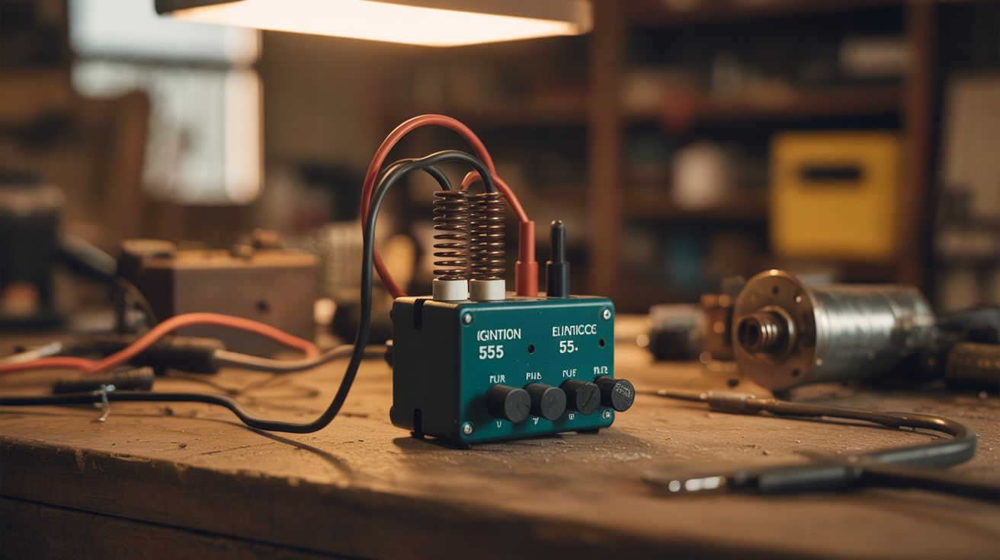

# #293 — Electric Fence Charger

  

> Ignition coil + 555 timer = thousands of volts that convince livestock to stay put. Cheap, simple, extremely persuasive.

## Ratings

     

## 🧪 What Is It?

Electric fence chargers (also called energizers or fencers) produce short, high-voltage pulses — typically 2,000 to 10,000 volts — that travel through a wire fence.
When an animal touches the wire and completes the circuit to ground, it gets a sharp, painful shock that teaches it to respect the fence boundary.
The voltage is high but the current is extremely low (milliamps) and the pulse duration is very short (microseconds), so the shock is startling and unpleasant but not dangerous to animals or humans.
Commercial fence chargers cost $40-150.
This one costs about $5 in parts you probably already have.

The core of the build is a car ignition coil.
An ignition coil is a step-up transformer designed to convert 12 volts into 20,000-40,000 volts — that's how your car creates the spark that ignites the fuel-air mixture in each cylinder.
Junkyard cars have them by the dozen, and they're nearly indestructible.
Pair the coil with a 555 timer circuit that generates timed pulses (about one per second), a MOSFET to switch the coil's primary current, and a 12V battery for power.
The 555 triggers the MOSFET, which sends a pulse of current through the ignition coil's primary winding.
When the MOSFET shuts off, the collapsing magnetic field induces a high-voltage spike on the secondary winding.
That spike goes to the fence wire.

This is the same operating principle as every commercial fence charger on the market — they just wrap it in a nicer box and charge you ten times more.
The 555 timer is one of the most well-understood ICs in electronics history (designed in 1971, still in mass production, billions sold).
The circuit is about as complex as a flashlight with a few extra components.

<strong>🧰 Ingredients</strong>

- [ ] Ignition coil — standard 12V automotive ignition coil, any make/model *(junkyard, ~$0-5)*
- [ ] 555 timer IC — the classic NE555 or equivalent *(electronics supplier, ~$0.25)*
- [ ] MOSFET — IRF540N or similar logic-level N-channel MOSFET rated for 20A+ *(electronics supplier, ~$1)*
- [ ] 12V battery — car battery, motorcycle battery, or any 12V lead-acid *(already own, or junkyard ~$0-10)*
- [ ] Resistors — 1K ohm (x2), 100K ohm (x1) for the 555 timing circuit *(electronics supplier, ~$0.10)*
- [ ] Capacitors — 10uF electrolytic (x1) for timing, 0.01uF ceramic (x1) for noise filtering *(electronics supplier, ~$0.20)*
- [ ] Flyback diode — 1N4007 or similar, protects the MOSFET from voltage spikes *(electronics supplier, ~$0.05)*
- [ ] Fence wire — galvanized steel wire, 14-17 gauge, or aluminum electric fence wire *(hardware store or farm supply, ~$10-20 per roll)*
- [ ] Insulators — purpose-built fence insulators, or cut plastic bottles into standoff shapes *(farm supply ~$5 for a bag, or free from recycling bin)*
- [ ] Grounding rod — 3-4 foot steel rod or copper pipe driven into the ground *(hardware store ~$5, or rebar from scrap pile)*
- [ ] Project enclosure — waterproof plastic box to house the circuit *(hardware store or repurpose a food container, ~$2-5)*
- [ ] Wire — 16-18 AWG hookup wire for the circuit, plus insulated lead wire to connect charger to fence *(hardware store or salvage)*
- [ ] 8-pin DIP socket — optional, but makes it easy to replace the 555 if you fry it during testing *(electronics supplier, ~$0.10)*
- [ ] Perfboard — for permanent soldering after breadboard prototyping *(electronics supplier, ~$1)*
- [ ] Toggle switch — main power on/off *(salvage or ~$1)*

## 🔨 Build Steps

1. **Pull an ignition coil.**
Find any car at a junkyard and pull the ignition coil.
Older vehicles (pre-2000) use a single large coil with two primary terminals and one high-voltage tower, which is easiest to work with.
Newer vehicles often use coil-on-plug packs — these work too, but you only need one coil from the pack.
The coil has two terminals on the primary side (marked + and -) and one high-voltage output terminal on the secondary side (the thick wire connector or the boot that plugs into the spark plug).

2. **Test the coil.**
Use a multimeter on resistance mode.
Primary winding resistance (between the + and - terminals) should be 0.5-2 ohms.
Secondary winding resistance (between either primary terminal and the high-voltage output) should be 6,000-12,000 ohms.
If both readings are in range, the coil is good.
If the secondary reads open (infinite resistance), the internal winding is broken — grab a different coil.

3. **Build the 555 timer circuit on a breadboard.**
This is a standard astable (free-running) 555 configuration.
Pin 1 to ground.
Pin 2 to pin 6 (threshold and trigger tied together).
Pin 3 is the output.
Pin 4 (reset) to VCC (12V).
Pin 5 through a 0.01uF capacitor to ground.
Pin 7 (discharge) through a 1K resistor to VCC, and also through the 100K resistor to the pin 2/6 junction.
Pin 8 to VCC.
A 10uF electrolytic capacitor connects between the pin 2/6 junction and ground.
This configuration produces a pulse approximately once per second with a very short duty cycle — a brief "on" pulse followed by a long "off" pause.

4. **Add the MOSFET switching stage.**
The 555's output (pin 3) drives the gate of the IRF540N MOSFET through a 1K resistor.
The MOSFET's source connects to ground.
The MOSFET's drain connects to the negative (-) terminal of the ignition coil's primary winding.
The positive (+) terminal of the coil's primary connects to 12V (battery positive).
When the 555 output goes high, the MOSFET turns on, current flows through the coil's primary, and the magnetic field builds up.
When the 555 output goes low, the MOSFET shuts off, the magnetic field collapses, and the secondary winding produces a high-voltage spike.
That spike is your fence pulse.

5. **Install the flyback diode.**
Connect a 1N4007 diode across the MOSFET's drain and source.
Cathode (striped end) toward the drain (coil side), anode toward source (ground side).
This clamps the voltage spike on the primary side to protect the MOSFET.
Without this diode, the inductive kickback from the coil primary can exceed the MOSFET's voltage rating and destroy it.
The secondary side still produces the full high-voltage pulse — the diode only protects the switching circuit.

6. **Test on the bench.**
Connect a 12V battery.
You should hear a faint clicking from the ignition coil — that's the magnetic field snapping on and off once per second.
Hold an insulated screwdriver near the secondary output terminal and you'll see (and hear) a spark jump to any nearby grounded metal.
The spark should be blue-white and about 1/4" to 1/2" long.
If you don't get a spark, check the 555 output with a multimeter or LED — it should pulse high/low.
If the 555 works but no spark, check the MOSFET wiring and the coil connections.
The primary side has polarity — if you swap + and -, the coil still works but produces a weaker spark.

7. **Solder the permanent circuit.**
Once the breadboard prototype works, transfer everything to perfboard.
Breadboard connections vibrate loose in the field, and one bad connection means no fence.
Use a DIP socket for the 555 so you can replace it without desoldering.
Add a toggle switch in the positive battery lead for easy on/off.
Double-check every solder joint — cold joints fail in the heat of summer and the cold of winter.

8. **Mount everything in an enclosure.**
The ignition coil is heavy, so bolt it down securely inside the enclosure or mount it to the outside.
Mount the perfboard with standoffs (small bolts with spacers) so the solder side doesn't touch the enclosure wall.
Drill holes for the battery leads, fence output wire, ground wire, and power switch.
Use cable glands or silicone sealant around wire pass-throughs to keep water out.
Label the terminals: FENCE, GROUND, BATTERY +, BATTERY -.

9. **Install the grounding rod.**
Drive a 3-4 foot steel rod or copper pipe into the ground near where you'll mount the charger.
Wet soil grounds better than dry — if your soil is sandy or dry, pour water around the rod periodically, or use multiple rods connected together with wire spaced 10 feet apart.
Connect the grounding rod to the circuit ground (battery negative) with heavy-gauge wire (10-12 AWG minimum).
The shock only works when the animal completes the circuit from the hot fence wire, through its body, through the ground, back to the grounding rod.
A bad ground is the #1 cause of weak or nonexistent shocks.

10. **Run the fence wire.**
Mount insulators on fence posts (T-posts, wood posts, or trees).
The insulators keep the fence wire from touching the grounded posts, which would short the system.
Commercial screw-in insulators work best, but you can make them from plastic bottles — cut the bottom off a bottle, drill a hole through the cap, bolt the cap to the post, and run the fence wire through the bottle body.
It looks janky but insulates perfectly.
Run galvanized steel or aluminum wire between insulators at the appropriate height for your livestock (nose height — about 2 feet for goats, 3 feet for cattle).

11. **Connect charger to fence.**
Run an insulated wire from the ignition coil's secondary output terminal to the first fence post.
Strip the insulation at the connection point and wrap it securely around the fence wire.
At the charger end, use an alligator clip or bolt terminal for easy disconnect when servicing.
Keep the lead wire as short as practical — long runs of insulated wire add capacitance that weakens the pulse.

12. **Test the fence.**
Use a fence voltage tester (or a neon bulb held between the fence wire and ground) to verify voltage is present along the entire fence.
Walk the fence line and check for shorts — tall grass, fallen branches, sagging wire touching metal posts, or cracked insulators will drain the charge.
Trim vegetation along the fence line regularly.
Touch the fence briefly with the back of your hand (not a gripping hand — this is important) to confirm the shock is noticeable.
It should feel like a sharp snap — startling and unpleasant, not agonizing.

## ⚠️ Safety Notes

- The secondary output of an ignition coil can produce 20,000+ volts.
While the current is very low and the pulse is extremely brief (making it non-lethal under normal circumstances), it is still a painful shock.
Never touch the secondary output terminal or fence wire while the charger is on.
Always disconnect the battery before working on the circuit or fence.

- Post warning signs on the fence.
"Electric Fence" signs are legally required in most jurisdictions and cost a couple bucks at farm supply stores.
People with pacemakers, heart conditions, or other medical devices should never touch an electric fence — the electrical pulse can interfere with medical electronics.

- This circuit pulses once per second by design.
Never build a continuous (DC) electric fence — continuous current causes muscle lock-up (tetanus), preventing the animal or person from releasing the wire, which can be fatal.
The pulsed design ensures the victim can pull away between pulses.
This is not optional — it is the single most important safety feature of any electric fence system.

- Keep the charger and battery in a weatherproof enclosure.
Water and 12V batteries create corrosion.
Water and high-voltage coils create shorts.
Both are bad.

- Lead-acid batteries produce hydrogen gas while charging.
Charge in a ventilated area, away from sparks or flame.

- Check local regulations before installing an electric fence.
Many municipalities have specific rules about placement, signage, voltage limits, and proximity to public walkways.

## 🔗 See Also

- [Electric Skateboard](088-electric-skateboard.md)
- [Jacob's Ladder](../mad-scientist/034-jacobs-ladder.md)

**References:**
- [Appliance Teardown Guide](../../reference/appliance-teardown-guide.md)
- [Technical Glossary](../../reference/glossary.md)
