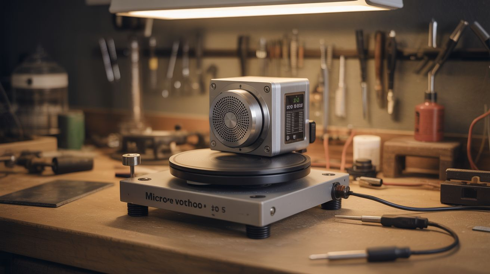

# #294 — Motor-Driven Turntable

  

> Microwave motor + lazy susan + potentiometer. Smooth, silent rotation for product photography, 3D scanning, or spin-coating. Commercial turntables cost $40-150. Build this for $5.

## Ratings

     

## 🧪 What Is It?

A motor-driven turntable is a rotating platform that spins at a controlled, consistent speed. The immediate use case is product photography — set a product on the platform, hit record, and get a smooth 360-degree rotation without touching anything. But the applications pile up fast: 3D scanning (most photogrammetry software expects consistent rotation), spray-painting small parts (spin the part instead of walking around it), drying coatings evenly, displaying models or collectibles, and even spin-coating thin films onto flat surfaces. Anywhere you need something to rotate slowly and smoothly, this is the tool.

The secret weapon here is the microwave turntable motor. Every microwave oven has one — a small synchronous AC motor geared down to 3-6 RPM. It's designed to rotate a glass plate loaded with food, quietly, for years. That means it already has the exact properties you want: low RPM, silent operation, enough torque to spin several pounds, and a coupling shaft that fits standard microwave turntable couplers. Pull one from a dead microwave and you're 80% done. These motors run directly on AC mains (120V/240V depending on your country), so there's no speed controller needed — plug it in and it spins. If you want variable speed, use a small DC geared motor instead and control it with a potentiometer.

The DC motor route gives you adjustable RPM, which matters for photography (slower = smoother video) versus painting (faster = more even coating). Either way, the build is dead simple. This is a one-afternoon project, possibly the easiest motorized build in this entire collection. The hardest part is cutting a clean circle for the platform, and even that's optional if you use a pre-made lazy susan or salvaged turntable platter.

<strong>🧰 Ingredients</strong>

- [ ] Microwave turntable motor — synchronous AC motor, 3-6 RPM, with D-shaft coupler *(dead microwave, ~$0)*
- [ ] **OR** small geared DC motor — 12V, 5-30 RPM range *(dead printer, power tool, or online ~$5-8)*
- [ ] Round platform — 10-14" diameter lazy susan, plywood disc, or salvaged record turntable platter *(thrift store ~$2, or cut from scrap plywood)*
- [ ] Potentiometer — 10K ohm, for speed control with DC motor *(electronics supplier ~$1)*
- [ ] Power supply — AC cord with plug for microwave motor, or 12V DC adapter for geared motor *(salvage from dead electronics, ~$0-3)*
- [ ] Mounting base — 3/4" plywood square, about 12" x 12" *(scrap pile or hardware store)*
- [ ] Shaft coupler — connects motor shaft to platform; microwave motors have a D-shaft that fits standard couplers *(3D print, or use a friction-fit rubber grommet)*
- [ ] Rubber feet — 4x adhesive pads to dampen vibration and prevent the base from creeping *(dollar store ~$1)*
- [ ] Screws and mounting hardware — to secure motor to base *(hardware store ~$2)*
- [ ] Optional: Arduino Nano + motor driver (L298N or similar) — for programmable speed, direction, and timed rotation *(~$7 total)*
- [ ] Optional: white foam board or fabric backdrop — instant mini photo studio *(dollar store ~$2)*

## 🔨 Build Steps

1. **Salvage the motor.**
If using a microwave motor: unplug the microwave, then discharge the capacitor.
This is non-negotiable — microwave capacitors can hold a lethal charge (2000V+) for days after unplugging.
Use an insulated screwdriver across the capacitor terminals, or a bleeder resistor.
Once safe, remove the small motor bolted to the floor of the microwave cavity.
It has two wires and a D-shaped shaft poking up through the cavity floor.
Cut the wires with plenty of length — you'll need slack for routing.
If using a DC geared motor from a printer, extract it along with any attached gearbox and note the voltage rating printed on the motor body.

2. **Build the base.**
Cut a 12" x 12" square of 3/4" plywood.
Drill a hole in the center sized for the motor shaft to pass through from underneath.
The motor mounts to the underside of the base with the shaft poking up through the top.
Sand the edges and corners — you'll be reaching across this thing regularly.
Stick rubber feet on the bottom corners to dampen vibration and prevent creeping.
If the base feels too light (it shouldn't walk across the table when the motor runs), glue a second layer of plywood to the underside or bolt some steel angle to it for mass.

3. **Mount the motor.**
Position the motor under the base, centered, with the shaft coming up through the hole.
Most microwave turntable motors have a flat mounting plate with screw holes — bolt it directly to the underside of the plywood using short wood screws or machine bolts with T-nuts.
For a DC motor without a mounting flange, fabricate a small bracket from scrap sheet metal or 3D-print a cradle.
The motor must be perpendicular to the base.
Any tilt means the platform wobbles, and wobble means your product photography is useless.
Use a square or level against the shaft to verify alignment.

4. **Attach the platform.**
For a microwave motor with its D-shaft, the simplest approach is the microwave turntable coupler — that three-pronged plastic piece that normally sits on the shaft inside the microwave.
Glue or screw the coupler to the underside center of your platform disc.
It clicks onto the motor shaft and drives the platform.
For a DC motor with a round shaft, use a set-screw shaft coupler, a friction-fit rubber grommet, or drill a tight hole in the platform center and press it onto the shaft with a dab of epoxy.
A lazy susan bearing between the base and platform adds stability for heavier loads — the motor drives the rotation while the bearing carries the weight.

5. **Set the platform height.**
You need a small gap (1/8" to 1/4") between the bottom of the spinning platform and the top of the stationary base.
The motor shaft length usually provides this naturally.
If the platform drags on the base, add a washer or spacer on the shaft below the platform.
If it sits too high and wobbles, shorten the coupler or add a thrust washer.
The platform should spin freely with zero contact against the base.

6. **Wire the AC motor (microwave motor path).**
Attach a power cord with a plug to the motor's two wires.
That's it.
Polarity doesn't matter — it's a synchronous AC motor.
Solder the connections and insulate with heat-shrink tubing.
Add an inline rocker switch so you can start and stop without yanking the plug.
When you flip the switch, the motor spins at its fixed RPM.
No speed control, no driver, no code.
Beautifully stupid simple.

7. **Wire the DC motor (variable speed path).**
Connect the motor to a potentiometer-based speed circuit.
Simplest version: wire a 10K potentiometer and the motor in a PWM circuit using a 555 timer IC — this gives smooth speed control from near-zero to full RPM.
Don't just wire the pot in series as a voltage divider; it wastes power as heat and gives jerky low-speed performance.
Better version: use a small off-the-shelf PWM motor driver module (they're a few bucks and take a knob input directly).
Best version: wire the motor through an L298N driver controlled by an Arduino, giving you programmable speed, direction reversal, and timed stops for photography intervals.

8. **Balance the platform.**
Spin the platform by hand and watch for wobble.
If one side dips, the platform isn't centered on the shaft or the disc itself is uneven.
Re-center and re-mount.
For a plywood disc, sand the heavy side or add a small counterweight — a coin taped to the underside of the light side works.
A balanced platform is the difference between smooth footage and seasick-inducing video.
For critical photography work, stick a bubble level on the platform and adjust until it reads true while spinning.

9. **Test unloaded.**
Power on and let it spin for a few minutes.
Watch for vibration migrating through the base to the table surface.
If the whole setup walks across the table, the rubber feet aren't grippy enough or there's a balance issue.
Listen for noise — microwave motors should be nearly inaudible.
DC motors with gearboxes can hum or whine; rubber-mounting the motor to the base (using rubber grommets instead of rigid bolts) reduces transmitted noise significantly.

10. **Test with weight.**
Place a representative object on the platform — something close to the heaviest thing you plan to spin.
The motor shouldn't slow down noticeably or stall.
Microwave motors can handle 5-7 lbs without flinching.
Small DC geared motors vary widely — if yours struggles under load, you need a motor with more torque or lower RPM (lower RPM through gearing means more torque at the output shaft).
Center the weight on the platform.
Off-center loads create wobble that gets worse with mass.

11. **Set up for photography (optional).**
Tape a sheet of white foam board into a curved sweep — one edge on the table behind the turntable, curving up and over to form a seamless background.
Position two desk lamps or LED panels at 45-degree angles to the product.
Diffuse the light through a sheet of paper or thin fabric to kill harsh shadows.
Place your product on the turntable, start the motor, and record video with your phone or camera on a tripod.
For 3D scanning, consistent lighting and a plain background are critical — the scanning software needs to cleanly separate the object from the background.
A matte black surface under the object helps eliminate reflections.

12. **Add programmable control (optional).**
Flash an Arduino Nano with a sketch that drives the motor via the potentiometer for speed, with a button to reverse direction and another to toggle between continuous rotation and step-pause mode.
Step-pause mode rotates a fixed number of degrees, pauses for N seconds (so your camera can fire a shot), then rotates again — perfect for automated 36-image product turnarounds or photogrammetry capture.
Stepper motors are ideal for this since they move in precise angular increments.
If you have a NEMA 17 from a dead printer, swap it in for the DC motor and use an A4988 driver for exact angular control.
Ten degrees per step, 36 steps per revolution, one photo per step — that's a complete 3D scan orbit with no manual intervention.

## ⚠️ Safety Notes

- If salvaging a microwave turntable motor, you must discharge the magnetron capacitor first.
Microwave capacitors can retain a lethal charge (2000V+) for days after the oven is unplugged.
Use an insulated screwdriver across the capacitor terminals, or a discharge resistor.
Do not skip this step.
The turntable motor itself is low-voltage and harmless — the danger is the capacitor sitting right next to it inside the microwave.

- The AC microwave motor runs on mains voltage (120V or 240V).
All wire connections must be properly insulated with wire nuts and heat-shrink tubing.
No exposed copper, period.
If you're not comfortable wiring mains-voltage devices, use the DC motor path instead — it's 12V and won't kill you.

- Spinning platforms can fling objects off if they're not centered or if the RPM is too high.
Don't place anything fragile or valuable on the turntable without a test run using a dummy weight first.
Keep fingers, hair, and loose clothing away from the gap between the spinning platform and the stationary base.

- If using a lithium battery pack for a portable DC version, follow standard lithium safety: don't charge unattended, inspect for swelling, and store on a non-flammable surface.

## 🔗 See Also

- [Motor-Powered Pottery Wheel](292-motor-powered-pottery-wheel.md)
- [Electric Skateboard](088-electric-skateboard.md)

**References:**
- [Appliance Teardown Guide](../../reference/appliance-teardown-guide.md)
- [Technical Glossary](../../reference/glossary.md)
- [Electronics & Microcontrollers Guide](../../reference/electronics-and-microcontrollers.md)
