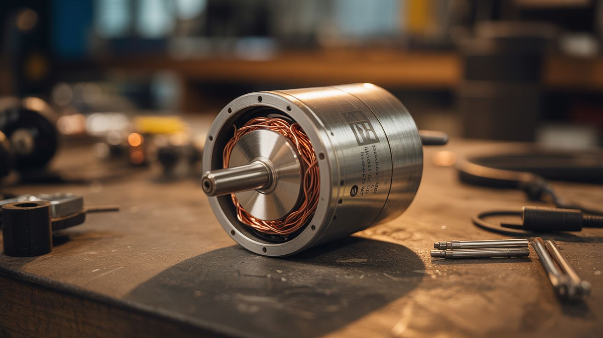

# ⚙️ Scooter & Motor

  

  

> Every dead scooter motor is a brushless beast waiting to power something wilder than a sidewalk ride.

Dead electric scooters, hoverboards, and e-bikes contain some of the most useful motors you'll ever salvage: brushless DC motors with built-in hall effect sensors, designed to deliver smooth torque at variable speeds. Paired with ESCs (electronic speed controllers), they power everything from skateboards to camera sliders to winches. And here's the physics bonus: every motor is also a generator. Spin the shaft with wind, water, or pedal power and it produces electricity. A $200 scooter's motor alone is worth the salvage.

---

## Builds

<a class="cat-card" href="088-electric-skateboard.md">
#088Electric Skateboard

Jaw

Brain

Wallet

Spicy

Clout

Time

</a>
<a class="cat-card" href="089-motorized-camera-slider.md">
#089Motorized Camera Slider

Jaw

Brain

Wallet

Spicy

Clout

Time

</a>
<a class="cat-card" href="090-electric-winch.md">
#090Electric Winch

Jaw

Brain

Wallet

Spicy

Clout

Time

</a>
<a class="cat-card" href="091-wind-phone-charger.md">
#091Wind Phone Charger

Jaw

Brain

Wallet

Spicy

Clout

Time

</a>
<a class="cat-card" href="292-motor-powered-pottery-wheel.md">
#292Motor-Powered Pottery Wheel

Jaw

Brain

Wallet

Spicy

Clout

Time

</a>
<a class="cat-card" href="293-electric-fence-charger.md">
#293Electric Fence Charger

Jaw

Brain

Wallet

Spicy

Clout

Time

</a>
<a class="cat-card" href="294-motor-driven-turntable.md">
#294Motor-Driven Turntable

Jaw

Brain

Wallet

Spicy

Clout

Time

</a>
<a class="cat-card" href="273-washing-machine-motor-lathe.md">
#273Washing Machine Motor Lathe

Jaw

Brain

Wallet

Spicy

Clout

Time

</a>

---

### Suggested Build Order

Start with simple motor repurposing, then tackle power electronics:

1. **[#294 — Motor-Driven Turntable](294-motor-driven-turntable.md)** — Simplest motor project. One motor, one platform.
2. **[#089 — Motorized Camera Slider](089-motorized-camera-slider.md)** — Stepper control and linear motion.
3. **[#292 — Motor-Powered Pottery Wheel](292-motor-powered-pottery-wheel.md)** — Hub motor + speed control.
4. **[#090 — Electric Winch](090-electric-winch.md)** — High-torque motor applications.
5. **[#091 — Wind Phone Charger](091-wind-phone-charger.md)** — Motor as generator. Reverse the physics.
6. **[#088 — Electric Skateboard](088-electric-skateboard.md)** — Full ESC + battery + motor integration.
7. **[#293 — Electric Fence Charger](293-electric-fence-charger.md)** — High-voltage pulse circuits. Respect the zap.

### Related Categories

- [Functional Machines](../functional-machines/) — Motor-driven tools and equipment
- [Power & Energy](../power-and-energy/) — Motors as generators and energy systems
- [Drone Salvage](../drone-salvage/) — Brushless motor applications and ESC programming

---

## 📚 Reference Guides

- [Appliance Teardown Guide](../../docs/reference/appliance-teardown-guide.md)
- [Tools Needed](../../docs/reference/tools-needed.md)
- [Sourcing Guide](../../docs/reference/sourcing-guide.md)
- [Difficulty & Ratings Guide](../../docs/reference/difficulty-guide.md)
