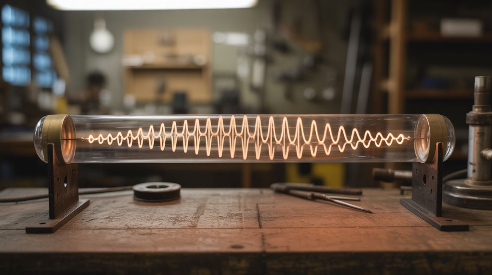

# #009 — Rubens' Tube

  

> A gas-filled tube with a row of holes shows standing sound waves as a dancing wall of fire — the most elegant physics demo ever built.

## Ratings

     

## 🧪 What Is It?

A Rubens' tube is a metal pipe sealed at both ends with a row of small holes drilled along the top. One end has a gas inlet (propane), and the other end has a speaker membrane. When you fill the tube with propane and light the holes, you get a row of small flames. Play a tone through the speaker, and the sound waves create pressure variations inside the tube — the flames at pressure nodes shrink, and the flames at antinodes grow taller. You get a real-time, physical visualization of standing wave patterns drawn in fire.

Change the frequency and the flame pattern changes instantly. Low frequencies produce long, lazy waves with a few peaks. High frequencies produce many short peaks. Play music and the flames dance to the beat. It's physics and fire art simultaneously.

<strong>🧰 Ingredients</strong>

- [ ] Steel or aluminum tube, 4-6 feet long, 2-3 inch diameter *(source: hardware store or scrap metal, ~$10-15)*
- [ ] Propane tank with regulator and hose *(source: BBQ supply, ~$10 for regulator if you already have a tank)*
- [ ] Speaker, 4-6 inch woofer *(source: dead boom box or car speaker, free)*
- [ ] Latex sheet or rubber membrane *(source: balloon, rubber glove, or exercise band, ~$1)*
- [ ] Amplifier — any small amp or powered speaker amp board *(source: old stereo, thrift store, ~$5)*
- [ ] End caps for the tube *(source: hardware store pipe caps, ~$5)*
- [ ] Drill with small bit (1/16" or 1mm) *(source: own or borrow)*
- [ ] JB Weld or high-temp silicone sealant *(source: hardware store, ~$5)*
- [ ] Phone or signal generator for audio source *(source: already own)*

## 🔨 Build Steps

1. **Drill the flame holes.** Mark a straight line along the top of your tube using a chalk line or tape. Drill holes every 1/2 inch (about 1cm apart) along the entire length. Use a 1/16" or 1mm drill bit. Keep the holes evenly spaced — uneven spacing produces uneven baseline flame heights. Deburr each hole.

2. **Seal one end with the gas inlet.** Cap one end of the tube with a pipe cap. Drill a hole in the cap and install a brass fitting for the propane hose. Seal everything with JB Weld or high-temp silicone. This end needs to be gas-tight.

3. **Build the speaker end.** On the other end, mount the speaker facing into the tube with a flexible membrane seal between the speaker cone and the tube opening. The speaker pushes air (and therefore pressure waves) into the tube without letting gas escape. A latex balloon stretched over the tube end with the speaker pressed against it works well. The membrane must be flexible enough to transmit sound but sealed enough to hold gas.

4. **Leak test.** Before using propane, seal all the flame holes with tape, connect the gas line, and pressurize very gently. Spray soapy water on all joints and seams. Fix any bubbles. Gas leaks at the wrong place are bad news.

5. **Fill with propane.** In a well-ventilated area (preferably outdoors), remove the tape from the holes, connect the propane, and open the valve slowly. Let gas flow for 30-60 seconds to purge all air from the tube. You'll smell the propane coming out of the holes when the tube is full.

6. **Light the flames.** Using a long BBQ lighter or taper, run the flame along the row of holes from one end to the other. All the holes should light with small, even flames. Adjust the gas flow so the flames are about 1-2 inches tall at baseline. Too much gas and the flames are uncontrollable; too little and they go out when you play sound.

7. **Connect the audio.** Wire the speaker to your amplifier. Connect your phone or a signal generator app to the amplifier input. Start with a simple sine wave tone.

8. **Play tones and observe.** Start with a low frequency (100-200 Hz) and slowly sweep upward. At resonant frequencies of the tube, you'll see clear standing wave patterns — alternating tall and short flames. The number of peaks increases with frequency. This is literally what sound waves look like.

9. **Play music.** Switch from sine waves to actual music. Bass-heavy music with clear beats works best — the flames will jump and dance with the rhythm. Electronic music, hip-hop, and anything with deep bass creates the most dramatic visual response.

## ⚠️ Safety Notes

> **Spicy Level 3 build.** Read the [Safety Guide](../../docs/safety/README.md) before starting.

> [!WARNING]
> **Propane is explosive.** A gas leak near the tube can accumulate and ignite explosively. Do this outdoors or in a very well-ventilated area. If the flames go out but gas is still flowing, shut off the gas immediately and let the area ventilate before relighting. Never relight if you smell accumulated gas.
- **The tube gets hot.** After running for more than a few minutes, the metal tube will be too hot to touch. Support it on non-flammable stands and don't grab it bare-handed to reposition. Let it cool fully before storing.
- **Keep the propane tank at a safe distance.** Use a hose at least 6 feet long between the tank and the tube. If the fire somehow travels back down the hose (flashback), you want the tank far away. A flashback arrestor fitting on the hose is a worthwhile $10 investment.

## 🔗 See Also

- [Propane Vortex Cannon](../fire-and-plasma/003-propane-vortex-cannon.md) — another propane project with dramatic fire effects
- [Plasma Speaker](008-plasma-speaker.md) — visualize sound with an electrical arc instead of fire
