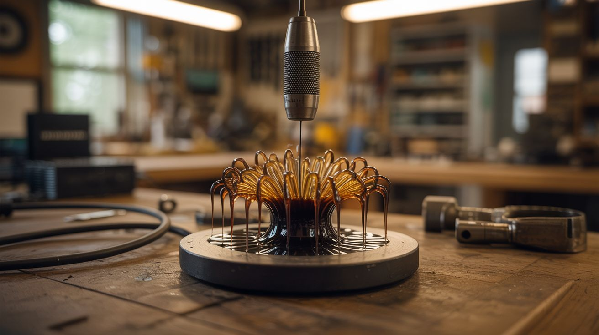

# #011 — Ferrofluid Speaker

  

> A speaker magnet meets ferrofluid and creates a living, dancing liquid sculpture that responds to every beat.

## Ratings

| Jaw Drop Rating | Brain Melt Level | Wallet Damage | Spicy Level | Clout Potential | Time to Build |
|---|---|---|---|---|---|
| ⭐⭐⭐⭐ | ⭐⭐ | ⭐⭐ | ⭐ | ⭐⭐⭐⭐ | ⭐ |

## What Is It?

Ferrofluid is a liquid suspension of nanoscale magnetic particles in a carrier oil. When exposed to a magnetic field, it forms dramatic spiky structures as the particles align with field lines. By placing ferrofluid on the magnet of a speaker and playing music, the changing electromagnetic field from the voice coil modulates the magnetic field strength, causing the ferrofluid to dance, spike, and flow in real time with the audio.

The result is mesmerizing — a jet-black liquid that seems alive, growing spines and tentacles with every bass hit and collapsing into smooth pools during quiet moments. Mounted in a clear container with backlighting, it becomes a kinetic art piece that responds to whatever you're listening to.

## Ingredients

- [ ] Ferrofluid, 2-4 oz *(source: online science supplier or make your own from toner powder and vegetable oil, ~$10-15)*
- [ ] Speaker with exposed magnet, 3-6 inch *(source: dead boom box, car speaker, or thrift store, free-$3)*
- [ ] Amplifier — small amp board or old stereo receiver *(source: thrift store or online, ~$5)*
- [ ] Clear container — petri dish, watch glass, or small glass bowl *(source: dollar store, ~$2)*
- [ ] Audio cable (3.5mm) *(source: old headphone cable, free)*
- [ ] LED strip or small flashlight for backlighting *(source: dollar store or around the house, ~$3)*
- [ ] Plastic wrap or clear acrylic sheet for containment *(source: around the house)*

## Build Steps

1. **Prepare the speaker.** Remove the speaker from its enclosure so the magnet on the back is exposed. The magnet is the heavy disc on the rear of the speaker — this is what the ferrofluid will respond to. Clean the magnet surface so it's flat and free of debris.

2. **Position the speaker.** Mount the speaker magnet-side up, so the magnet faces the ceiling. The speaker cone faces down. Secure it so it doesn't rock or tip. A small box or stand works well.

3. **Create the ferrofluid stage.** Place a clear petri dish, watch glass, or shallow glass container directly on top of the speaker magnet. This is where the ferrofluid will sit and perform. The container keeps the ferrofluid from running off the magnet and staining everything it touches (ferrofluid stains are permanent on most surfaces).

4. **Add the ferrofluid.** Carefully pour or pipette 1-2 tablespoons of ferrofluid into the center of the glass container. It should immediately form a dome or mound shape as the magnet underneath pulls it. If it stays flat and liquid-looking, your container might be too thick — the magnet needs to be close enough to influence the fluid.

5. **Wire the audio.** Connect your amplifier to the speaker's voice coil leads. Connect your phone or audio source to the amplifier's input via the 3.5mm cable. Keep the volume at zero initially.

6. **Add lighting.** Position LED strips or a small light behind or below the ferrofluid container. Backlighting makes the spikes and structures dramatically more visible. White or colored LEDs both work — experiment with what looks best against the black fluid.

7. **Play music and adjust.** Start playing bass-heavy music and slowly increase the volume. The ferrofluid will begin to respond — growing spikes with bass hits and flowing with the rhythm. Too much volume can cause the fluid to spray or pool off the magnet. Find the range where the motion is dramatic but controlled.

8. **Experiment with audio.** Try different genres. Deep bass produces large, slow spike movements. Midrange vocals create rapid surface ripples. Try a pure sine wave sweep from 20 Hz to 1 kHz and watch how the fluid responds differently at each frequency.

## Safety Notes

- **Ferrofluid stains everything permanently.** It contains nanoscale iron particles in oil — it will stain skin, clothing, countertops, and wood on contact. Work over newspaper or a disposable surface. Wear gloves when handling. If it gets on skin, mineral oil or rubbing alcohol helps remove it faster than soap.
- **Keep ferrofluid away from electronics and credit cards.** The magnetic particles can damage magnetic strips, hard drives, and sensitive electronics. Work away from laptops and phones, and wash hands thoroughly before handling other devices.

## See Also

- [Ultrasonic Levitator](010-ultrasonic-levitator.md) — another way to make invisible physical forces create visible wonder
- [CRT Oscilloscope Visualizer](../light-and-visual/021-crt-oscilloscope-visualizer.md) — visualize music on a screen instead of in a liquid

**References:**
- [Appliance Teardown Guide](../../reference/appliance-teardown-guide.md)
- [Technical Glossary](../../reference/glossary.md)
