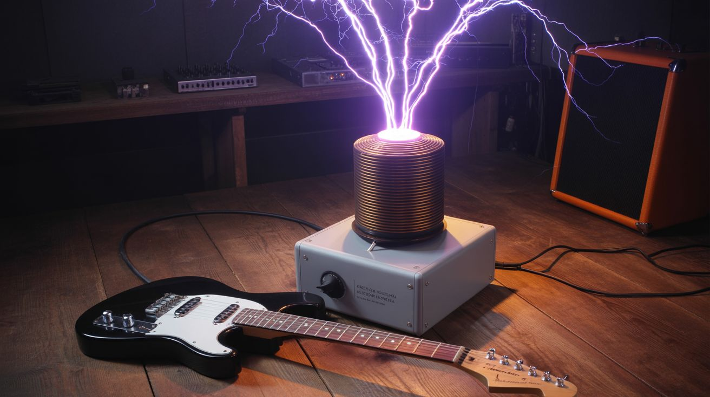

# #315 — Tesla Coil Guitar Amp

  

> Plug your guitar into a Tesla coil. The arc IS the speaker — lightning bolts modulated by your riff.

## Ratings

     

## 🧪 What Is It?

A solid-state Tesla coil (SSTC or DRSSTC) with an audio interrupter circuit that accepts guitar input. Instead of producing a continuous arc, the coil's discharge is modulated by the guitar signal — the arc length, brightness, and intensity follow the audio waveform. The rapidly heating and cooling air around the arc creates pressure waves (sound), so the lightning bolt literally becomes a speaker. Every note you play is a visible bolt of electricity that you can hear. Power chords have never been this literal.

The DRSSTC (Dual Resonant Solid State Tesla Coil) is the preferred topology because it produces fat, loud arcs at controllable duty cycles. The audio interrupter takes the guitar signal, processes it into a PWM control signal, and gates the Tesla coil's primary oscillator. High notes produce thin, rapid arcs. Low notes produce thick, lazy discharges. Distortion sounds absolutely demonic through a Tesla coil because the arc clips and distorts in its own unique way, adding harmonics that no amp simulator can replicate. Clean tones shimmer. Palm mutes crack like miniature thunder.

The DRSSTC works by driving a primary coil at the resonant frequency of the secondary coil, using an H-bridge of IGBT transistors. The secondary resonates at tens to hundreds of kilohertz, building up voltage until it breaks down the air at the toroid and produces an arc. The audio interrupter controls when the H-bridge fires — modulating on-time and repetition rate to encode the guitar signal into the discharge pattern. The arc acts as a plasma speaker: the superheated air channel expands and contracts with each pulse, creating sound waves that carry the guitar signal to your ears. The frequency response is limited (roughly 200 Hz to 10 kHz), but for guitar, that covers the entire musical range with character to spare.

<strong>🧰 Ingredients</strong>

- [ ] DRSSTC driver board or H-bridge — IGBT modules rated for high pulse current *(salvage from inverter welder, UPS, or induction cooktop — or buy assembled driver board, ~$40)*
- [ ] Secondary coil form — PVC pipe, 3-4" diameter, 12-18" long *(hardware store, ~$5)*
- [ ] Magnet wire — 28-32 AWG, enough for ~1000 turns on the secondary form *(dead motor or transformer winding, or electronics supplier, ~$10)*
- [ ] Primary coil — 1/4" copper tubing, 5-8 turns *(dead refrigerator coil or hardware store, ~$10)*
- [ ] MMC (Multi-Mini Capacitor) bank — polypropylene film capacitors rated for pulse service *(electronics supplier, ~$15-20)*
- [ ] Toroid — spun aluminum duct end cap, or formed from flexible dryer vent tubing into a donut shape *(hardware store, ~$5-10)*
- [ ] GDT (Gate Drive Transformer) — small ferrite toroid core + magnet wire *(salvage ferrite from dead CFL bulb or switching power supply, free)*
- [ ] Audio interrupter module — ATtiny85 or Arduino-based, builds from open-source schematics *(electronics bin + breadboard, ~$5)*
- [ ] Guitar input — 1/4" jack + preamp circuit *(dead guitar amp or effects pedal, free)*
- [ ] Power supply — 120-340VDC bus (rectified mains or variac + bridge rectifier) *(dead microwave, ATX power supply components, or variac from e-waste — free to $20)*
- [ ] RF ground — copper pipe or ground rod + heavy gauge wire *(hardware store, ~$10)*
- [ ] Polyurethane coating — for secondary coil insulation *(hardware store, ~$5)*

## 🔨 Build Steps

1. **Wind the secondary coil.** Mount the PVC pipe in a lathe, slow drill, or winding jig. Wind approximately 1000 turns of 28-32 AWG magnet wire in a single, tight layer. Keep the turns even and close together — gaps reduce the coil's Q factor and produce weaker arcs. Leave 2" bare at each end. Apply 3-4 coats of polyurethane, letting each coat dry fully, to insulate the windings against high-voltage breakdown.

2. **Build the primary coil.** Form 5-8 turns of 1/4" copper tubing in a flat spiral or helical coil at the base of the secondary. The primary should be spaced 1-2 inches away from the secondary to prevent arcing between them. Leave enough tubing at each end for connections. The primary carries hundreds of amps in short pulses, so connections must be solid — bolted lugs, not alligator clips.

3. **Build the MMC capacitor bank.** Calculate the required capacitance to resonate with the primary inductance at the secondary's resonant frequency. Wire polypropylene film capacitors in a series-parallel arrangement to achieve the target capacitance and voltage rating. Each capacitor should be rated for pulse service — standard electrolytics will fail immediately. Use bleeder resistors across each capacitor for safety during discharge.

4. **Assemble the DRSSTC driver.** Wire the IGBT H-bridge with the gate drive transformer (GDT) for isolated gate signals. The driver must include a current-sensing feedback circuit — the coil self-resonates by tracking the secondary's natural resonant frequency. The feedback antenna (a short wire near the secondary base) picks up the resonant signal and feeds it back to the driver, which locks onto the frequency automatically. Test the driver at low voltage first with an oscilloscope on the feedback signal to verify clean resonance tracking.

5. **Build the audio interrupter.** The interrupter is a small circuit that takes the guitar signal and converts it into a control signal for the DRSSTC driver's enable pin. Guitar signal goes through a preamp stage (for level matching), then an envelope follower (to extract volume dynamics), then a PWM generator. The PWM output gates the driver — when the enable pin is high, the coil fires; when low, it doesn't. Modulating the pulse width and repetition rate reproduces audio through the arc. Open-source interrupter schematics for ATtiny85 and Arduino are widely available in the Tesla coil community.

6. **Mount the toroid.** Attach the toroid to the top of the secondary coil. The toroid capacitively loads the secondary, lowering its resonant frequency and providing a smooth, rounded surface that shapes the arc breakout point. A spun aluminum duct end cap (8-12" diameter) works well. A toroid formed from flexible dryer vent tubing bent into a donut and wrapped in aluminum tape is the classic junkyard approach.

7. **Establish the RF ground.** Drive a copper pipe or ground rod into the earth near the coil. Connect it to the secondary base with heavy gauge wire (10 AWG or larger). A proper RF ground is essential — without it, the coil will find its own ground path through nearby electronics, wiring, or you. If operating on concrete (garage, patio), run a ground bus wire to an earth ground point.

8. **Test without audio first.** Power up the coil at reduced voltage (use a variac if available). Verify clean, stable arcs from the toroid. Listen for any unusual buzzing, clicking, or arcing from places other than the toroid — these indicate insulation breakdown, primary-to-secondary arcing, or driver issues. Fix any problems before proceeding. The coil should produce clean, white-purple arcs with a characteristic hissing/buzzing sound.

9. **Connect the guitar and play.** Plug the guitar into the interrupter's 1/4" input jack. Power up the coil. Play a simple riff — single notes at first — and adjust the interrupter gain and duty cycle until the arc clearly reproduces the audio. You should be able to hear the notes from several feet away, produced entirely by the arc. Adjust the maximum duty cycle to control arc length and volume. Higher duty cycle means longer arcs and louder audio, but also more stress on the IGBTs.

## ⚠️ Safety Notes

> **Spicy Level 4 build.** Read the [Safety Guide](../../safety/README.md) before starting.

> [!CAUTION]
> **This is a lethal high-voltage device.** The primary circuit carries hundreds of amps at kilovolt-level voltages. A direct contact with the primary bus or MMC bank can kill instantly. Full high-voltage safety protocols apply at all times. Never reach toward any part of the circuit while powered. Use a variac or current-limited power supply during testing.
- **The MMC bank stores lethal energy even after power-off.** Always discharge capacitors with a grounded shorting stick before touching anything. Bleeder resistors help but are not a substitute for active discharge verification.
- **RF ground is mandatory.** Without it, the return current path is unpredictable and potentially through nearby electronics, building wiring, or people.
- **The arc produces UV radiation and ozone.** Prolonged exposure to the arc's UV output can cause eye irritation and skin burns. Ozone buildup in enclosed spaces causes respiratory irritation. Operate outdoors or in a well-ventilated area.
- **Intense EMI.** The coil produces broadband electromagnetic interference that can damage or disrupt nearby electronics, including phones, computers, and pacemakers. Keep all electronics at least 15 feet away. People with pacemakers or other implanted medical devices must not be near an operating Tesla coil.
- **Build a kill switch** that you can reach without approaching the coil — a clearly marked, easily accessible emergency power cutoff.
- **This build is for experienced high-voltage builders only.** If you have not built and safely operated high-voltage circuits before, start with lower-voltage projects first.

## 🔗 See Also

- [Plasma Speaker](008-plasma-speaker.md)
- [Plasma Speaker Lamp](../unholy-combos/283-plasma-speaker-lamp.md)

**References:**
- [Appliance Teardown Guide](../../reference/appliance-teardown-guide.md)
- [Technical Glossary](../../reference/glossary.md)
- [Electronics & Microcontrollers Guide](../../reference/electronics-and-microcontrollers.md)
