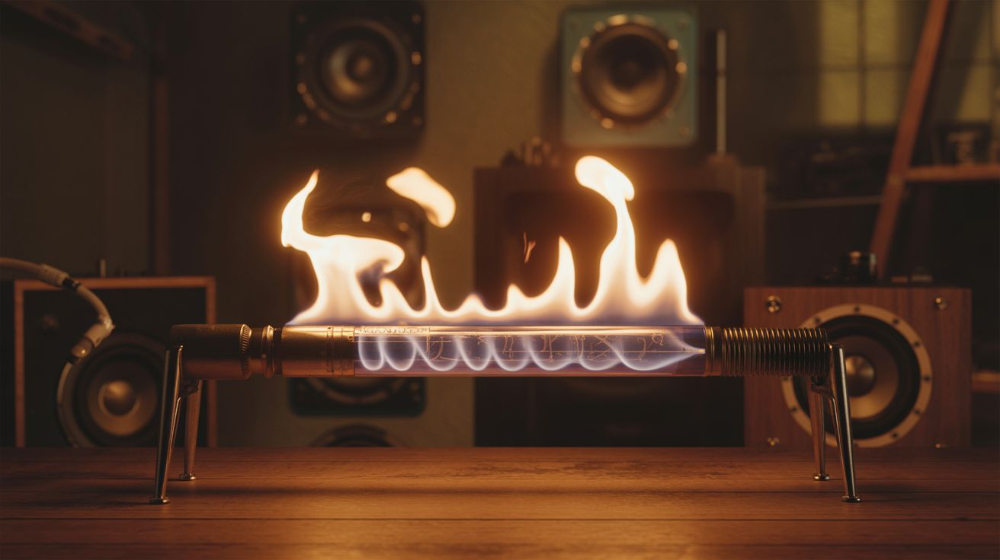

# 🔊 Sound & Music

  

  

> Builds that make noise in ways that shouldn't be possible — speakers made from lightning, fire that dances to bass, and objects floating on invisible waves.

This category covers acoustic and audio projects that exploit physics in unexpected ways. Some produce sound, some visualize it, and some use it to do things that look like magic.

**Common salvage sources:** Old speakers, flyback transformers from CRT TVs, ultrasonic transducers from humidifiers, springs, wire, small motors.

## Builds

<a class="cat-card" href="008-plasma-speaker.md">
#008Plasma Speaker

Jaw

Brain

Wallet

Spicy

Clout

Time

</a>
<a class="cat-card" href="009-rubens-tube.md">
#009Rubens' Tube

Jaw

Brain

Wallet

Spicy

Clout

Time

</a>
<a class="cat-card" href="010-ultrasonic-levitator.md">
#010Ultrasonic Levitator

Jaw

Brain

Wallet

Spicy

Clout

Time

</a>
<a class="cat-card" href="011-ferrofluid-speaker.md">
#011Ferrofluid Speaker

Jaw

Brain

Wallet

Spicy

Clout

Time

</a>
<a class="cat-card" href="012-thunder-drum.md">
#012Thunder Drum

Jaw

Brain

Wallet

Spicy

Clout

Time

</a>
<a class="cat-card" href="013-aeolian-wind-harp.md">
#013Aeolian Wind Harp

Jaw

Brain

Wallet

Spicy

Clout

Time

</a>
<a class="cat-card" href="014-bone-conduction-speaker.md">
#014Bone Conduction Speaker

Jaw

Brain

Wallet

Spicy

Clout

Time

</a>
<a class="cat-card" href="315-tesla-coil-guitar-amp.md">
#315Tesla Coil Guitar Amp

Jaw

Brain

Wallet

Spicy

Clout

Time

</a>

---

### Suggested Build Order

Start with simple acoustic physics and build toward high-voltage audio:

1. **[#012 — Thunder Drum](012-thunder-drum.md)** — Spring + can. Simplest build.
2. **[#014 — Bone Conduction Speaker](014-bone-conduction-speaker.md)** — Piezo vibrates objects into speakers.
3. **[#013 — Aeolian Wind Harp](013-aeolian-wind-harp.md)** — Wind plays strings automatically.
4. **[#011 — Ferrofluid Speaker](011-ferrofluid-speaker.md)** — Magnetic liquid dances to music.
5. **[#010 — Ultrasonic Levitator](010-ultrasonic-levitator.md)** — Sound waves hold objects in mid-air.
6. **[#009 — Rubens' Tube](009-rubens-tube.md)** — Fire dances to sound. Propane required.
7. **[#008 — Plasma Speaker](008-plasma-speaker.md)** — Arc discharge reproduces audio.
8. **[#315 — Tesla Coil Guitar Amp](315-tesla-coil-guitar-amp.md)** — Play guitar through lightning. The endgame.

### Related Categories

- [Fire & Plasma](../fire-and-plasma/) — More fire + plasma builds
- [Junk Instruments](../junk-instruments/) — Playable instruments from salvage
- [Art & Installation](../art-and-installation/) — When sound becomes visual art

---

## 📚 Reference Guides

- [Tools Needed](../../docs/reference/tools-needed.md)
- [Sourcing Guide](../../docs/reference/sourcing-guide.md)
- [Difficulty & Ratings Guide](../../docs/reference/difficulty-guide.md)
