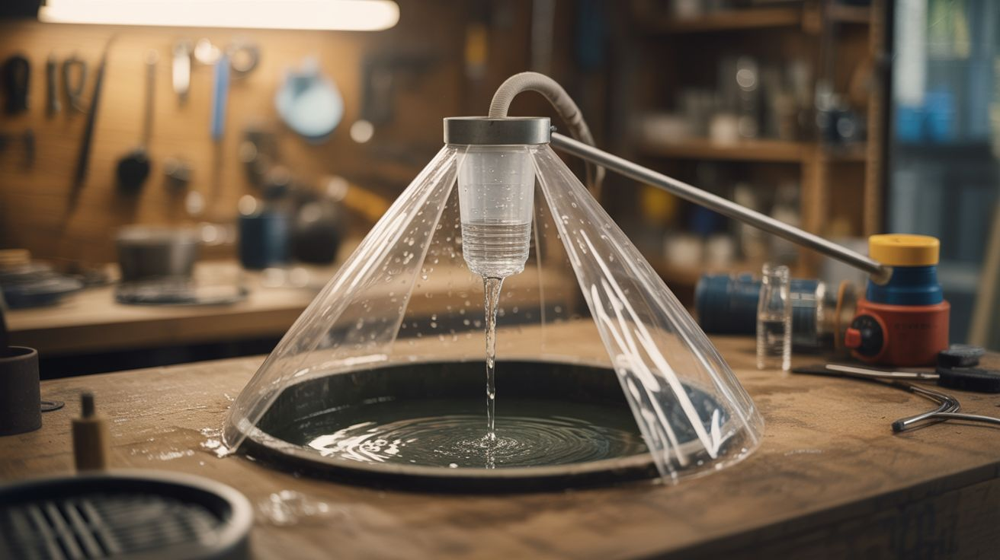

# #248 — Solar Still

  

> Plastic over pit + collection cup = distilled water from sun.

## Ratings

| Jaw Drop Rating | Brain Melt Level | Wallet Damage | Spicy Level | Clout Potential | Time to Build |
|---|---|---|---|---|---|
| ⭐⭐⭐ | ⭐ | ⭐ | ⭐ | ⭐⭐⭐ | ⭐⭐ |

## What Is It?

A solar still uses the sun to evaporate water from moist soil, contaminated water, or even vegetation, then condenses the vapor on a plastic sheet and drips it into a collection cup. It's the same water cycle that makes rain, just miniaturized into a hole in the ground. The sun heats the air under the plastic, moisture evaporates from whatever's in the pit, rises to hit the cooler plastic sheet, condenses into droplets, and gravity pulls them down to the lowest point — where your cup is waiting. The output is distilled water: no salt, no bacteria, no sediment. It won't win any speed contests — expect half a liter to a liter per day from a good-sized still — but when there's no other option, it's the difference between hydration and heat stroke.

## Ingredients

- [ ] Clear plastic sheeting — 6x6 feet minimum, thicker is better *(hardware store, trash bags in a pinch)*
- [ ] Shovel or digging tool *(toolbox, sharp stick in a real emergency)*
- [ ] Collection cup or container — wide mouth preferred *(junk drawer, cut-off bottle)*
- [ ] Small rock or weight — to create the cone shape in the plastic *(ground)*
- [ ] Larger rocks or dirt — to anchor the plastic edges *(ground)*
- [ ] Optional: surgical tubing or straw — lets you drink without dismantling the still *(pharmacy, aquarium supply)*
- [ ] Optional: contaminated water or vegetation — to increase moisture in the pit *(any water source, green leaves)*

## Build Steps

1. **Choose your location.** Pick a spot with maximum sun exposure throughout the day. South-facing slopes are ideal in the northern hemisphere. Avoid shade from trees or structures. Low ground where moisture naturally collects gives you a head start.
2. **Dig the pit.** Excavate a bowl-shaped hole about 3 feet across and 2 feet deep. The wider and deeper, the more surface area for evaporation. Slope the sides smoothly — you don't want dirt crumbling in later.
3. **Add moisture sources.** If the soil isn't already damp, pour in any available water — muddy, salty, contaminated, doesn't matter. You can also pack the pit with green leaves, grass, or cactus pads. Anything with moisture will work. The still purifies whatever evaporates.
4. **Place the collection cup.** Set your container at the very center of the pit's bottom. Make sure it's stable and won't tip over. If you have tubing, run one end into the cup and the other up and out over the pit edge so you can sip without opening the still.
5. **Cover with plastic.** Lay the plastic sheet over the pit. Extend it at least a foot past the edges in every direction. Anchor the edges with rocks, dirt, or logs to create an airtight seal. Any air leaks reduce efficiency.
6. **Create the drip point.** Place a small rock on the center of the plastic sheet, directly above the collection cup. This creates an inverted cone shape so condensation runs down to the lowest point and drips into the cup.
7. **Wait.** The still needs full sun and time to work. Leave it undisturbed for at least 4-6 hours. Opening it releases the trapped humid air and resets the process. Check and harvest water in the evening.
8. **Harvest and reset.** Carefully lift one edge of the plastic, remove the cup, and drink. Replace any vegetation that has dried out with fresh material. Re-seal and repeat daily.

## Safety Notes

- Solar stills purify water through evaporation and condensation, but this process does not remove volatile organic compounds or chemicals with boiling points near water. Do not use with fuel-contaminated or chemically polluted water.
- Output is low — a solar still is a supplement, not a primary water source. In a real survival situation, pursue multiple water strategies simultaneously.
- In desert environments, the energy you spend digging the pit can cause you to sweat out more water than the still produces. Dig during cool hours (dawn or dusk), not in peak sun.

## See Also

- [Gravity Water Filter](250-gravity-water-filter.md)
- [Rocket Stove](253-rocket-stove.md)
