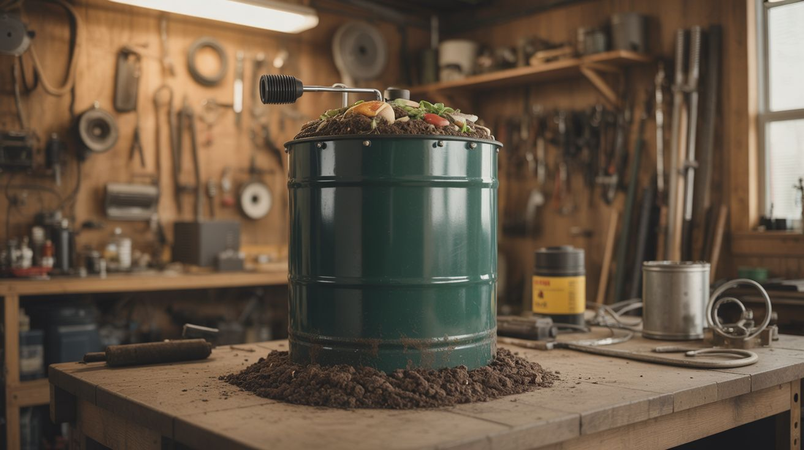

# #249 — Biogas Generator

  

> Sealed drum + compost = methane for cooking. Cook food from rotting food.

## Ratings

| Jaw Drop Rating | Brain Melt Level | Wallet Damage | Spicy Level | Clout Potential | Time to Build |
|---|---|---|---|---|---|
| ⭐⭐⭐⭐ | ⭐⭐⭐ | ⭐⭐ | ⭐⭐⭐ | ⭐⭐⭐⭐ | ⭐⭐⭐ |

## What Is It?

Anaerobic bacteria eat organic waste and produce methane — the same natural gas that powers your kitchen stove. A biogas generator is just a sealed container where you feed these bacteria kitchen scraps, manure, or any organic waste, and collect the gas that comes off. The concept is ancient. Farmers in India and China have used biogas digesters for centuries. The engineering is simple: a sealed drum with an inlet for waste, an outlet for gas, and a way to drain the spent slurry (which happens to be excellent fertilizer). A well-fed household digester can produce enough methane to cook for 2-4 hours per day. You are literally cooking dinner with yesterday's dinner.

## Ingredients

- [ ] 55-gallon plastic drum with sealable lid — must be airtight *(hardware store, industrial surplus)*
- [ ] Smaller bucket or drum — for gas collection/storage *(hardware store)*
- [ ] PVC pipe and fittings — 1" diameter for gas line, 3" for waste inlet *(hardware store)*
- [ ] Ball valve — to control gas flow *(hardware store, plumbing supply)*
- [ ] Silicone sealant — to make all connections airtight *(hardware store)*
- [ ] Garden hose or flexible tubing — for gas delivery to burner *(junk drawer)*
- [ ] Inner tube from a tire — makes a flexible gas storage bladder *(bike shop, junkyard)*
- [ ] Single-burner propane stove — repurposed for biogas *(camping supply, thrift store)*
- [ ] Organic waste — kitchen scraps, manure, grass clippings *(kitchen, yard)*
- [ ] Water *(tap)*

## Build Steps

1. **Prepare the digester drum.** Drill a 3" hole near the top of the drum for the waste inlet pipe. Drill a 1" hole in the lid for the gas outlet pipe. Every penetration must be sealed airtight with silicone — any air leak introduces oxygen, which kills the anaerobic bacteria and stops gas production.
2. **Install the inlet pipe.** Insert a 3" PVC pipe through the side hole, angled downward into the drum. This is where you'll feed in waste. Add a removable cap or funnel on the outside. The pipe should extend below the liquid level inside the drum to create a water seal that prevents gas from escaping through the inlet.
3. **Install the gas outlet.** Thread a 1" PVC pipe through the lid hole and seal it. Connect the ball valve on the outside. This is your gas control point. Run flexible tubing from the valve to either a gas storage bladder or directly to your burner.
4. **Build a gas storage bladder.** Inflate an old inner tube slightly and connect its valve stem to the gas line via a barbed fitting. As gas is produced, it inflates the tube. When you need to cook, open the valve and the tube's elasticity pushes gas to the burner. This also acts as a pressure indicator — if the tube is firm, you have gas.
5. **Add the slurry drain.** Install a spigot or valve at the bottom of the drum. The spent slurry needs to be drained periodically to make room for fresh waste. This liquid is nutrient-rich fertilizer — use it on your garden.
6. **Charge the digester.** Fill the drum about one-third full with a slurry of manure and water. Cow or pig manure contains the anaerobic bacteria you need to seed the system. Mix to the consistency of a thick milkshake. Top off with water to about two-thirds full.
7. **Seal it up and wait.** Close the lid tightly, close the gas valve, and wait 2-4 weeks. The bacteria need time to establish a colony and begin producing methane. You'll know it's working when the inner tube starts to inflate.
8. **Start feeding.** Once gas production begins, add kitchen scraps daily through the inlet pipe. Chop waste into small pieces — smaller pieces decompose faster. Avoid citrus, onions, and meat in large quantities, as they can shift the pH and slow the bacteria.
9. **Test the gas.** Before connecting to a burner, bleed the first batch of gas outdoors. Early gas production is mostly carbon dioxide with some methane — it won't burn well. Once you can ignite the gas from the tube with a match and it burns with a steady blue flame, you're producing quality methane.
10. **Connect to the burner.** Route the gas line to your stove burner. Biogas burns at lower pressure than propane, so you may need to open up the burner jet slightly with a drill bit one size larger. Adjust the air intake for a clean blue flame.

## Safety Notes

- Methane is flammable and explosive when mixed with air at 5-15% concentration. Never use the biogas system indoors without ventilation. Test all connections with soapy water — bubbles mean leaks. Fix every leak before use.
- Hydrogen sulfide (rotten egg smell) is produced alongside methane. It's toxic in high concentrations. Always operate the digester outdoors and stand upwind when opening the drum.
- Never use a flame to check for gas leaks. Use soapy water or a commercial gas leak detector.

## See Also

- [Rocket Stove](253-rocket-stove.md)
- [Gravity Water Filter](250-gravity-water-filter.md)
