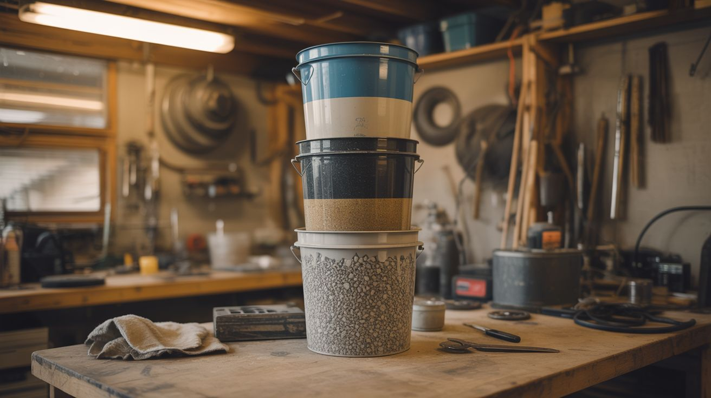

# #250 — Gravity Water Filter

  

> Stacked buckets: gravel, sand, charcoal, cloth = clean water.

## Ratings

     

## 🧪 What Is It?

A gravity water filter uses stacked layers of increasingly fine filtration media to remove sediment, bacteria, and many chemical contaminants from water — no electricity, no pumps, no moving parts. Gravel catches the big stuff. Sand catches the medium stuff. Activated charcoal adsorbs chemicals, removes taste and odor, and traps bacteria. A cloth layer at the bottom keeps the charcoal from washing through. Pour muddy creek water in the top, and clear drinkable water comes out the bottom. This isn't theory — it's how municipal water treatment worked for centuries before modern chemistry. The World Health Organization still recommends biosand filters as appropriate technology for developing regions. It works, it's free, and you can build it from junkyard materials in an afternoon.

<strong>🧰 Ingredients</strong>

- [ ] Two 5-gallon buckets — food-grade preferred, one nests on top of the other *(bakery, restaurant dumpster, hardware store)*
- [ ] Spigot or valve — for the bottom bucket *(hardware store, salvaged from a cooler)*
- [ ] Coarse gravel — 1/2" to 1" stones, washed *(driveway, landscaping supply, creek bed)*
- [ ] Fine gravel — pea-sized, washed *(same sources)*
- [ ] Clean sand — coarse builder's sand, not play sand *(hardware store, creek bed)*
- [ ] Activated charcoal — or make your own from hardwood *(pet store aquarium section, hardware store)*
- [ ] Cotton cloth or coffee filters — for the final barrier *(junk drawer)*
- [ ] Drill with 1/16" bit — for the diffuser holes *(toolbox)*

## 🔨 Build Steps

1. **Drill the upper bucket.** Make 20-30 small holes (1/16") in the bottom of the top bucket. These allow filtered water to drip through into the collection bucket below. Space them evenly across the bottom.
2. **Drill for the spigot.** Near the bottom of the lower bucket, drill a hole sized for your spigot. Install the spigot and seal around it with food-safe silicone or a rubber gasket. This is your clean water tap.
3. **Layer the cloth.** Place a piece of cotton cloth or several coffee filters flat across the bottom of the upper bucket, covering all the drill holes. This prevents fine charcoal particles from passing through.
4. **Add activated charcoal.** Pour a 3-4 inch layer of activated charcoal on top of the cloth. This is the workhorse layer — it adsorbs chlorine, organic chemicals, some heavy metals, and many bacteria. If using homemade charcoal, crush it to pea-sized pieces first.
5. **Add fine sand.** Pour a 3-4 inch layer of clean fine sand on top of the charcoal. Rinse the sand thoroughly before adding — you don't want it clouding your output. This layer catches particles too small for gravel but too large for charcoal.
6. **Add fine gravel.** Pour a 2-inch layer of pea gravel on top of the sand. This prevents the sand from shifting when you pour water in.
7. **Add coarse gravel.** Pour a 2-inch layer of larger gravel on top. This is the pre-filter that catches leaves, bugs, and large sediment.
8. **Flush the system.** Pour 2-3 gallons of clean water through the filter and discard the output. The first few batches will be cloudy as loose particles wash out. Keep flushing until the output runs clear.
9. **Filter your water.** Pour source water gently into the top of the gravel layer. Don't dump it in hard — you'll disturb the sand and reduce effectiveness. Let gravity do the work. Collection takes 15-30 minutes per gallon depending on how packed your media is.
10. **Maintain it.** When flow rate drops significantly, scrape off the top inch of sand (it clogs with captured particles over time) and replace it. Replace the charcoal layer every 2-3 months of regular use, as it becomes saturated and stops adsorbing.

## ⚠️ Safety Notes

- Gravity sand filters are effective against sediment, many bacteria, and some chemicals, but they do not reliably remove viruses. If your water source may contain viruses (human sewage contamination), boil the filtered water for one minute before drinking.
- Activated charcoal has a finite adsorption capacity. Once saturated, it stops removing chemicals and can even release previously captured contaminants. Replace it on schedule.

## 🔗 See Also

- [Solar Still](248-solar-still.md)
- [Rocket Stove](253-rocket-stove.md)
