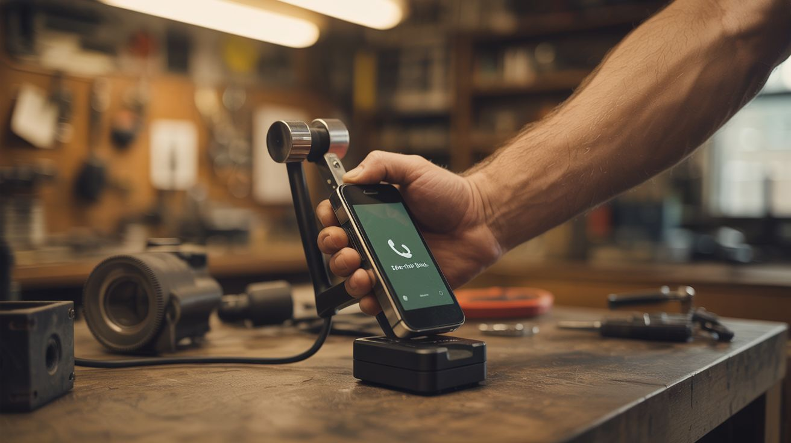

# #251 — Hand-Crank Phone Charger

  

> Five minutes of cranking buys you one emergency call. Your arm is the power plant.

## Ratings

     

## 🧪 What Is It?

Every DC motor is also a generator — spin the shaft and it produces electricity instead of consuming it. That motor inside your dead cordless drill, hand mixer, or printer is a perfectly good power source waiting to be unlocked. The problem is that your hand turns a crank at maybe 2-3 revolutions per second, and a small motor needs hundreds or thousands of RPM to generate useful voltage. That's where gear reduction comes in: a large gear on the crank drives a small gear on the motor shaft, multiplying your slow hand speed into high-RPM rotation.

Wire the motor's output through a Schottky diode (to prevent backflow), a big capacitor (to smooth the pulsing output), and a 5V buck/boost voltage regulator with a USB port, and you've got a hand-crank phone charger. Five minutes of steady cranking gives you enough juice for an emergency phone call. Twenty minutes gets you a few texts and a map pull. It's not fast, it's not glamorous, and your arm will hate you. But when the grid goes down, when you're deep in the backcountry with a dead battery, when hurricane season reminds you that infrastructure is a polite suggestion — this thing earns its keep.

This is the same fundamental mechanism inside every commercial hand-crank flashlight and emergency radio, except you're building it from salvaged parts for nearly free. The engineering is dead simple and the satisfaction of generating your own electricity from muscle power is unreasonably high.

<strong>🧰 Ingredients</strong>

- [ ] DC motor (12V-24V range) — the higher the voltage rating, the easier it generates at low RPM *(dead cordless drill, electric screwdriver, hand mixer, or printer — free from e-waste pile)*
- [ ] Gear set or pulleys — need roughly 10:1 speed increase from crank to motor shaft *(old hand drill gearbox, bicycle gears, printer gear train — salvage or $2-5 at thrift store)*
- [ ] Crank handle — something comfortable to grip and spin *(bent steel rod, old hand drill handle, bicycle pedal arm — junk drawer or $1)*
- [ ] 5V buck/boost voltage regulator module with USB output *(electronics supplier, $1-3)*
- [ ] Electrolytic capacitor, 1000uF 16V or larger — smooths voltage ripple *(old power supply board, or $0.50)*
- [ ] 1N5817 Schottky diode — prevents backflow from phone into generator *(electronics bin, $0.10)*
- [ ] USB-A female port — if not included on regulator module *(old computer motherboard, cable cut-off — free)*
- [ ] Wood or metal base plate — to mount everything solid *(scrap wood, cutting board, old shelf bracket — free)*
- [ ] Zip ties, bolts, screws — for mounting *(junk drawer)*
- [ ] Soldering iron + solder + wire *(toolbox)*
- [ ] Multimeter — essential for checking voltage output *(toolbox, or $10 budget model)*

## 🔨 Build Steps

1. **Harvest the motor.** Crack open your dead appliance and extract the DC motor. Cordless drills are ideal because they already have a planetary gearbox attached — you might get the motor and gear reduction in one step. Note which wires are positive and negative, or just test with a multimeter when you spin the shaft — the voltage polarity tells you. Printer motors are also excellent: they're high-quality, have tight tolerances, and often come with gear trains still attached.

2. **Test the motor as a generator.** Chuck the motor shaft in a drill (or spin it vigorously by hand) and measure the output voltage with a multimeter. Most small DC motors produce 5-20V when spun at speed. If you can get above 7V at a speed achievable through gearing, it'll work. Below that and your regulator won't have enough headroom.

3. **Design the gear train.** You need to multiply your hand-crank speed by roughly 10x before it hits the motor shaft. If you scored a drill gearbox, you're done — those typically have 10:1 to 20:1 ratios. Otherwise, find two gears or pulleys with the right ratio. A large gear (50+ teeth) on the crank axle meshing with a small gear (5-10 teeth) on the motor shaft is the simplest approach. Printer gear trains are goldmines — they're designed for precise speed ratios and mesh perfectly. You can also stack multiple stages: two 3:1 reductions in series give you 9:1.

4. **Build the crank assembly.** Bend a steel rod into an L-shaped crank handle, or repurpose a hand drill handle. The arm should be 4-6 inches from the rotation center — long enough for leverage but short enough that your hand doesn't fly in circles. Mount it to the large gear's axle with a set screw, bolt, or weld. The crank should spin smoothly without wobble.

5. **Mount everything to the base.** Bolt the motor down firmly to your base plate. Mount the gear train so teeth mesh cleanly with the motor shaft gear. The crank should turn freely with minimal resistance when disconnected from the circuit. If it's hard to turn before you even connect a load, your gears are binding or misaligned — shim, adjust, or file until the action is smooth. Every bit of friction you fight is energy wasted.

6. **Wire the electrical circuit.** Connect the motor's output wires through the Schottky diode (band/stripe toward the positive side of the regulator input). This prevents your phone from back-driving the motor and draining itself when you stop cranking. Solder the 1000uF capacitor across the regulator's input terminals (observe polarity — the stripe marks negative). Connect the regulator's 5V output to the USB port's power pins (pin 1 = +5V, pin 4 = GND).

7. **Handle the USB data lines.** Some phones won't charge unless the USB data lines (D+ and D-) are configured correctly. For most Android phones, short D+ and D- together with a 200-ohm resistor. For iPhones, specific resistor divider values on D+ and D- signal "Apple charger." Look up the values for your phone brand. Without this, your phone may see the USB port as a data connection and refuse to draw charging current.

8. **Test voltage output.** Spin the crank at a comfortable, sustainable pace and measure voltage at the regulator's input with your multimeter. You want 7-20V raw from the motor. Verify 5.0V stable at the USB output. If input voltage is too low, increase your gear ratio or accept that you need to crank faster. If the output fluctuates wildly, your capacitor is too small — add a second one in parallel.

9. **Load test with a phone.** Plug in a phone and crank. The phone should show "Charging." If it flickers between charging and not-charging, your cranking speed is varying too much and the regulator is dropping in and out. Add more capacitance, crank more steadily, or consider adding a small rechargeable battery (single 18650 cell with charge controller) as a buffer between the regulator and the USB output — crank to charge the battery, battery charges the phone at a steady rate.

10. **Enclose and ruggedize.** Mount everything in a sturdy box or frame. Protect the electronics from rain and dust. Add a carrying handle or strap. Consider mounting the whole unit in a surplus ammo can — they're waterproof, sturdy, and look appropriately apocalyptic. Label the USB port so future-you remembers what this contraption does.

## ⚠️ Safety Notes

- Spinning gears can catch fingers, hair, and loose clothing. Keep the gear train enclosed or shielded with a guard made from scrap sheet metal or a cut-up tin can. This is especially important if anyone else will use it.
- Some motors can generate surprisingly high voltage at high RPM. If your raw motor output exceeds 25V, crank slower or add a 24V zener diode across the output to clamp voltage and protect your regulator.
- The Schottky diode is not optional. Without it, your phone's battery will back-drive the motor when you stop cranking and drain itself. A regular 1N4007 diode works but drops 0.7V. A Schottky drops only 0.3V — every fraction of a volt matters when you're generating power with your arm.
- Never connect a motor directly to a phone without the voltage regulator. Unregulated voltage spikes from speed changes can permanently damage phone charging circuits.

## 🔗 See Also

- [Faraday Cage](252-faraday-cage.md)
- [Biogas Generator](249-biogas-generator.md)
- [Solar Still](248-solar-still.md)

**References:**
- [Appliance Teardown Guide](../../reference/appliance-teardown-guide.md)
- [Technical Glossary](../../reference/glossary.md)
