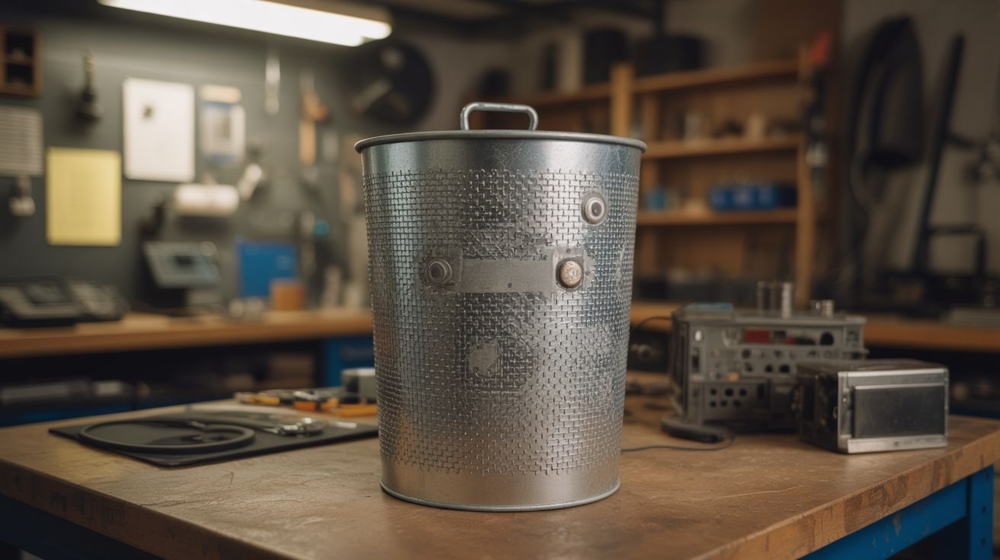

# #252 — Faraday Cage

  

> A metal trash can that makes your electronics invisible to the electromagnetic apocalypse.

## Ratings

| Jaw Drop Rating | Brain Melt Level | Wallet Damage | Spicy Level | Clout Potential | Time to Build |
|---|---|---|---|---|---|
| ⭐⭐⭐ | ⭐ | ⭐ | ⭐ | ⭐⭐⭐ | ⭐ |

## What Is It?

A Faraday cage is a sealed conductive enclosure that blocks electromagnetic fields from getting in or out. Put your phone inside and it goes completely silent — no calls, no texts, no WiFi, no GPS, no Bluetooth. It's not airplane mode. It's not a signal-blocking pouch. It's a complete electromagnetic void. Radio waves hit the metal shell and the free electrons in the conductor rearrange themselves to cancel the incoming field. Nothing penetrates. Michael Faraday demonstrated this principle in 1836, and the physics hasn't changed since.

The build is almost insultingly simple: a galvanized steel trash can with a tight-fitting lid and conductive gasket tape sealing every gap. That's it. The hard part isn't building it — it's building it well enough that there are zero gaps in the shielding. Electromagnetic waves are relentless. A gap of just a few millimeters at certain frequencies and your "protection" becomes a fancy garbage can. The gasket tape at the lid seam is the difference between a real Faraday cage and a metal box you feel good about.

Why would you want one? EMP preparedness is the headline answer — a coronal mass ejection or high-altitude electromagnetic pulse could fry unshielded electronics across entire regions. But there are plenty of practical uses too: RF-quiet testing environments for electronics projects, storing sensitive equipment away from interference, RFID-blocking storage for key fobs and access cards, or just proving to your skeptical friends that yes, the physics is real. Drop a phone inside, call it from another phone, and watch it go straight to voicemail. That demonstration alone is worth the build.

## Ingredients

- [ ] Galvanized steel trash can with tight-fitting lid — 10 or 20 gallon *(hardware store $15-20, or dumpster behind a hardware store — free)*
- [ ] Conductive gasket tape — adhesive-backed copper or aluminum mesh tape, minimum 2" wide *(electronics supplier or HVAC supply, $5-10 per roll)*
- [ ] Aluminum foil tape — real metal tape, not regular duct tape *(HVAC supply, hardware store, $4)*
- [ ] Aluminum foil — heavy duty, for backup sealing and testing *(kitchen, $3)*
- [ ] Cardboard or foam padding — insulation layer to prevent contents from touching the metal shell *(any box, free)*
- [ ] A phone or portable radio — for testing *(you already own one)*

## Build Steps

1. **Inspect the can.** Look for dents, holes, rust spots, or seam gaps. Run your finger along every weld and seam. Any gap wider than 1mm is a potential leak point for higher frequencies. Small dents are fine — they don't break electrical conductivity. Rust spots need to be sanded back to bare metal with steel wool or sandpaper. If the can has a rolled seam on the side, inspect it closely — these are usually tight enough, but check for pinholes.

2. **Clean all contact surfaces.** Wipe down the lid rim and can rim with rubbing alcohol or acetone. The gasket tape needs clean bare metal to bond properly. Any paint, oil, or grime between the tape and the metal reduces the electrical contact that makes the seal work. If the can has a painted interior, sand the rim area down to bare metal.

3. **Apply gasket tape to the lid rim.** Run a continuous strip of conductive gasket tape around the entire inner rim of the lid where it contacts the can body. Overlap the start and end points by at least 1 inch — gaps at tape seams are the most common failure point. Press firmly along the entire length to ensure full adhesive and conductive contact.

4. **Apply gasket tape to the can rim.** Run a matching strip around the top edge of the can body. When the lid closes, you want metal-tape-on-metal-tape contact all the way around — a continuous conductive seal with zero gaps. Double up the tape if the fit between lid and can body is loose.

5. **Seal internal seams.** If the can has a side seam (most do), run a strip of aluminum foil tape along its full interior length. Check the bottom seam where the base meets the wall. You're looking for continuous metal contact at every joint. Think of it like waterproofing — if water could seep through a seam, radio waves at the right frequency can too.

6. **Line the interior with insulation.** Cut cardboard or rigid foam to line the bottom and sides of the can. Your electronics must NOT touch the metal shell directly. If they do, an EMP-induced current flowing through the cage wall could arc into your devices through direct contact — which is exactly the thing you're trying to prevent. Maintain at least 1 inch of air gap or insulation on all sides, including the top when the lid is closed.

7. **Test with a cell phone.** Place your phone inside, close the lid firmly, and call it from another phone. If it rings, you have a gap — reopen and examine the lid seal. If it goes straight to voicemail, the cage is blocking cell frequencies (700MHz-2.5GHz). This is a good sign but not a complete test.

8. **Test with FM radio.** Put a portable FM radio tuned to a strong local station inside the closed can. FM operates at ~88-108 MHz with wavelengths around 3 meters. If FM is blocked, you're stopping wavelengths much longer than most threat frequencies. Open the lid a crack and the station should come back — that confirms the cage is doing the work, not just distance.

9. **Test WiFi (advanced).** Put your phone inside and try to ping it or see if it appears on your WiFi network from outside. WiFi at 2.4 GHz has a wavelength of about 12cm, and 5 GHz WiFi is about 6cm. Small gaps that passed the cell and FM tests may leak at these shorter wavelengths. This is the hardest test to pass and the most satisfying when you nail it.

10. **Store your protected gear.** Wrap individual electronics in cloth or place them in small cardboard boxes before loading them into the cage. This adds another insulation layer and keeps things organized. Good candidates for EMP storage: a spare phone, handheld radios, USB drives with important documents, a hand-crank charger, flashlights with electronic drivers, a small solar charge controller. Label a manifest on the outside so you're not rummaging during an actual emergency.

11. **Maintain and re-test.** Check the cage every few months with the phone test. Corrosion, dents from bumping the can around, or adhesive deterioration on the gasket tape can open gaps over time. Re-tape and re-test as needed. The cage is only as good as its weakest seal.

## Safety Notes

- A Faraday cage blocks signals in both directions. If you store a phone inside, no one can reach you — including emergency services. Do not lock away your only communication device.
- Galvanized steel contains a zinc coating that produces toxic fumes if heated (welding, grinding, cutting with a torch). Light sanding outdoors is fine, but do not weld or grind on the cage without proper ventilation and a respirator.
- This cage is designed for EMP and RF protection, not lightning. A direct lightning strike carries thousands of amps and requires a proper ground rod and heavy-gauge conductor. Don't put this on your roof and don't rely on it during a thunderstorm.
- Don't store anything with a lithium battery in a sealed Faraday cage long-term without periodic checks. Lithium batteries that swell or vent in an enclosed space create a hazard.

## See Also

- [Hand-Crank Phone Charger](251-hand-crank-charger.md)
- [Laser Tripwire Security System](../laser-lab/268-laser-tripwire-alarm.md)
- [Solar Still](248-solar-still.md)
