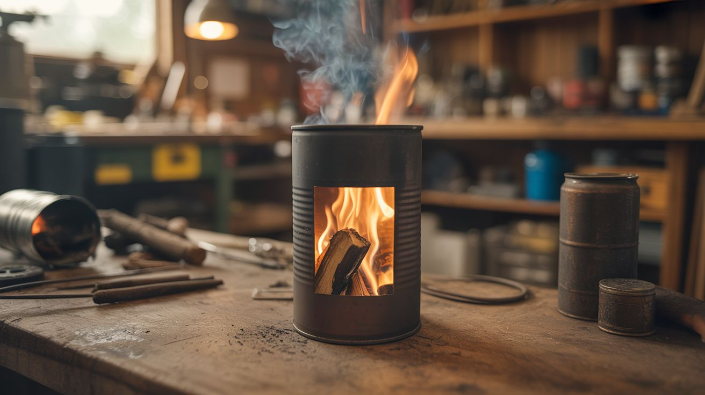

# #253 — Rocket Stove

  

> An L-shaped tin can inferno that boils water with a handful of twigs. 10x more efficient than an open fire.

## Ratings

     

## 🧪 What Is It?

A rocket stove is a hyper-efficient wood-burning cook stove that uses an insulated L-shaped combustion chamber to create a powerful self-reinforcing updraft. Small sticks feed into the horizontal opening at the bottom. The fire burns at the elbow of the L. Hot gases rocket up the vertical insulated chimney and blast directly into the bottom of your pot. The insulation keeps the heat inside the chamber instead of radiating uselessly outward. Result: you boil a quart of water with a handful of twigs that you'd normally ignore as kindling.

An open campfire wastes roughly 85-90% of the wood's energy — heat radiates in all directions, combustion is incomplete, and most of the hot gas drifts away without touching your cookware. A rocket stove flips those numbers. The insulated chimney heats the air inside to extreme temperatures, hot air rises fast, this creates a powerful draft that sucks fresh oxygen through the fuel magazine at the bottom, and that incoming air feeds the fire even hotter. It's a self-reinforcing cycle. The fire burns so hot and so completely that there's almost no smoke — the volatile gases that would normally escape as visible smoke are instead combusted inside the chamber. You can literally cook with twigs and leaves.

The design was developed in the 1980s by Dr. Larry Winiarski for use in developing countries where deforestation from inefficient cooking fires was destroying ecosystems and smoke inhalation was killing people. The World Health Organization and dozens of NGOs have deployed millions of rocket stove variants worldwide. You can build one from three tin cans and some ash in about 30 minutes. Upgrade to a #10 institutional-sized can with vermiculite insulation and you've got something that'll serve you for years.

<strong>🧰 Ingredients</strong>

- [ ] Large can (#10 size, ~6" diameter) — the outer body and insulation shell *(restaurant dumpster, bulk food section — free)*
- [ ] Medium can (~4" diameter) — the inner combustion chimney/riser *(standard vegetable or coffee can — free)*
- [ ] Small can or rectangular duct piece — the horizontal fuel feed magazine *(soup can or cut from sheet metal — free)*
- [ ] Vermiculite, perlite, or dry wood ash — insulation fill between inner and outer cans *(garden center $5/bag, or free ash from any fireplace)*
- [ ] Tin snips — for cutting cans *(toolbox, or $8 at hardware store)*
- [ ] Work gloves — cut tin is razor sharp *(toolbox)*
- [ ] Metal file or sandpaper — to deburr cut edges *(toolbox)*
- [ ] Wire coat hanger — for pot support grate *(closet — free)*
- [ ] Small piece of hardware cloth or expanded metal — fuel shelf inside the feed tube *(hardware store $2, or cut from a salvaged grate)*

## 🔨 Build Steps

1. **Prepare the outer can.** Remove the top of the large #10 can if it's not already open. Leave the bottom intact. This is the outer shell that holds insulation and provides structure. File or bend any sharp edges inward — you'll be reaching inside this can repeatedly.

2. **Cut the feed tube hole.** Near the bottom of the large outer can, trace the outline of your small feed tube can. Cut this hole with tin snips. It should be a tight fit — the feed tube slides through here horizontally. Take your time. A sloppy hole lets insulation leak out and weakens the structure. File all cut edges smooth.

3. **Prepare the inner chimney.** Remove both ends of the medium can. This becomes the vertical combustion riser that sits inside the large can. Near the bottom of this can, cut a hole that matches the diameter of your feed tube. This is where the horizontal and vertical sections meet — the elbow of the L-shape.

4. **Cut and prepare the feed tube.** The small can (or rectangular duct section) forms the horizontal fuel magazine. Remove both ends if it's a can, creating a tube. It should be long enough to extend from outside the outer can, through the insulation gap, and into the inner chimney. About 8-10 inches total length works well.

5. **Build the fuel shelf.** Inside the feed tube, install a small grate or shelf made from bent coat hanger wire or a piece of hardware cloth, positioned about 1 inch up from the bottom of the tube. Sticks rest on top of this shelf. The gap underneath allows primary combustion air to flow under the fuel and feed the fire from below — this underfire air supply is what makes rocket stoves dramatically more efficient than top-lit fires.

6. **Assemble the L-shape.** Slide the feed tube through the hole in the outer can and into the matching hole in the inner chimney can. The three pieces form an L: fuel enters horizontally through the feed tube, fire burns at the junction where horizontal meets vertical, and hot gases rise up through the inner chimney. The joints should be snug. If there are gaps, fold small tabs of metal over to tighten, or seal with furnace cement. Some air leakage actually helps — it provides secondary combustion air that burns off smoke.

7. **Center the inner chimney.** Position the medium can vertically inside the large can, centered. The top of the inner chimney should sit about 1-2 inches below the rim of the outer can, leaving room for the pot support and a critical gap for exhaust gases to escape around the pot.

8. **Fill with insulation.** Pour vermiculite, perlite, or dry wood ash into the gap between the inner and outer cans. Fill completely and pack lightly — you want insulation, not compression. This layer is critical. Without it, heat radiates through the outer wall and your stove performs barely better than three rocks and a campfire. Vermiculite is ideal because it withstands extreme temperatures without settling or degrading.

9. **Build the pot support.** Cut three or four tabs from the top rim of the outer can and bend them inward at 90 degrees to form pot rests. Alternatively, bend a wire coat hanger into a ring or cross shape that sits on top. The key dimension: maintain about a 1-inch gap between the top of the inner chimney and the bottom of the pot. This gap allows combustion gases to escape laterally after transferring their heat. Too tight and the draft chokes. Too wide and hot gases escape without contacting the pot.

10. **First burn — cure and test.** Stuff a small ball of paper or dry grass into the feed tube and light it. Once burning, start feeding small dry sticks (pencil-thickness or thinner) into the horizontal tube. Within 60-90 seconds, you'll hear the draft kick in — a distinctive roaring whoosh as air pulls hard through the feed tube. The fire intensifies dramatically. This is the "rocket" in rocket stove. Set a pot of water on top and time it. A well-built rocket stove boils a quart of water in under 5 minutes on twigs alone.

11. **Dial in the feed rate.** Don't stuff the feed tube full of wood. You want 3-5 sticks at a time, pushed in gradually as they burn. Overloading chokes the air supply and produces smoke — the exact thing this design eliminates. Underloading starves the fire. The sweet spot is a hot, nearly smokeless burn with a visible jet of flame rising from the chimney. If you see heavy smoke, your fuel is either too wet, too thick, or too tightly packed.

## ⚠️ Safety Notes

- The outer can gets extremely hot during operation — hot enough to cause serious burns instantly. Place the stove on bare ground, concrete, gravel, or a fireproof surface. Never on a wooden deck, dry grass, a picnic table, or inside a tent or structure.
- Use outdoors only with good ventilation. Even efficient combustion produces carbon monoxide. In a confined space, rocket stoves are lethal.
- Keep a bucket of water or sand nearby whenever the stove is running. This is still an open fire, just a well-managed one.
- Cut tin edges are extremely sharp and become even more hazardous when heated (metal expands and edges can split). Wear gloves during construction and file every cut edge smooth.
- Let the stove cool completely before moving or storing it. The insulation retains heat for a surprisingly long time — what feels cool on the outside may still have glowing embers inside.

## 🔗 See Also

- [Gravity Water Filter](250-gravity-water-filter.md)
- [Solar Still](248-solar-still.md)
- [Biogas Generator](249-biogas-generator.md)
