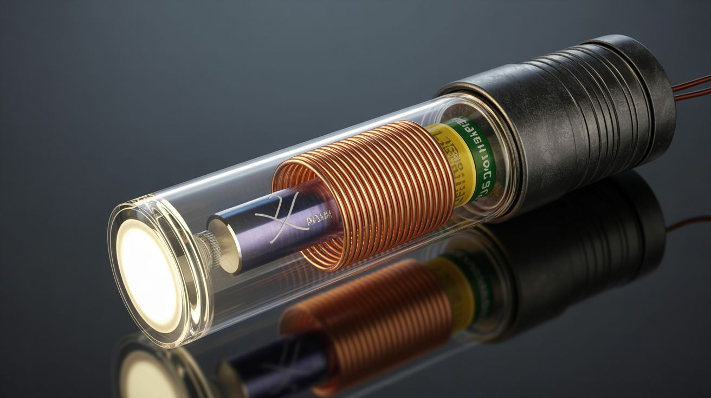

# #318 — Faraday Flashlight

  

> Shake it and it lights up — no batteries, no charging, no solar. Just magnets, a coil, and your arm.

## Ratings

| Jaw Drop Rating | Brain Melt Level | Wallet Damage | Spicy Level | Clout Potential | Time to Build |
|---|---|---|---|---|---|
| ⭐⭐⭐⭐ | ⭐⭐ | ⭐ | ⭐ | ⭐⭐⭐⭐ | ⭐ |

## What Is It?

A neodymium magnet slides back and forth through a coil of copper wire inside a clear tube. Each time the magnet passes through the coil, it induces a pulse of current — Faraday's law of electromagnetic induction, the same principle that powers every generator on Earth. A bridge rectifier converts the alternating pulses (the magnet moves in both directions) into DC. A supercapacitor stores the charge. The capacitor powers a bright LED. Shake for 30 seconds, get 5 minutes of usable light. No batteries to die. No solar panel to aim. No charging cable to forget. Just physics and your arm.

The energy conversion chain is elegant in its directness: your kinetic energy becomes magnetic flux change through the coil, which induces an EMF (voltage) in the wire, which the rectifier converts to DC, which accumulates in the capacitor, which lights the LED. Every component in the chain can be salvaged from dead electronics: the magnet comes from a hard drive voice coil assembly (those neodymium magnets are absurdly powerful for their size), the wire comes from a dead motor winding, the diodes come from any circuit board, the LED comes from anything with a power indicator, and the tube comes from hardware store acrylic or PVC.

The flashlight works effectively forever because there's nothing to wear out. No chemical battery to degrade. No filament to burn out (LEDs last 50,000+ hours). The supercapacitor can handle hundreds of thousands of charge cycles compared to a battery's few hundred. The only consumable is your patience and the calories in your arm. This is the simplest, most reliable emergency light source you can build, and it doubles as a perfect hands-on demonstration of electromagnetic induction for anyone who's ever wondered how generators actually work.

## Ingredients

- [ ] Neodymium magnet — cylindrical, sized to slide freely inside your tube *(hard drive voice coil assembly, free from e-waste)*
- [ ] Magnet wire — 28-30 AWG, about 100 feet *(dead motor winding, free from e-waste)*
- [ ] Clear acrylic or PVC tube — 8-12" long, inner diameter slightly larger than the magnet *(hardware store, ~$3)*
- [ ] 4 small diodes (1N4001 or similar) — for the bridge rectifier *(any dead circuit board, free from e-waste)*
- [ ] Supercapacitor — 1F to 5F, 5.5V *(dead electronics or ~$2 new)*
- [ ] Bright white LED — 5mm or 10mm *(any dead electronics with indicator lights, free from e-waste)*
- [ ] Current-limiting resistor — 47-100 ohm *(electronics bin, free)*
- [ ] Small slide switch — for on/off control *(dead electronics, free)*
- [ ] End caps — rubber stoppers, corks, or 3D-printed caps for the tube *(hardware store, ~$1)*
- [ ] Shrink tubing + solder + soldering iron *(toolbox)*
- [ ] Tape or hot glue — to secure the coil winding *(workshop, free)*

## Build Steps

1. **Wind the coil.** Wrap 200-400 turns of magnet wire around the middle section of the tube. More turns produces more voltage per pass of the magnet — 300 turns is a good starting point. Wind in neat, tight layers. Secure the start and finish of the winding with tape, and leave 4-inch wire tails at each end for connections. Hot glue or tape over the finished coil to keep it in place.

2. **Build the bridge rectifier.** Arrange 4 diodes in a full-wave bridge configuration. This converts the AC pulses (since the magnet generates current in one direction going through the coil and the opposite direction coming back) into positive-only DC pulses. Solder the diodes together, observing the correct orientation — two diodes point inward (anodes together = positive output), two point outward (cathodes together = negative output). The AC input comes from the coil, and the DC output goes to the capacitor.

3. **Connect the supercapacitor.** Solder the supercapacitor across the rectifier's DC output, observing polarity. The positive lead of the capacitor connects to the positive output of the rectifier. The capacitor stores charge between shakes, providing steady power to the LED even when you stop shaking.

4. **Wire the LED circuit.** Connect the LED in series with the current-limiting resistor (47-100 ohm) across the supercapacitor terminals. Observe LED polarity — the longer lead is positive. The resistor prevents the LED from drawing too much current when the capacitor is fully charged. Add the slide switch in series if you want on/off control so the LED doesn't drain the capacitor when you're not using the light.

5. **Prepare the tube.** Drop the neodymium magnet into the tube. It should slide freely from end to end with minimal friction — if it's too tight, the magnet won't build enough speed. If it's way too loose, the magnet passes through the coil's center off-axis and induces less voltage. A snug but free-sliding fit is ideal. Cap both ends with rubber stoppers or corks so the magnet can't escape. The magnet should bounce slightly off the end caps with each shake.

6. **Mount the electronics.** Attach the rectifier, capacitor, resistor, switch, and LED to one end of the tube. You can mount components alongside the tube with hot glue, or build a small enclosure at one end that holds everything. The LED should point forward from the end of the tube, flashlight-style. Keep wiring short and connections solid — this thing gets shaken vigorously.

7. **Test and calibrate.** Shake the tube vigorously for 30 seconds and check if the LED lights up. If it's dim, you need either more coil turns (more voltage per shake), a stronger magnet (more flux change), or a lower-value current-limiting resistor (more current to the LED, at the cost of faster capacitor drain). If the LED doesn't light at all, check the rectifier wiring and capacitor polarity.

8. **Optional upgrades.** Add a second coil at the other end of the tube for double the output per shake — wire both coils into the same rectifier. Use a reflector behind the LED (a small piece of polished aluminum or a reflector from a dead flashlight) to focus the beam. Add a lanyard loop so you don't drop it in the dark.

## Safety Notes

- Zero electrical danger. The open-circuit voltage generated by shaking is typically 1-3 volts — far below any level that could cause harm.
- The neodymium magnet is the primary physical hazard during assembly. It's strong enough to pinch skin painfully if it snaps to a metal surface or to another magnet. Handle with care, keep away from credit cards and electronics, and keep a firm grip on it while inserting it into the tube.
- The tube can crack if dropped on a hard surface. Acrylic is more prone to shattering than PVC. If the magnet escapes a broken tube, it becomes a pinch hazard again.

## See Also

- [Crystal Radio](317-crystal-radio.md)
- [Hand-Crank Phone Charger](251-hand-crank-charger.md)
- [E-Waste Wind Turbine](../unholy-combos/285-e-waste-wind-turbine.md)

**References:**
- [Appliance Teardown Guide](../../reference/appliance-teardown-guide.md)
- [Technical Glossary](../../reference/glossary.md)
