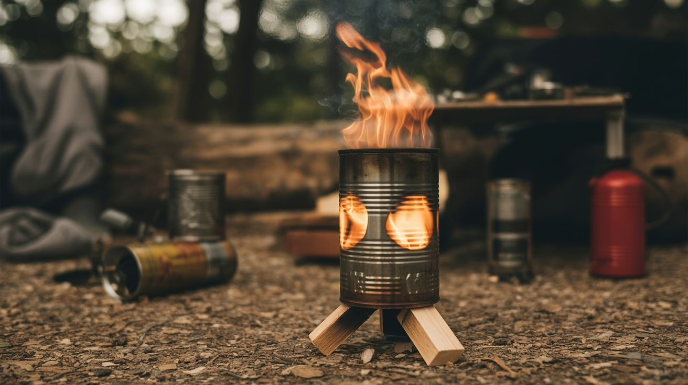

# ⛺ Survival & Off-Grid

  

  

> The grid is down, the water's off, and you're 40 miles from a Walmart. These builds are why you're fine.

The power's out. The water's off. The cell towers are dead. Now what? These builds answer that question with nothing but junk, ingenuity, and a refusal to be helpless. A pit in the ground becomes a water distiller. A sealed drum full of compost becomes a gas stove. Stacked buckets become a water treatment plant. A salvaged motor becomes a phone charger.

None of these builds require a hardware store run during the apocalypse. They use materials you can scavenge, stockpile, or pull from a dumpster. The best survival gear isn't bought — it's built by someone who understands how things work.

---

## Builds

| # | Build | Jaw Drop | Brain Melt | Wallet | Spicy | Clout | Time |
|---|---|---|---|---|---|---|---|
| 248 | [Solar Still](248-solar-still.md) | ⭐⭐⭐ | ⭐ | ⭐ | ⭐ | ⭐⭐⭐ | ⭐⭐ |
| 249 | [Biogas Generator](249-biogas-generator.md) | ⭐⭐⭐⭐ | ⭐⭐⭐ | ⭐⭐ | ⭐⭐⭐ | ⭐⭐⭐⭐ | ⭐⭐⭐ |
| 250 | [Gravity Water Filter](250-gravity-water-filter.md) | ⭐⭐⭐ | ⭐ | ⭐ | ⭐ | ⭐⭐⭐ | ⭐⭐ |
| 251 | [Hand Crank Charger](251-hand-crank-charger.md) | ⭐⭐⭐ | ⭐⭐ | ⭐ | ⭐ | ⭐⭐⭐ | ⭐⭐ |
| 252 | [Faraday Cage](252-faraday-cage.md) | ⭐⭐⭐ | ⭐ | ⭐ | ⭐ | ⭐⭐⭐ | ⭐ |
| 253 | [Rocket Stove](253-rocket-stove.md) | ⭐⭐⭐ | ⭐ | ⭐ | ⭐⭐ | ⭐⭐⭐ | ⭐ |
| 317 | [Crystal Radio](317-crystal-radio.md) | ⭐⭐⭐⭐ | ⭐⭐⭐ | ⭐ | ⭐ | ⭐⭐⭐⭐ | ⭐ |
| 318 | [Faraday Flashlight](318-faraday-flashlight.md) | ⭐⭐⭐⭐ | ⭐⭐ | ⭐ | ⭐ | ⭐⭐⭐⭐ | ⭐ |

---

### Suggested Build Order

Start with the simplest survival builds and progress toward self-sufficiency:

1. **[#253 — Rocket Stove](253-rocket-stove.md)** — Tin cans + fire. Cook anywhere.
2. **[#317 — Crystal Radio](317-crystal-radio.md)** — Zero-power AM radio. Hear the world without batteries.
3. **[#318 — Faraday Flashlight](318-faraday-flashlight.md)** — Shake for light. Infinite battery life.
4. **[#250 — Gravity Water Filter](250-gravity-water-filter.md)** — Clean water from buckets and sand.
5. **[#248 — Solar Still](248-solar-still.md)** — Distill water from sunlight.
6. **[#251 — Hand Crank Charger](251-hand-crank-charger.md)** — Muscle power → phone power.
7. **[#252 — Faraday Cage](252-faraday-cage.md)** — Protect electronics from EMP.
8. **[#249 — Biogas Generator](249-biogas-generator.md)** — Compost → cooking fuel. The endgame.

### Related Categories

- [Power & Energy](../power-and-energy/) — Battery banks, generators, solar
- [Humidifier & Water](../humidifier-and-water/) — Water collection and purification
- [Big Builds](../big-builds/) — Large-scale off-grid infrastructure
