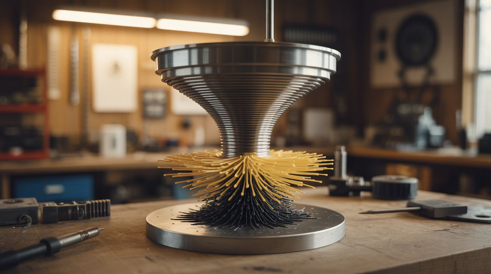

# #053 — Singing Ferrofluid Tornado

  

> Ferrofluid dancing to music inside a rotating magnetic field. A liquid tornado of magnetic spikes that sings. Three builds fused into one unholy creation.

## Ratings

     

## 🧪 What Is It?

Take the ferrofluid display from the Ferrofluid Mirror build, add a rotating magnetic field that spins the ferrofluid into a vortex, then modulate the field intensity with audio so the spikes dance to music. The result is a magnetic liquid tornado — a spinning column of black spikes that grows and shrinks with the beat, individual spines extending and retracting in time with frequencies, the whole mass rotating in a vortex that seems alive.

This combines three independent techniques: ferrofluid manipulation (electromagnet array), rotational field generation (phase-shifted coil pairs, like a brushless motor stator), and audio modulation (amplitude envelope mapped to field strength). Each technique is a build on its own. Together, they produce something that genuinely looks like it came from another dimension.

The spinning ferrofluid sits in a shallow glass dish on a custom-wound stator. The stator's coils are driven by audio-modulated, phase-shifted signals from an Arduino and power amplifier. Bass frequencies drive overall field intensity (spike height). Mid frequencies modulate the rotation speed. Treble creates fine texture in the spike pattern.

<strong>🧰 Ingredients</strong>

- [ ] Ferrofluid — 100-200ml, oil-based *(online supplier, ~$20-$40)*
- [ ] Shallow glass dish — Petri dish or watch glass, 4"-6" diameter *(lab supply, online)*
- [ ] Stator assembly — 3-6 coils wound on iron cores, arranged in a circle *(wound from magnet wire on iron bolts, see [Ferrofluid Mirror](../art-and-installation/046-ferrofluid-mirror/))*
- [ ] Magnet wire — 22-24 AWG enameled copper, ~200 feet *(electronics supplier)*
- [ ] Iron bolt cores — 3/8" diameter, matching the number of coils *(hardware store)*
- [ ] Arduino Mega or similar — enough PWM outputs for all coils *(electronics supplier, ~$15)*
- [ ] MOSFET driver boards — one channel per coil, rated for 3A+ *(electronics supplier)*
- [ ] Audio input module — 3.5mm jack + analog signal conditioning *(electronics supplier)*
- [ ] Power supply — 24V, 10A+ *(ATX PSU or dedicated supply)*
- [ ] Circular mounting plate — acrylic or wood, to hold the coils in a ring *(hardware store)*
- [ ] Acrylic dome or glass bell jar — to enclose the display *(lab supply, online)*
- [ ] Flyback diodes — one per coil *(electronics supplier)*
- [ ] Audio source — phone, laptop *(already own)*

## 🔨 Build Steps

1. **Wind the stator coils.** Wind 6 identical coils: 150-200 turns of 22 AWG magnet wire on each iron bolt core. Secure the windings with epoxy. Test each coil for resistance uniformity — they should all match within 10%. Install a flyback diode across each coil.
2. **Build the stator ring.** Mount the 6 coils in a circle on the mounting plate, evenly spaced (60 degrees apart), with all bolt heads pointing upward. The glass dish of ferrofluid will sit centered on top of these bolt heads. The coil circle diameter should match the dish diameter so the bolt heads sit directly under the dish's rim.
3. **Wire the drive electronics.** Each coil connects to its own MOSFET channel. The Arduino drives all MOSFETs with PWM. Power comes from the 24V supply through the MOSFETs. Use star grounding — all ground wires return to a single point at the power supply to avoid ground loops.
4. **Program the rotation.** Generate a rotating magnetic field by driving the coils with phase-shifted sine waves — each coil's PWM duty cycle follows a sine wave, but offset by 60 degrees from its neighbor. This creates a field that sweeps around the circle, pulling the ferrofluid into rotation. Control the sine wave frequency to control rotation speed (1-5 Hz looks best).
5. **Add audio modulation.** Feed audio from the 3.5mm jack into the Arduino's analog input. Use a peak detector circuit (diode + capacitor) to extract the amplitude envelope. Multiply the rotating sine wave amplitudes by the audio envelope — louder music = taller spikes and faster rotation. For frequency-separated response, add a simple low-pass and high-pass filter to split bass and treble.
6. **Prepare the ferrofluid dish.** Pour ferrofluid into the glass dish to a depth of about 5-8mm. Place the dish centered on the stator ring. The ferrofluid should show no response until the coils are powered.
7. **Power on and tune.** Start the rotation at low amplitude. The ferrofluid should begin to dimple and slowly rotate. Increase amplitude until dramatic spikes form. Play music and adjust the audio modulation depth — the spikes should dance with the beat without the ferrofluid sloshing out of the dish.
8. **Enclose the display.** Cover the dish with an acrylic dome or glass bell jar. This prevents ferrofluid splatter (it happens when modulation is aggressive) and creates a contained, museum-quality display piece. Backlight or sidelight with LEDs for dramatic effect.
9. **Fine-tune the mapping.** Experiment with which audio frequencies map to which parameters. A good starting point: bass (20-200 Hz) controls spike height, mids (200-2000 Hz) control rotation speed, treble (2-8 kHz) modulates individual coil intensity for texture. The result should look organic and reactive, not mechanical and repetitive.

## ⚠️ Safety Notes

> **Spicy Level 3 build.** Read the Safety Guide before starting.

- Ferrofluid stains permanently. If it splashes out of the dish (and it will during testing), it will ruin any surface it contacts. Test on a disposable surface. Wear clothes you don't care about. The enclosed dome prevents splatter during normal operation.
- The stator coils draw significant current and produce heat. Monitor coil temperature during extended operation. If any coil becomes too hot to touch, reduce the duty cycle or add cooling. Overheated coils can melt their enamel insulation and short.
- The audio input circuit must be isolated from the high-current drive circuit. Ground loops between the audio source and the stator driver can inject noise, damage the audio source, or cause erratic behavior. An optocoupler or isolation transformer on the audio input prevents this.

## 🔗 See Also

- [Ferrofluid Mirror](../art-and-installation/046-ferrofluid-mirror/)
- [Levitating Plasma Speaker](055-levitating-plasma-speaker/)

