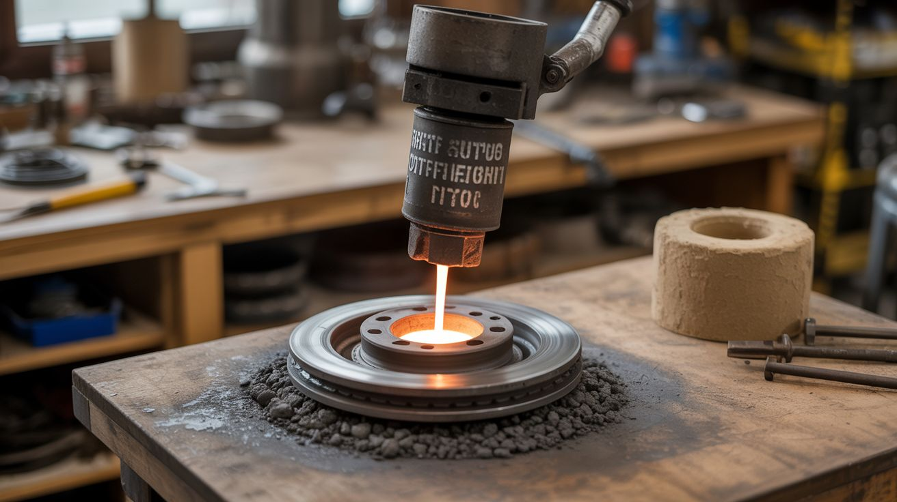

# #284 — Thermite Forge Foundry

  

> Thermite melts steel. A brake rotor catches it. A sand mold shapes it. Home metallurgy at 2500°C — the most violent casting process you'll ever attempt.

## Ratings

     

## 🧪 What Is It?

Thermite is a mixture of aluminum powder and iron oxide (rust) that, once ignited, undergoes an exothermic oxidation-reduction reaction producing molten iron and aluminum oxide slag at approximately 2500°C. That's hot enough to melt through an engine block. Most people light thermite as a spectacle and walk away from a cooling puddle of iron on the ground. This build captures that molten iron and puts it to work — pouring it into a sand casting mold to produce actual steel objects.

The chemistry is straightforward: 2Al + Fe2O3 → Al2O3 + 2Fe + massive heat. The aluminum steals the oxygen from the iron oxide, releasing pure molten iron and aluminum oxide (corundum) slag. The reaction is self-sustaining once ignited — no external heat source needed after the magnesium ribbon starter burns through to the thermite mix. The molten iron produced is surprisingly pure and separates cleanly from the lighter slag, which floats on top.

A car brake rotor serves as the crucible. Cast iron rotors handle the thermal shock better than almost anything else you'll find for free — they're already designed for extreme heat cycling. The rotor sits inside a steel container lined with fire bricks and sand, with a hole drilled in the bottom that plugs with a clay stopper. Thermite goes on top. Light it, let the reaction complete (about 15-30 seconds depending on batch size), pull the clay stopper, and molten iron pours through the bottom tap hole into your sand mold below. The result is a rough cast iron object that you can grind, machine, and finish into something permanent — a tool, a sculpture, a paperweight made from rust and aluminum cans.

<strong>🧰 Ingredients</strong>

- [ ] Iron oxide powder (Fe2O3) — fine red rust, 200 mesh or finer *(online chemical supplier or made by rusting steel wool in hydrogen peroxide, ~$15 per pound)*
- [ ] Aluminum powder — 200 mesh, flake or atomized *(online pyrotechnics supplier, ~$15 per pound)*
- [ ] Magnesium ribbon — for ignition, 3mm wide *(online chemical or pyrotechnics supplier, ~$8)*
- [ ] Brake rotor — vented or solid, from any car *(junkyard, ~$5 or free)*
- [ ] Fire bricks — 4-6, to line the reaction container *(hardware store, ~$3 each)*
- [ ] Sand casting frame (flask) — two-part wood or metal frame for cope and drag *(build from scrap wood or buy, ~$10-$20)*
- [ ] Casting sand — olivine or petrobond (oil-bonded) for the mold *(foundry supply or online, ~$20 for 25 lbs)*
- [ ] Clay or fireclay — for the tap stopper and sealing *(hardware store, ~$5)*
- [ ] Steel container — 5-gallon steel bucket or metal drum section to hold the fire bricks and rotor *(salvage, free)*
- [ ] Safety gear — full face shield (not just goggles), leather welding gloves, leather apron, leather boots, long-sleeve cotton or leather shirt *(welding supplier, ~$30-$60 total)*
- [ ] Metal rod — 1/4" steel, 3 feet long, for pulling the tap stopper *(hardware store, ~$3)*
- [ ] Pattern — the object you want to cast, carved from wood, 3D-printed, or made from wax *(already own or ~$5 in material)*

## 🔨 Build Steps

1. **Prepare the thermite mix.** Measure iron oxide and aluminum powder by weight at a ratio of approximately 8:3 (iron oxide to aluminum) — for example, 800g Fe2O3 to 300g Al. This is stoichiometric. Mix them thoroughly but gently in a plastic container with a wooden stick. Never use metal tools — a spark from metal-on-metal can ignite the mix. Never mix near open flame. Store in a sealed plastic container away from heat. A good first batch is 500g total, which yields roughly 200g of molten iron.

2. **Build the reaction vessel.** Line the inside of the steel container with fire bricks, creating a cavity that the brake rotor fits inside snugly. The rotor sits at the top of the brick cavity, right-side-up, with its center hole serving as the tap hole. Below the rotor, the bricks form a channel that funnels molten iron down to the bottom of the container, where you'll drill or cut a tap hole in the steel bucket. Seal all gaps between bricks with fireclay slurry and let it dry for 24 hours.

3. **Make the tap stopper.** Roll a plug of fireclay around the end of the metal rod, sized to fit snugly into the bottom tap hole. When you're ready to pour, you pull the rod and the clay plug comes with it, releasing the molten iron. Test-fit the stopper multiple times — it needs to seat firmly but pull cleanly. Let the clay dry completely.

4. **Prepare the sand mold.** Pack casting sand firmly around your pattern in the flask, following standard green sand or petrobond technique: place the pattern in the drag (bottom half), pack sand, flip, apply parting dust, add the cope (top half), cut a sprue hole and riser, remove the pattern. The mold cavity should be slightly below the tap hole so gravity feeds the molten iron directly into the sprue. Remember that cast iron shrinks about 1% on cooling — size your pattern accordingly.

5. **Set up the pour station.** This happens outdoors, on dry bare dirt or concrete, far from anything flammable. Place the sand mold on the ground. Position the reaction vessel above it on fire bricks or a steel stand, with the tap hole directly over the mold's sprue. Insert the tap stopper from below. Verify everything is aligned — once the thermite is lit, you cannot reposition anything. Have a garden hose charged and ready 50 feet away (for surrounding brush, never for the thermite itself — water on molten iron causes a steam explosion).

6. **Load and ignite.** Pour the thermite mix into the brake rotor crucible, mounding it in the center. Insert a 6-inch piece of magnesium ribbon into the top of the mound with 2 inches sticking out. Clear everyone to a minimum 20-foot radius. Light the magnesium ribbon with a long-reach lighter or torch and retreat immediately. The magnesium burns at about 2200°C, which is hot enough to initiate the thermite reaction. The thermite will ignite within 5-10 seconds and burn violently for 15-30 seconds with intense white light and sparks.

7. **Tap the molten iron.** Wait 30-60 seconds after the reaction completes for the slag to separate and float to the top. The molten iron pools at the bottom of the rotor. Wearing full safety gear and standing to the side (never directly over the vessel), pull the tap stopper rod. Molten iron pours through the bottom hole into the sand mold's sprue. The pour takes 5-10 seconds. Do not lean over the mold — steam from the sand creates violent spattering.

8. **Cool and extract.** Let the mold cool for at least one hour. Do not quench it with water. Break apart the sand mold to reveal your casting. The object will be rough, with sprues and risers attached and a sandy surface texture. Cut off the sprue and riser with an angle grinder, then grind and file the casting to final shape. The resulting metal is nearly pure iron — soft, workable, and surprisingly good-looking when polished.

## ⚠️ Safety Notes

> **Spicy Level 5 build.** Read the [Safety Guide](../../safety/README.md) before starting.

- Thermite cannot be extinguished once ignited. Water, sand, and fire extinguishers do not stop it — water makes it dramatically worse by causing a steam explosion that sprays molten iron in all directions. If something goes wrong, evacuate and let it burn out. This is why you do it outdoors on bare ground with nothing flammable within 20 feet.
- Molten iron at 2500°C will burn through any material it contacts: shoes, skin, concrete, asphalt. Full leather protection is mandatory — synthetic fabrics (polyester, nylon) melt and fuse to skin on contact with radiant heat. Cotton or leather only. Steel-toed leather boots, not sneakers. A single splash of molten iron will cause a severe burn that requires immediate medical attention.
- The reaction produces intense UV and infrared radiation. Do not look directly at the burning thermite without shade 5+ welding goggles or a welding helmet. A face shield alone is not sufficient to protect your eyes from the radiant intensity. The flash can cause arc eye (welding flash burn) at close range.
- Check your local regulations. Thermite itself is generally legal to possess and ignite on private property in most US jurisdictions, but local fire codes, burn bans, and HOA rules may apply. Use common sense about location — dry grass and thermite are a wildfire ignition combination.

## 🔗 See Also

- [Desktop Foundry](../fire-and-plasma/005-desktop-foundry.md)
- [Thermite Flower Pot Forge](../pyro-and-chemistry/105-thermite-flower-pot.md)
