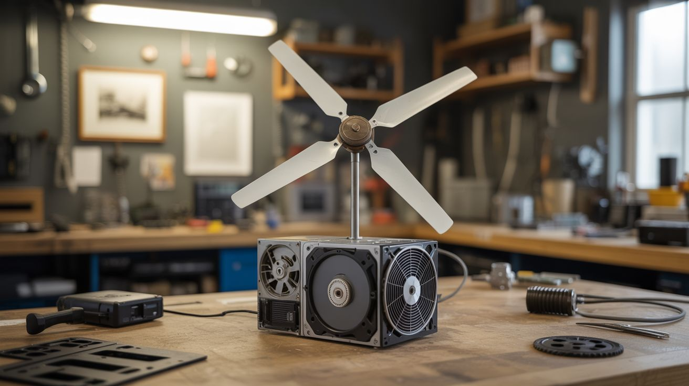

# #285 — E-Waste Wind Turbine

  

> A wind generator built entirely from electronic waste. Hard drive motors become generators, printer gears handle RPM matching, and old fan blades catch the wind. Free power from free parts.

## Ratings

     

## 🧪 What Is It?

Every dead hard drive contains a brushless DC motor with precision bearings, neodymium magnets, and copper coil windings. Spin that motor with external force and it becomes a three-phase AC generator. The problem: hard drive motors are designed to spin at 5400-7200 RPM, and wind turbine blades at this scale spin at maybe 200-500 RPM. The solution: a gear train salvaged from inkjet printers, which are stuffed with precision gears designed for exactly this kind of RPM multiplication.

This build combines three to four hard drive motors wired in parallel, driven through a printer gear train, with blades cut from PVC pipe or salvaged from a box fan. The gear train steps up the slow blade rotation by a factor of 10-20x, bringing the motor shafts into their useful generation range. The three-phase AC output feeds through a rectifier bridge to produce DC, which charges a 12V battery through a simple charge controller. The result is a legitimate wind power system that can produce 10-50 watts in moderate wind — enough to charge phones, run LED lights, or keep a small battery bank topped off.

The engineering challenge isn't any single component — it's making them all work together. The gear train needs to handle the torque without stripping. The blade pitch needs to match the generator's optimal RPM range. The electrical output needs to be conditioned for battery charging. Each of these is a solvable problem using nothing but salvaged parts and basic tools. The whole turbine can be built for effectively zero dollars if you have access to e-waste, which — let's be honest — you do. Everyone does.

<strong>🧰 Ingredients</strong>

- [ ] Brushless DC motors — from dead hard drives, 3.5" desktop drives preferred over 2.5" laptop drives for higher output (need 3-4) *(dead hard drives, free from any IT department or e-waste bin)*
- [ ] Printer gear train — the reduction gear assembly from an inkjet printer, intact if possible *(dead inkjet printer, free)*
- [ ] Fan blades or PVC pipe — either salvage blades from a 20" box fan, or cut custom blades from 6" PVC pipe *(dead box fan or hardware store, ~$5 for PVC)*
- [ ] Rectifier bridge — 4x 1N5408 diodes per motor (or a bridge rectifier module) *(electronics supplier, ~$2)*
- [ ] Charge controller — PWM solar charge controller, 12V 10A *(online, ~$8-$12)*
- [ ] 12V battery — sealed lead-acid (SLA) 7Ah or similar *(already own, or ~$15)*
- [ ] Mounting pole — 1.5" galvanized steel pipe, 6-10 feet *(hardware store, ~$15)*
- [ ] Pipe flange — for mounting the turbine head to the pole *(hardware store, ~$5)*
- [ ] Bearings — if the printer gear train doesn't include sufficient bearing support, salvage bearings from hard drives or skateboards *(salvage, free)*
- [ ] Weatherproofing — outdoor silicone caulk, electrical tape, heat shrink tubing *(hardware store, ~$5)*
- [ ] Wire — 16 AWG outdoor-rated, enough to run from turbine top to battery (20-30 feet typical) *(hardware store, ~$8)*
- [ ] Plywood — 1/2" sheet, for the turbine hub and nacelle base *(hardware store, ~$5)*
- [ ] Tail vane — sheet aluminum or thin plywood, to keep the turbine facing into the wind *(salvage or hardware store, ~$3)*

## 🔨 Build Steps

1. **Harvest and test the motors.** Open each hard drive (Torx T8 screws, often with a hidden one under the label). Remove the platters and head assembly to expose the spindle motor. The motor is the flat, round assembly at the center of the drive with three solder pads on the PCB. Desolder the motor or clip the PCB traces. To test generation capacity, chuck the motor shaft in a power drill, spin it at various RPMs, and measure AC voltage across any two of the three phase wires with a multimeter. At 3000 RPM, a good motor should produce 3-8V AC per phase. Discard any motor producing less than 2V.

2. **Build the rectifier circuits.** Each motor produces three-phase AC. Wire a full bridge rectifier for each: six diodes in a standard three-phase bridge configuration (or use three single-phase bridges). The DC output from each rectifier feeds into a common bus. Wire all motor rectifier outputs in parallel — this adds their current capacities while maintaining the same voltage. Add a large electrolytic capacitor (1000uF, 25V) across the DC bus to smooth the output.

3. **Design the gear train.** Disassemble the printer and extract the gear train intact. You need a gear ratio of approximately 10:1 to 20:1 — slow input (blade shaft) to fast output (motor shaft). Most inkjet printers have a compound gear train in this range for their paper feed mechanism. Map out the gear ratios by counting teeth. If the existing train doesn't hit your target ratio, combine gears from multiple printers. Mount the gears on a plywood plate, ensuring proper mesh and free rotation. The input shaft (low speed, high torque) connects to the blade hub. The output shaft (high speed, low torque) connects to the motor shafts.

4. **Fabricate the blades.** Option A: Salvage fan blades from a box fan — they're already aerodynamically shaped, balanced, and have a center hub. Remove the motor, keep the blade assembly, and attach it to your gear train input shaft. Option B: Cut three blades from a 6" PVC pipe. Slice the pipe lengthwise into thirds, then cut each third to a 16-24" length. The pipe's natural curve creates an airfoil profile. Sand the leading edge round and the trailing edge thin. Bolt the three blades to a plywood hub disk at 120-degree spacing, angled at about 15-20 degrees pitch.

5. **Assemble the nacelle.** The nacelle is the housing that holds the gear train and generators. Build it from plywood — a flat base plate with the gear train and motors mounted on top, and a simple plywood box or pipe section as a weather shield. Mount the blade hub on the front of the input shaft, extending forward of the nacelle. Mount a tail vane on the back — a flat piece of aluminum or plywood on a boom, roughly the same area as the blade sweep. The tail keeps the turbine pointed into the wind.

6. **Mount the swivel.** The nacelle needs to rotate freely on the top of the mounting pole to follow wind direction. A pipe flange bolted to the nacelle base, sitting on a short pipe stub with a thrust bearing (or just a greased pipe-in-pipe joint), provides this rotation. The electrical wires run down through the center of the pipe. Use enough slack wire to allow several full rotations before the cable wraps — or install a slip ring if you want unlimited rotation (though for a home turbine, just unwrap the cable periodically).

7. **Wire the charge circuit.** Run the DC output from the rectifier bus down the pole to the charge controller. Connect the charge controller to the 12V battery. The charge controller prevents overcharging and handles load management. Set it for sealed lead-acid or whatever battery chemistry you're using. Connect a small load (USB charger, LED light) to the charge controller's load terminals for testing.

8. **Raise and test.** Mount the pole in a secure base — a Christmas tree stand weighted with sandbags works for testing, a ground sleeve cemented in a bucket works for semi-permanent installation. Get the turbine at least 6-8 feet above any nearby obstructions. In 10-15 mph wind, the blades should spin up, the gear train should whir, and the battery should begin charging. Monitor voltage and current at the battery terminals. In good wind, expect 1-3 amps at 12V from a 3-motor setup — roughly 15-35 watts.

9. **Weatherproof and optimize.** Seal all electrical connections with heat shrink and silicone. Coat exposed plywood with exterior polyurethane or paint. The gear train is the most weather-sensitive component — enclose it completely and consider packing the gears with lithium grease. Check blade balance by spinning the rotor by hand — if it consistently stops in the same position, one blade is heavier. Sand material from the heavy blade until it balances. An unbalanced rotor vibrates, wears bearings, and eventually self-destructs.

## ⚠️ Safety Notes

- Hard drive platters are made of glass (in newer drives) or aluminum and shatter violently if dropped or hit. Wear safety glasses when disassembling hard drives. Handle platters by the edges and set them aside carefully — the glass ones break into razor-sharp shards.
- Spinning blades are a laceration hazard. At full speed, even lightweight PVC blades carry enough energy to break fingers. Never reach into the blade arc while the turbine is mounted and could catch wind. When working on the nacelle, remove the blades first or tie them to prevent rotation.
- The gear train can multiply torque in reverse — if a motor shaft seizes, the blades suddenly become much harder to stop and the gears experience shock loads. Ensure all motor shafts spin freely before mounting. A seized motor in the gear train can strip gears or, worse, cause the blade hub to lock suddenly while spinning at speed, which transfers all the rotational energy into the mounting structure.

## 🔗 See Also

- [Bicycle Generator](../power-and-energy/050-bicycle-generator.md)
- [DIY Powerwall](../power-and-energy/052-diy-powerwall.md)

**References:**
- [Appliance Teardown Guide](../../reference/appliance-teardown-guide.md)
- [Technical Glossary](../../reference/glossary.md)
