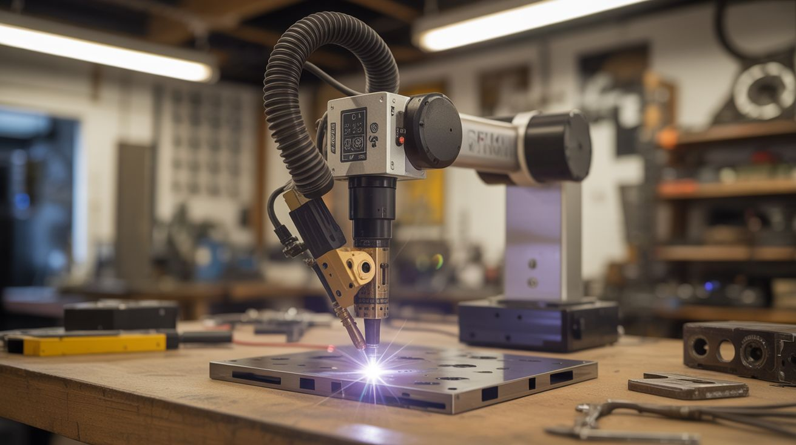

# #286 — Microwave Spot Welder Arm

  

> A robotic arm with a spot welder at the tip. Microwave transformer power meets printer stepper precision — programmable welding for battery packs, sheet metal, and custom fabrication.

## Ratings

     

## 🧪 What Is It?

A microwave oven transformer (MOT) is one of the most dangerously useful things you can pull from appliance e-waste. The original secondary winding produces around 2000V at low current — designed to power a magnetron. Knock out that secondary winding and replace it with 2-3 turns of thick welding cable, and you've converted it into a high-current, low-voltage beast: roughly 2-4V at 800-1000 amps. That's enough current to resistance-weld two pieces of metal together in a fraction of a second. Commercial spot welders use the exact same principle.

This build takes that rewound MOT spot welder and mounts it on a robotic arm built from printer stepper motors and linear rails salvaged from dead inkjet printers and flatbed scanners. Stepper motors produce precise, repeatable positioning. Linear rails provide smooth, backlash-free travel. An Arduino with a CNC shield (the kind used in 3D printers and hobby CNCs) coordinates the motion of multiple axes. A foot pedal triggers the weld pulse — your hands position the workpiece, your foot fires the welder, and the arm maintains exact electrode position and pressure.

The result is a semi-automated spot welder that can place welds at programmed coordinates with sub-millimeter repeatability. The killer application: building lithium battery packs. Each cell needs nickel strip tabs welded to its terminals — dozens or hundreds of identical welds at precise spacing. Doing this by hand with a manual spot welder is tedious and error-prone. Doing it with a CNC-positioned welder arm is fast, consistent, and satisfying in a way that only automation can be. But it's equally useful for any repetitive sheet metal joining task — HVAC ductwork seams, electronics enclosures, decorative metalwork.

<strong>🧰 Ingredients</strong>

- [ ] Microwave oven transformer (MOT) — from a dead microwave, 700W+ rated *(dead microwave, free from appliance recycler or curb)*
- [ ] Welding cable — 2/0 AWG or thicker, ~3 feet total, for the new secondary winding *(welding supplier, ~$10)*
- [ ] Copper electrodes — 3/8" copper rod, sharpened to flat tips *(hardware store or welding supplier, ~$5)*
- [ ] Stepper motors — NEMA 17 from printers/scanners, need 2-3 for X/Y/Z axes *(dead printers, free)*
- [ ] Linear rails — the chrome rods and linear bearings from printer/scanner carriages, 2-3 sets *(dead printers/scanners, free)*
- [ ] Arduino Uno + CNC shield — the GRBL-compatible combo used in hobby CNCs *(electronics supplier, ~$10-$15)*
- [ ] Stepper motor drivers — A4988 or DRV8825, one per motor *(electronics supplier, ~$2 each)*
- [ ] Foot pedal switch — heavy-duty momentary, rated for mains voltage *(electronics supplier or sewing machine supplier, ~$8)*
- [ ] Solid-state relay (SSR) — 25A+ rated, to switch the MOT primary on/off with precise timing *(electronics supplier, ~$8)*
- [ ] Arm structure — 3D-printed joints, plywood, or aluminum angle bracket for the arm segments *(hardware store, ~$10-$15)*
- [ ] Limit switches — microswitch type, 3-6 for homing each axis *(electronics supplier, ~$3)*
- [ ] Power relay or contactor — to safely disconnect MOT mains power when not welding *(electronics supplier, ~$5)*
- [ ] Timer circuit — 555 timer or Arduino-controlled, to limit weld pulse duration to milliseconds *(components on hand or ~$2)*
- [ ] 12V power supply — for the Arduino and stepper motors *(salvage or electronics supplier, ~$5)*

## 🔨 Build Steps

1. **Rewire the microwave transformer.** Remove the MOT from the microwave (unplug it first, obviously, and discharge the high-voltage capacitor by shorting its terminals with an insulated screwdriver — this capacitor can kill you). The MOT has a primary winding (thin wire, many turns) and a secondary winding (thinner wire, many more turns). Keep the primary. Remove the secondary by cutting it and hammering/chiseling it out of the core — this is brute-force work, the winding is varnished in tight. Thread 2-3 turns of your heavy welding cable through the core window as the new secondary. Two turns gives roughly 2V at 800+ amps. Three turns gives 3V at slightly less current. Solder or bolt heavy copper lugs to the cable ends.

2. **Build the electrodes.** Cut two 4-inch pieces of 3/8" copper rod. Flatten and shape one end of each rod into a small welding tip — a flat face about 3mm diameter works well for battery tab welding, larger for sheet metal. The other end connects to the welding cable. Use copper lugs and bolts — soldered connections will melt under the sustained high current. The two electrodes mount in opposition, one above and one below the workpiece, squeezing together to make the weld. For the robotic arm mount, the upper electrode is fixed to the arm's end effector, and the lower electrode is fixed to the work table.

3. **Build the weld timer.** Spot welding requires precise pulse duration — too short and the weld is cold, too long and you burn through the material. For 0.15mm nickel strip on 18650 cells, the sweet spot is roughly 5-15 milliseconds. Use either a 555 timer in monostable mode (triggered by the foot pedal) or program the Arduino to output a timed pulse. The pulse activates the SSR, which switches the MOT's primary winding on for exactly that duration. Start with shorter pulses and increase until you get consistent welds — a proper weld shows a slight discoloration circle without blowing a hole.

4. **Salvage the linear motion components.** Disassemble 2-3 printers and/or scanners. Extract the linear rails (smooth chrome rods with linear bearings or bushings), stepper motors, and any timing belts with pulleys. Flatbed scanners are gold — they have long, straight linear rails and precise carriage assemblies. Printers yield stepper motors and shorter rails. Map out which components will serve each axis of your arm.

5. **Design and build the arm.** This isn't a full industrial robot arm — it's a Cartesian gantry (X/Y/Z linear motion), which is far simpler and more precise. Build a frame from plywood or aluminum extrusion. Mount one linear rail for the X axis (left-right), with a carriage that rides on it. On that carriage, mount a Y axis rail (forward-back). On the Y carriage, mount a Z axis rail (up-down) that carries the upper welding electrode. Each axis is driven by a stepper motor through a timing belt or leadscrew. The travel distance depends on your salvaged rail lengths — even 6 inches per axis is useful for battery pack work.

6. **Wire the CNC electronics.** Plug the stepper motor drivers into the CNC shield, which plugs into the Arduino. Connect each motor to its driver. Connect limit switches to the homing inputs on the CNC shield. Flash GRBL firmware to the Arduino. Test each axis by sending G-code commands from a computer — each motor should move its axis smoothly, and hitting a limit switch should stop motion. Calibrate steps-per-millimeter for each axis by commanding a 10mm move and measuring the actual travel with calipers.

7. **Integrate the welder.** Mount the upper copper electrode to the Z axis carriage. Position the lower electrode on the fixed work table directly below. The Z axis brings the upper electrode down onto the workpiece with the lower electrode beneath — the workpiece and nickel strip are sandwiched between the two electrodes. Wire the foot pedal to trigger the weld timer. The sequence is: position the arm via G-code, press the foot pedal, SSR fires the MOT for the programmed pulse duration, weld is made, arm moves to the next position.

8. **Program the weld pattern.** For battery pack welding, the pattern is a grid of weld points along each nickel strip. Write or generate G-code that moves the arm to each weld position in sequence, pausing at each point for the foot pedal trigger. Or go fully automated: program the Arduino to trigger the weld pulse automatically at each position after a brief dwell, eliminating the foot pedal for production runs. Start in manual (foot pedal) mode until you trust the alignment and weld quality.

9. **Test and calibrate.** Run test welds on scrap nickel strip and steel sheet. A good spot weld holds when you try to peel the strip off — the strip should tear before the weld lets go. Adjust pulse duration, electrode pressure (controlled by Z axis position), and electrode tip condition. Copper tips degrade over time — file them flat when they pit. Once weld quality is consistent, run the full automated pattern on your actual workpiece.

10. **Add safety interlocks.** Wire a master power switch for the MOT circuit — this is mains voltage and must be switched with a properly rated contactor or relay, not a signal-level switch. Add an indicator light that shows when the MOT is energized. Consider an enclosure around the work area with a microswitch that kills MOT power if the enclosure is opened. The welding current is low voltage (2-4V) but the MOT primary is mains voltage — respect that boundary.

## ⚠️ Safety Notes

- The microwave oven's high-voltage capacitor can hold a lethal charge (2100V at several microfarads) even when the microwave is unplugged. Discharge it before touching any internal components. Short the capacitor terminals together using an insulated screwdriver. Some microwave capacitors have an internal bleeder resistor, but do not rely on it — always manually discharge.
- The MOT primary operates at mains voltage (120/240V AC). All mains wiring must use properly rated wire, connectors, and switches. The mains side must be completely enclosed with no exposed terminals. A ground fault on the primary can energize the entire metal frame of the welder. Use a GFCI outlet.
- The welding secondary produces extremely high current at low voltage. While 2-4V won't shock you, 800+ amps flowing through a ring, watch, or bracelet in contact with both electrodes simultaneously will instantly heat the jewelry red-hot and cause severe burns. Remove all metal jewelry before operating. The copper electrodes themselves get hot during repeated welding — wear leather gloves when handling them after a welding session.
- The weld flash is brief but intense. Repeated exposure adds up. Wear safety glasses rated for welding flash — standard safety glasses are sufficient for spot welding (it's not arc welding brightness, but it's not nothing either).

## 🔗 See Also

- [Spot Welder](../functional-machines/027-spot-welder.md)
- [Printer Stepper CNC](../printer-and-scanner/069-printer-stepper-cnc.md)

**References:**
- [Appliance Teardown Guide](../../reference/appliance-teardown-guide.md)
- [Technical Glossary](../../reference/glossary.md)
- [Electronics & Microcontrollers Guide](../../reference/electronics-and-microcontrollers.md)
