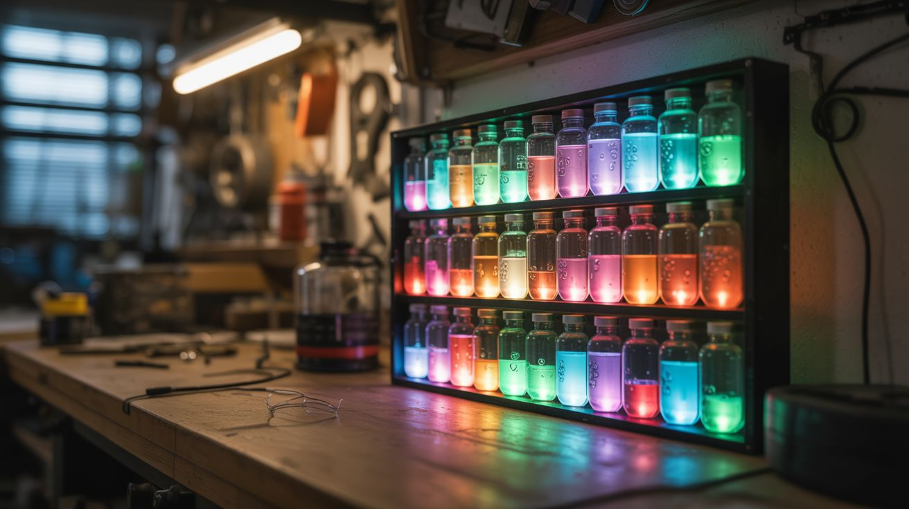

# #287 — Chemical LED Art Panel

  

> A wall panel where digital light and chemical reactions merge. Sealed glass vials of color-shifting solutions backlit by programmable LEDs — living art that breathes, shifts, and never looks the same twice.

## Ratings

     

## 🧪 What Is It?

Take an array of small sealed glass chambers — test tubes, vials, or custom-blown cells — and fill them with solutions that change color or opacity in response to temperature or applied voltage. Back the entire array with individually addressable RGB LEDs. The LEDs provide the light. The chemistry modulates it. The result is a display that combines the crisp programmability of digital LEDs with the organic, unpredictable behavior of chemical reactions — a grid of glowing cells where colors bloom, fade, and shift through transitions that no purely digital display can replicate.

The chemistry works two ways. The simpler approach uses thermochromic pigment — the same material in mood rings and color-changing mugs. Dispersed in a clear solution, thermochromic pigment transitions from opaque to transparent (or between two colors) at a specific temperature threshold. By mounting a small resistive heating element behind each vial and PWM-controlling its temperature, you can make individual cells shift from opaque to transparent, revealing or hiding the LED behind them. The transitions are slow and organic — not the instant on/off of a pixel, but a gradual bloom that takes 2-5 seconds, creating ghostly fade effects impossible with LEDs alone.

The more advanced approach uses electrochromic solutions — tungsten oxide nanoparticles in an electrolyte, sandwiched between conductive glass plates. Apply 1-3V and the solution shifts from transparent to deep blue. Reverse the voltage and it clears. This is the same chemistry used in Boeing 787 Dreamliner windows. The color transition is voltage-controllable, reversible, and can hold its state without continuous power. Combined with the RGB LED behind it, each cell becomes a hybrid pixel: the LED sets the hue, the electrochromic layer controls the saturation and depth, and the interplay between them creates colors and effects that neither technology can produce alone.

<strong>🧰 Ingredients</strong>

- [ ] WS2812B LED strip — 60 LEDs/meter density, enough for your panel grid (e.g., 64 LEDs for 8x8) *(electronics supplier, ~$10-$15)*
- [ ] Arduino Nano — for controlling LEDs and chemical layer *(electronics supplier, ~$5)*
- [ ] Small glass vials — test tubes (10-15mm diameter, 50-75mm long) or flat glass cells, one per grid position *(lab supply or online, ~$10-$20 for a set)*
- [ ] Thermochromic pigment powder — available in various transition temperatures (25°C, 31°C, 45°C, etc.) *(online specialty supplier, ~$8-$12)*
- [ ] Clear carrier solution — water or mineral oil to suspend the pigment in the vials *(hardware store, ~$3)*
- [ ] Resistive heating elements — small 10-ohm resistors (2W) work as heaters when driven at 5-12V, one per vial *(electronics supplier, ~$3 for a bag)*
- [ ] MOSFET array — to PWM-control individual heaters, one N-channel MOSFET per vial or a shift register + MOSFET combination for larger arrays *(electronics supplier, ~$5-$10)*
- [ ] Acrylic sheet — clear, 1/4" thick, for the panel frame front and back *(hardware store or plastics supplier, ~$10-$15)*
- [ ] Diffuser film — white translucent, to soften LED hotspots behind each vial *(photography/lighting supplier or online, ~$5)*
- [ ] Power supply — 5V 10A for the LEDs, plus 12V 3-5A for the heaters *(electronics supplier, ~$12-$18)*
- [ ] Silicone sealant — clear, to mount and seal vials in the panel *(hardware store, ~$5)*
- [ ] Wire — 22 AWG hookup wire, various colors, for the heater array and LED data *(electronics supplier, ~$5)*
- [ ] Mounting hardware — standoffs, screws, and picture-hanging hardware for wall mounting *(hardware store, ~$5)*
- [ ] Shift registers — 74HC595 or TLC5940 if driving more than 8-10 heaters from the Arduino's limited pins *(electronics supplier, ~$3)*

## 🔨 Build Steps

1. **Design the grid layout.** Decide on your array size — 8x8 (64 cells) is a good balance of visual impact and wiring complexity. Sketch the panel on paper: each grid position has one glass vial, one LED behind it, and one heater element. The panel face is clear acrylic with holes or channels to hold the vials. The back layer holds the LED strip and heater wiring. Total panel size for 8x8 at 20mm spacing is roughly 160mm x 160mm (about 6.5" square) — small enough for a desk display, or scale up to 12x12 or 16x16 for wall-mounted impact.

2. **Prepare the thermochromic solution.** Mix thermochromic pigment powder into your carrier solution at roughly 10-20% concentration by weight. Water works fine for a sealed system — add a drop of dish soap to help disperse the pigment. Mineral oil gives better suspension stability and won't grow mold. Stir or shake thoroughly until the solution is uniformly colored. Test it: warm a small sample above the transition temperature (hold the vial in your hand for 31°C pigment, or dip in warm water for 45°C). The solution should shift from deeply colored to nearly clear. Let it cool and watch the color return. If the transition is sluggish, the pigment concentration may be too high — dilute slightly.

3. **Fill and seal the vials.** Fill each glass vial about 80% full with the thermochromic solution, leaving a small air bubble for thermal expansion. Seal each vial with silicone sealant or a rubber stopper secured with epoxy. The seal must be permanent and watertight — a leaking vial on electronics is a disaster. Let the sealant cure fully (24 hours for silicone) before handling. Test each sealed vial by inverting it over a paper towel for an hour. Any leakers get re-sealed.

4. **Build the acrylic frame.** Cut the front acrylic panel with holes or channels to hold each vial in its grid position. A drill press with a Forstner bit matched to your vial diameter gives clean holes. The vials should fit snugly — friction fit plus a dab of silicone on the backside. Cut a back panel of matching size. The two panels will sandwich the LED strip and heater elements. Use standoffs (10-15mm) between front and back panels to create space for the electronics.

5. **Mount the LED strip.** Cut the WS2812B strip into individual LED segments (they cut at the marked solder pads every LED). Arrange one LED behind each vial position on the back panel, data-in to data-out in a serpentine pattern (left-to-right on row 1, right-to-left on row 2, etc.). Solder short jumper wires between each LED segment to maintain the data chain. Solder the 5V power and ground bus wires — thick enough for the total array current (64 LEDs at 60mA max each = 3.84A peak). Adhere the LEDs to the back panel with their adhesive backing or hot glue.

6. **Install the heater elements.** Mount one small resistor (10-ohm, 2W) behind each vial, between the LED and the back of the vial. These resistors become heaters when current flows through them — at 12V through 10 ohms, each dissipates 14.4W, which is too much. Use PWM to control the average power, or use higher-value resistors (47-100 ohm) to limit power per element to 1-3W. You only need to raise the vial temperature by 10-15°C above ambient, which takes surprisingly little heat for a small glass vial. Wire each heater's low side to a MOSFET channel for individual control.

7. **Wire the control electronics.** The Arduino Nano drives two systems: the WS2812B strip (one data pin, using the FastLED or NeoPixel library) and the heater array (via shift registers and MOSFETs if more than ~6 channels). For 64 heaters, use a chain of eight 74HC595 shift registers — each register controls 8 MOSFET gates, each MOSFET switches one heater. The Arduino clocks PWM duty cycle data out to the shift registers at ~100 Hz, giving smooth thermal control. Wire the 5V LED supply and 12V heater supply to their respective circuits with a common ground.

8. **Program the display patterns.** Start with a simple test: light all LEDs white and cycle all heaters on and off. The vials should shift from opaque-colored (heaters off) to transparent (heaters on), revealing the white light behind them. Then get creative. Program patterns that combine LED color changes with thermochromic transitions — a wave of heat rolling across the panel, revealing a color gradient that shifts as the LED colors change beneath. A random "breathing" pattern where individual cells slowly bloom transparent and fade back to opaque creates an organic, living-wall effect. The 2-5 second thermal lag is a feature, not a bug — it creates smooth, mesmerizing transitions that feel alive.

9. **Add the diffuser layer.** Cut a piece of diffuser film to panel size and mount it between the LEDs and the vials. Without diffusion, you see distinct LED hotspots — bright points rather than evenly lit cells. The diffuser spreads each LED's light across its vial evenly, making each cell glow uniformly. Test with and without diffusion — sometimes the hotspot look is actually interesting, especially with the thermochromic layer partially transparent.

10. **Final assembly and mounting.** Assemble the sandwich: back panel (LEDs + heaters + electronics) → diffuser → front panel (vials). Secure with standoff screws at the corners and midpoints. Route the power and data cables out the bottom or through one side. Mount a small project box on the back for the Arduino and power connections. Attach picture-hanging hardware or standoffs for wall mounting. Power it on and enjoy a wall piece that nobody can identify as any technology they've seen before — it's not a screen, it's not a lamp, it's something between chemistry and light that doesn't have a name yet.

## ⚠️ Safety Notes

- Thermochromic pigments are generally non-toxic (they're used in children's toys and food packaging), but avoid inhaling the dry powder during mixing. Work in a ventilated area and wear a dust mask. Once suspended in liquid and sealed in vials, there's no exposure risk.
- The heater resistors get hot — that's their job. At full power, a 10-ohm resistor at 12V reaches temperatures that can melt acrylic and burn skin. The PWM control should limit average power to 1-3W per element, but a software bug could latch a heater at full duty cycle. Add a thermal fuse (rated just above the thermochromic transition temp plus a margin) in series with each heater, or at minimum a master thermal cutoff on the heater supply that trips if any part of the panel exceeds 60°C.
- The 5V LED supply and 12V heater supply together can source significant current. Use properly rated wiring throughout (no 28 AWG signal wire carrying 4 amps). Add a fuse on each power supply output matched to the expected maximum draw. A short circuit in the heater array can start a fire if unfused — 12V at 5A is 60 watts of heating concentrated at a fault point.
- If you pursue the electrochromic approach instead of thermochromic, the tungsten oxide solution is mildly toxic. Handle with gloves, seal the cells permanently, and label the panel so future owners know not to break the vials open.

## 🔗 See Also

- [LED Cube 8x8x8](../pi-and-arduino/122-led-cube-8x8x8.md)
- [Chemiluminescent Fountain](../pyro-and-chemistry/111-chemiluminescent-fountain.md)

**References:**
- [Electronics & Microcontrollers Guide](../../reference/electronics-and-microcontrollers.md)
