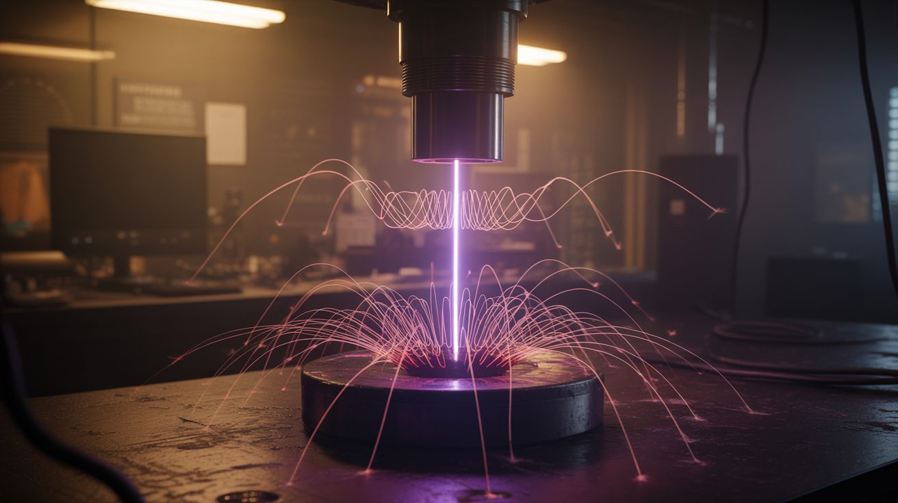

# 💀 Unholy Combos

  

  

> Two categories walk into a workshop. Something beautiful and terrifying walks out.

These are the boss fights. Each one takes two or more builds from other categories and smashes them together into something that makes people question reality. A ferrofluid tornado that dances to music. A cloud chamber inside a vacuum with plasma. A magnetically levitating plasma arc that plays audio.

Every build here assumes you've already mastered the individual components. If you haven't built a cloud chamber, don't start with the vacuum plasma version. If you haven't built a plasma speaker, you're not ready for the levitating one. These are endgame builds — the reward for putting in the work on everything else.

---

## Builds

<a class="cat-card" href="053-singing-ferrofluid-tornado.md">
#053Singing Ferrofluid Tornado

Jaw

Brain

Wallet

Spicy

Clout

Time

</a>
<a class="cat-card" href="054-vacuum-plasma-cloud-chamber.md">
#054Vacuum Plasma Cloud Chamber

Jaw

Brain

Wallet

Spicy

Clout

Time

</a>
<a class="cat-card" href="055-levitating-plasma-speaker.md">
#055Levitating Plasma Speaker

Jaw

Brain

Wallet

Spicy

Clout

Time

</a>
<a class="cat-card" href="283-plasma-speaker-lamp.md">
#283Plasma Speaker Lamp

Jaw

Brain

Wallet

Spicy

Clout

Time

</a>
<a class="cat-card" href="284-thermite-forge-foundry.md">
#284Thermite Forge Foundry

Jaw

Brain

Wallet

Spicy

Clout

Time

</a>
<a class="cat-card" href="285-e-waste-wind-turbine.md">
#285E-Waste Wind Turbine

Jaw

Brain

Wallet

Spicy

Clout

Time

</a>
<a class="cat-card" href="286-microwave-spot-welder-arm.md">
#286Microwave Spot Welder Arm

Jaw

Brain

Wallet

Spicy

Clout

Time

</a>
<a class="cat-card" href="287-chemical-led-art-panel.md">
#287Chemical LED Art Panel

Jaw

Brain

Wallet

Spicy

Clout

Time

</a>

---

### Suggested Build Order

These are endgame builds — each one assumes mastery of its component categories. Start with the least dangerous and work up:

1. **[#285 — E-Waste Wind Turbine](285-e-waste-wind-turbine.md)** — Lowest danger. Learn motor-as-generator + mechanical power transmission.
2. **[#287 — Chemical LED Art Panel](287-chemical-led-art-panel.md)** — Low danger. Combines chemistry with digital control.
3. **[#283 — Plasma Speaker Lamp](283-plasma-speaker-lamp.md)** — High voltage. Master flyback transformers first.
4. **[#286 — Microwave Spot Welder Arm](286-microwave-spot-welder-arm.md)** — MOT + CNC. Requires both electrical and mechanical skills.
5. **[#053 — Singing Ferrofluid Tornado](053-singing-ferrofluid-tornado.md)** — Multi-coil electromagnetic control. The signature build.
6. **[#284 — Thermite Forge Foundry](284-thermite-forge-foundry.md)** — Extreme heat. Do this outdoors with full PPE.
7. **[#054 — Vacuum Plasma Cloud Chamber](054-vacuum-plasma-cloud-chamber.md)** — Vacuum + high voltage. Advanced physics.
8. **[#055 — Levitating Plasma Speaker](055-levitating-plasma-speaker.md)** — The final boss. Magnetic levitation + plasma audio.

### Related Categories

- [Mad Scientist](../mad-scientist/) — The prerequisite builds for these mashups
- [Fire & Plasma](../fire-and-plasma/) — High-temperature and plasma components
- [Sound & Music](../sound-and-music/) — Audio-reactive builds and speaker physics

---

## 📚 Reference Guides

- [Tools Needed](../../reference/tools-needed.md)
- [Sourcing Guide](../../reference/sourcing-guide.md)
- [Difficulty & Ratings Guide](../../reference/difficulty-guide.md)
