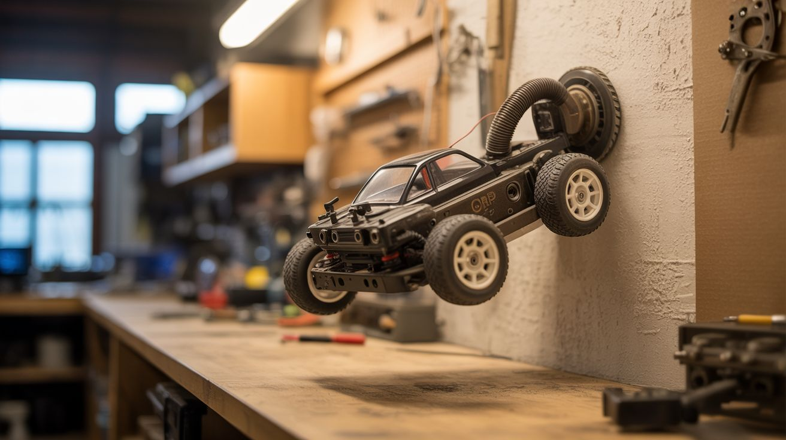

# #076 — Wall-Climbing Robot

  

> Vacuum motor suction + RC car chassis. The suction overcomes gravity. A remote-controlled robot that drives up walls and across ceilings.

## Ratings

| Jaw Drop Rating | Brain Melt Level | Wallet Damage | Spicy Level | Clout Potential | Time to Build |
|---|---|---|---|---|---|
| ⭐⭐⭐⭐⭐ | ⭐⭐⭐⭐ | ⭐⭐ | ⭐⭐ | ⭐⭐⭐⭐⭐ | ⭐⭐⭐ |

## What Is It?

A vacuum motor creates suction — negative pressure that pulls the motor housing toward whatever surface is sealing the intake. If that surface is a wall, and the suction force exceeds the robot's weight, the robot sticks to the wall. Add wheels driven by a separate motor and you have a vehicle that drives up vertical walls, across ceilings, and over any smooth surface. The key insight is that vacuum motors are wildly overpowered for their size — a small vacuum motor generates 5-10 kg of suction force while weighing under 1 kg. Subtract the robot's total weight and you have massive margin for wall climbing. It looks impossible. It's just physics.

## Ingredients

- [ ] Small vacuum motor or turbine fan — handheld/stick vacuum motors are ideal for weight savings *(dead vacuum)*
- [ ] RC car chassis with motors and wheels — small, lightweight *(thrift store or old toy)*
- [ ] Flexible rubber or foam gasket material — to seal suction chamber against the wall *(hardware store)*
- [ ] Arduino or RC receiver — for remote control *(~$5-15, electronics supplier)*
- [ ] Motor driver module (L298N or similar) — for controlling drive motors *(~$3, electronics supplier)*
- [ ] LiPo battery — lightweight, high power for both vacuum motor and drive motors *(~$10, hobby store)*
- [ ] Sheet plastic or thin plywood — for building the suction chamber chassis *(hardware store)*
- [ ] ESC (electronic speed controller) — if using a brushless vacuum motor *(hobby store)*
- [ ] RC transmitter + receiver OR Bluetooth module + phone app — for control *(hobby store or ~$5)*

## Build Steps

1. **Select and test the vacuum motor.** Use a motor from a handheld or stick vacuum — they're lighter than full-size vacuum motors. Test suction by powering the motor and placing the intake against a smooth wall. If the motor can hold its own weight against the wall by suction alone, you have enough force.
2. **Design the suction chamber.** Build a flat, enclosed chamber under the robot chassis that seals against the wall surface. The vacuum motor mounts inside or on top, sucking air out of the chamber. The chamber must have a flexible gasket around its perimeter — this creates the seal against the wall even on slightly uneven surfaces.
3. **Build the chassis.** Use lightweight sheet plastic, thin plywood, or 3D-printed parts. The robot needs to be as light as possible — every gram counts against gravity. Mount the vacuum motor centrally. Keep the profile low and the center of gravity close to the wall surface.
4. **Install the gasket.** Attach flexible rubber or foam weather stripping around the bottom perimeter of the suction chamber. The gasket must be soft enough to conform to the wall surface but firm enough to maintain the seal as the robot drives. Replace often — gasket wear is the #1 failure mode.
5. **Install drive wheels.** Mount 4 wheels with rubber tires at the corners, driven by small DC motors from an RC car. The wheels must protrude slightly below the gasket so they contact the wall. Use a differential drive (two motors, one per side) for tank-style steering.
6. **Wire the electronics.** Connect the vacuum motor to a power switch or ESC. Connect drive motors to the motor driver board. Connect the motor driver to the Arduino or RC receiver. Wire the LiPo battery to power everything. Add an on/off switch accessible from outside.
7. **Program the controls.** If using Arduino + Bluetooth: write code to receive joystick commands from a phone app and control the drive motors accordingly. If using an RC system: bind the receiver to your transmitter and map channels to forward/backward and left/right steering.
8. **Test on the ground first.** Drive the robot around on the floor to verify steering and speed control. Then power on the vacuum motor and place the robot against a smooth vertical wall — it should stick firmly. Drive up slowly.
9. **Tune the suction.** The vacuum motor should run at a speed that provides secure suction without being so strong that the gasket can't slide. If the robot sticks too hard and won't move, reduce vacuum motor power. If it slides or falls, increase power or improve the gasket seal.
10. **Test on different surfaces.** Smooth walls (painted drywall, glass, tile) work best. Textured surfaces (brick, stucco) break the gasket seal. Try ceilings — the robot needs enough suction to hold its own weight plus the force of acceleration during driving.

## Safety Notes

- A wall-climbing robot that loses suction falls. Test low on the wall first (1-2 feet off the ground). Never operate the robot above people, pets, or fragile objects. A falling robot is a projectile.
- LiPo batteries can catch fire if punctured, short-circuited, or overcharged. Use a proper LiPo charger, never over-discharge, and store in a fireproof bag. Impact from a fall can damage the battery.
- The vacuum motor generates significant heat in an enclosed space. Monitor motor temperature during extended runs. An overheating motor can warp plastic chassis parts or damage the battery.

## See Also

- [Vacuum Hovercraft](075-vacuum-hovercraft.md)
- [Cyclone Dust Separator](077-cyclone-dust-separator.md)

**References:**
- [Appliance Teardown Guide](../../reference/appliance-teardown-guide.md)
- [Technical Glossary](../../reference/glossary.md)
- [Electronics & Microcontrollers Guide](../../reference/electronics-and-microcontrollers.md)
