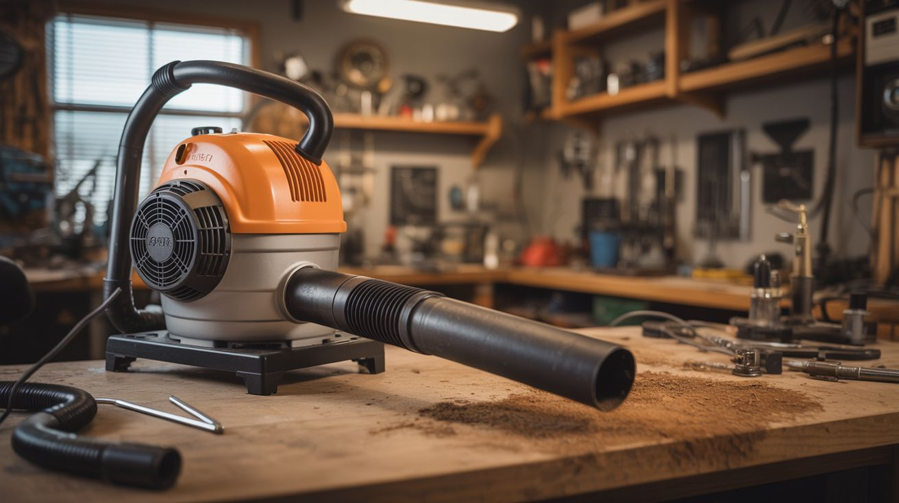

# #078 — Vacuum Leaf Blower

  

> Vacuum motors blow as hard as they suck. Add a PVC nozzle to the exhaust side. 100+ mph air. Free yard tool from a dead vacuum.

## Ratings

     

## 🧪 What Is It?

Every vacuum cleaner has a blow side — air comes in through the intake, passes through the motor impeller, and blasts out the exhaust port. Most vacuums vent this exhaust through a HEPA filter to avoid blowing dust around the room. Bypass the filter, attach a PVC nozzle to concentrate the exhaust, and you have a leaf blower pushing 100+ mph air. A 1200W upright vacuum motor moves the same volume of air as a budget electric leaf blower — because it basically IS a leaf blower with extra steps. This is a 15-minute conversion that turns a dead vacuum into a free yard tool.

<strong>🧰 Ingredients</strong>

- [ ] Dead vacuum cleaner with working motor — upright or canister *(e-waste bin, curb)*
- [ ] PVC pipe — 2" diameter, about 2 feet long *(hardware store)*
- [ ] PVC reducer fitting — to narrow the outlet for higher velocity *(hardware store)*
- [ ] Duct tape or hose clamp — to attach nozzle to exhaust port *(hardware store)*
- [ ] Extension cord — heavy duty *(already own)*

## 🔨 Build Steps

1. **Locate the exhaust port.** On most vacuums, the motor exhausts through a port on the side or back of the motor housing. On uprights, it's usually behind the filter area. On canisters, it's the rear vent grille. Remove any exhaust filters or grilles to expose the raw exhaust output.
2. **Measure the exhaust port.** Measure the diameter of the exhaust opening. You need a PVC pipe or adapter that fits snugly over or inside this port.
3. **Build the nozzle.** Cut a 2-foot length of 2" PVC pipe. Attach a reducer fitting at the end to narrow the opening — this accelerates the air (same volume through a smaller hole = higher velocity). A 2" to 1" reducer works well.
4. **Attach the nozzle.** Fit the PVC pipe onto the exhaust port. Use duct tape, a hose clamp, or a rubber coupling to create a snug, secure connection. Air leaks reduce performance and make noise. The connection needs to withstand the vibration of the motor.
5. **Handle and grip.** If using the original vacuum body, the existing handle works. If you've extracted just the motor, mount it in a bucket or create a simple handle from PVC pipe fittings. The motor needs to be held securely during use.
6. **Test it.** Plug in, power on, and point the nozzle at some leaves on a paved surface. The concentrated exhaust should blast leaves, dirt, and debris effectively. If the motor strains or overheats, the nozzle restriction may be too tight — use a larger reducer opening.
7. **Refine the nozzle.** Experiment with different reducer sizes and pipe lengths. Longer pipes give more reach but reduce airspeed. A wider outlet moves more volume (better for wet leaves), a narrower outlet gives higher velocity (better for stuck debris).

## ⚠️ Safety Notes

- Vacuum motors are not designed for outdoor use. Do not operate in rain or on wet surfaces. The motor draws high current and electrocution through a wet cord is a real risk. Use a GFCI outlet.
- The concentrated air blast can launch small rocks, twigs, and debris at high speed. Wear safety glasses and closed-toe shoes. Point the nozzle away from people, pets, and windows.
- Vacuum motors run hot, especially without their original cooling airflow paths. The exhaust air itself is warm. Don't run continuously for more than 10-15 minutes without letting the motor cool. Overheating burns out the motor windings.

## 🔗 See Also

- [Vacuum Hovercraft](075-vacuum-hovercraft.md)
- [Cyclone Dust Separator](077-cyclone-dust-separator.md)

**References:**
- [Appliance Teardown Guide](../../docs/reference/appliance-teardown-guide.md)
- [Technical Glossary](../../docs/reference/glossary.md)
