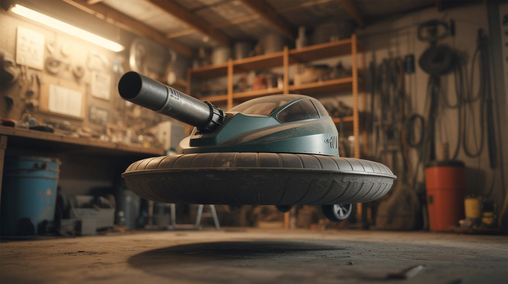

# 🌀 Vacuum Cleaner

  

  

> A vacuum cleaner is a high-RPM motor attached to an impeller. That's a jet engine's job description.

Vacuum motors are absurdly powerful for their size — typically 1000-1500 watts, spinning at 20,000-30,000 RPM. They move massive volumes of air. Reverse the airflow direction and you have a hovercraft lift fan. Add suction to a robot and it climbs walls. Channel the exhaust and you have a leaf blower. Add a cyclone separator and your shop vac filter lasts forever.

The motor doesn't care whether it's sucking dust or doing something far more interesting.

---

## Builds

<a class="cat-card" href="075-vacuum-hovercraft/">
#075Vacuum Hovercraft

Jaw

Brain

Wallet

Spicy

Clout

Time

</a>
<a class="cat-card" href="076-wall-climbing-robot/">
#076Wall-Climbing Robot

Jaw

Brain

Wallet

Spicy

Clout

Time

</a>
<a class="cat-card" href="077-cyclone-dust-separator/">
#077Cyclone Dust Separator

Jaw

Brain

Wallet

Spicy

Clout

Time

</a>
<a class="cat-card" href="078-vacuum-leaf-blower/">
#078Vacuum Leaf Blower

Jaw

Brain

Wallet

Spicy

Clout

Time

</a>
<a class="cat-card" href="298-vacuum-sandblaster/">
#298Vacuum Sandblaster

Jaw

Brain

Wallet

Spicy

Clout

Time

</a>
<a class="cat-card" href="299-pneumatic-launcher/">
#299Pneumatic Launcher

Jaw

Brain

Wallet

Spicy

Clout

Time

</a>
<a class="cat-card" href="325-benchtop-wind-tunnel/">
#325Benchtop Wind Tunnel

Jaw

Brain

Wallet

Spicy

Clout

Time

</a>
<a class="cat-card" href="326-air-hockey-table/">
#326Air Hockey Table

Jaw

Brain

Wallet

Spicy

Clout

Time

</a>

---

### Suggested Build Order

Start with the simplest motor repurposing, end with the crowd-pleaser:

1. **[#078 — Vacuum Leaf Blower](078-vacuum-leaf-blower/)** — Reverse the airflow. Simplest build.
2. **[#077 — Cyclone Dust Separator](077-cyclone-dust-separator/)** — Essential shop tool. Passive physics.
3. **[#298 — Vacuum Sandblaster](298-vacuum-sandblaster/)** — Blow mode + abrasive media. Surface stripping.
4. **[#075 — Vacuum Hovercraft](075-vacuum-hovercraft/)** — The classic. A platform that floats on air.
5. **[#076 — Wall-Climbing Robot](076-wall-climbing-robot/)** — Suction + drive motors. Advanced build.
6. **[#299 — Pneumatic Launcher](299-pneumatic-launcher/)** — Pressurized air + projectiles. The showstopper.
7. **[#325 — Benchtop Wind Tunnel](325-benchtop-wind-tunnel/)** — See aerodynamics with smoke + vacuum motor.
8. **[#326 — Air Hockey Table](326-air-hockey-table/)** — Reversed airflow + drilled surface = playable game.

### Related Categories

- [Functional Machines](../functional-machines/) — Workshop tools from salvaged motors
- [Pranks & Party](../pranks-and-party/) — Party builds powered by air pressure
- [Weird Science](../weird-science/) — Aerodynamics and physics demonstrations

