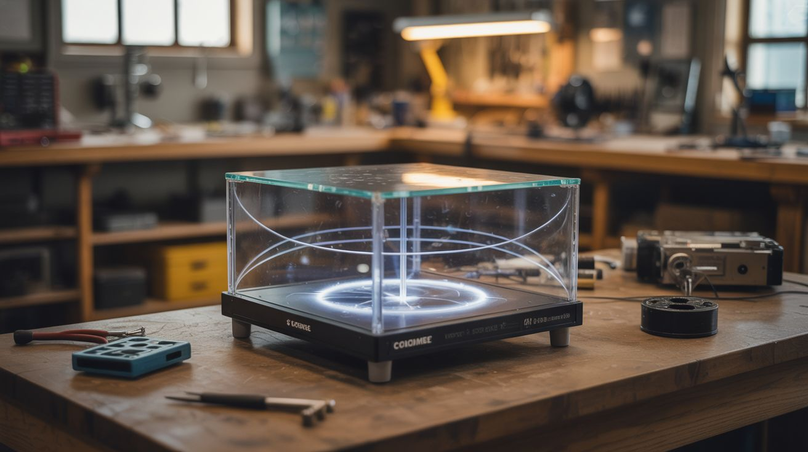

# #330 — Cloud Chamber Coffee Table

  

> A functioning particle physics detector built into a coffee table — watch cosmic rays from deep space while you drink your morning coffee.

## Ratings

     

## 🧪 What Is It?

A continuous cloud chamber sealed inside a glass-topped coffee table. The bottom of the chamber sits on a cold plate chilled by a salvaged fridge compressor, while the top stays at room temperature. Isopropyl alcohol evaporates from a felt strip near the top, and the vapor drifts downward through the temperature gradient until it reaches a supersaturated zone near the cold bottom. When a charged particle — a cosmic ray muon from a supernova explosion 10,000 light years away, an alpha particle from trace radon in your living room, or a beta particle from a radioactive mineral — tears through that supersaturated layer, it ionizes alcohol molecules along its path. Vapor condenses instantly on those ions, leaving a bright white trail that appears for about a second before dissipating. You are watching subatomic particles in real time with your naked eyes.

The coffee table form factor makes this a permanent installation rather than a finicky lab demo. A standard cloud chamber requires constant dry ice replenishment and works for maybe 20 minutes before the ice sublimates. By using a compressor-driven cold plate instead, the chamber runs continuously as long as the compressor is plugged in — hours, days, indefinitely. Side-mounted LED strips at a low angle illuminate the vapor trails against the dark chamber floor, making them glow brilliantly. The visual effect is somewhere between a lava lamp and a portal into another dimension. Guests will either ask you about quantum physics or quietly suspect you're a supervillain.

The build is mostly carpentry and plumbing with some basic electrical. The physics does all the hard work — you're just creating the right thermal environment and getting out of nature's way. The most delicate part is sealing the glass chamber airtight so the alcohol atmosphere stays saturated. Everything else is forgiving.

<strong>🧰 Ingredients</strong>

- [ ] Salvaged refrigerator or window AC compressor with working refrigerant loop *(source: dead fridge or AC unit — the compressor is the valuable part, free from curb finds)*
- [ ] Aluminum plate, at least 12"x18"x1/4" thick *(source: scrap metal yard or machine shop cutoff bin, ~$10-15)*
- [ ] Aquarium glass or display case glass panels — one for the top, four for the sides *(source: thrift store aquarium, old display case, or glass shop, ~$15-30)*
- [ ] LED strip lights, cool white *(source: under-cabinet strips, dead TV backlight strips, ~$5-10)*
- [ ] Isopropyl alcohol, 99% concentration *(source: pharmacy or electronics supply, ~$8)*
- [ ] Black felt or dark fabric for the chamber floor *(source: craft store, ~$3)*
- [ ] Felt strip for the alcohol reservoir along the top interior *(source: craft store, ~$2)*
- [ ] Silicone sealant, aquarium-grade *(source: hardware store or pet store, ~$6)*
- [ ] Lumber for the table frame — legs, apron, support structure *(source: scrap wood, pallet wood, or dimensional lumber, ~$10-20)*
- [ ] Copper tubing for the cold plate evaporator coil *(source: dead fridge or AC, or hardware store, ~$10)*
- [ ] Insulation foam board for under the cold plate *(source: hardware store, ~$5)*
- [ ] 12V power supply for LED strips *(source: old laptop charger or wall adapter, free)*

## 🔨 Build Steps

1. **Build the table frame.** Construct a sturdy four-legged table frame with an open center cavity where the cloud chamber will sit. The table surface should be roughly coffee-table height (16-18 inches). The cavity needs to accommodate the glass chamber on top and the cold plate assembly below. Use heavy lumber — this table holds glass, aluminum, and a compressor. It should not wobble.

2. **Prepare the cold plate.** Braze or clamp copper evaporator tubing to the bottom of the aluminum plate in a serpentine pattern covering the full surface. This is where refrigerant will flow, pulling heat out of the plate. The aluminum needs to reach about -30°C to -40°C for reliable cloud chamber operation. Sand the top surface of the plate to a uniform matte finish — this helps you see particle trails. Glue black felt to the plate's top surface using thin, even adhesive so it lies perfectly flat.

3. **Connect the compressor loop.** Mount the salvaged compressor in the table's lower shelf or base. Connect the copper evaporator tubing on the cold plate to the compressor's suction and discharge lines through the capillary tube or expansion valve that came with the original unit. If you're reusing a complete fridge refrigerant loop (compressor + condenser coil + cap tube), you just need to swap the evaporator for your flat plate. Mount the condenser coil (the hot side) on the outside of the table frame where it can dissipate heat freely.

4. **Build the glass chamber.** Construct a rectangular glass box sized to sit on top of the cold plate with 1-2 inches of clearance above. The top pane is the viewing window — this is where you look down to watch particle trails. Seal all glass joints with aquarium silicone. The chamber needs to be airtight but not pressure-rated — there's no pressure differential, just a sealed atmosphere. Leave one small, sealable port for adding alcohol.

5. **Install the alcohol reservoir.** Glue a felt strip along the inside top edge of the chamber, running around the full perimeter. This strip will be saturated with isopropyl alcohol. The alcohol wicks through the felt, evaporates from the warm top of the chamber, and the vapor drifts down toward the cold plate. The felt needs to be secure — it can't droop or fall. Use silicone adhesive rated for alcohol contact.

6. **Mount the LED side lighting.** Attach LED strips along the inside lower edges of the glass chamber, pointing horizontally across the chamber floor at a very shallow angle (nearly parallel to the cold plate surface). This side-lighting technique is critical — it catches the tiny vapor trails and makes them glow against the dark felt background. Overhead lighting washes them out. Run the LED wires out through a sealed port in the glass.

7. **Seal the chamber to the cold plate.** Set the glass chamber on top of the cold plate with a continuous bead of silicone between them. Press evenly and let it cure 24 hours. This seal must be airtight. The temperature differential between the warm top and cold bottom of the chamber is what creates the supersaturated zone — any air leak disrupts the vapor gradient.

8. **Insulate the cold plate underside.** Glue rigid insulation foam to the bottom and sides of the cold plate, everywhere except the top surface inside the chamber. You want all the cooling directed upward into the chamber, not leaking into the table frame. Insulate the refrigerant tubing runs as well.

9. **Charge and test.** Power on the compressor and let the cold plate reach operating temperature (30-45 minutes). Inject 99% isopropyl alcohol into the chamber through the fill port — enough to thoroughly saturate the felt strip, plus a thin pool on the chamber floor. Seal the port. Kill the room lights, turn on the LEDs, and wait 5-10 minutes for the vapor gradient to establish. You should start seeing short, straight trails (muons from cosmic rays) and occasional thick, branching tracks (alpha particles from ambient radon).

10. **Final table finishing.** Once the chamber is working reliably, finish the table — sand, stain or paint the frame, add a lower shelf to hide the compressor and wiring, route the power cord cleanly. Add a simple on/off switch. The compressor runs quietly (it's just a fridge compressor) and the chamber needs no maintenance beyond occasional alcohol top-offs every few weeks through the fill port.

## ⚠️ Safety Notes

> [!WARNING]
> **Dry ice alternative:** If you test with dry ice before the compressor is set up, always handle dry ice with insulated gloves. Bare-skin contact causes instant frostbite. Use it in a ventilated area — sublimating CO2 displaces oxygen in enclosed spaces.

- **Isopropyl alcohol is flammable.** 99% IPA has a low flash point. Keep it away from open flames, hot surfaces, and sparks. The sealed chamber contains the vapor safely during operation, but be careful during filling — don't fill the chamber near the running compressor's electrical contacts.
- **Refrigerant handling.** If you're brazing copper tubing onto a charged refrigerant system, vent and recover the refrigerant first. Breathing refrigerant vapor directly can cause cardiac arrhythmia. Work in ventilation.
- **Glass panels.** Tempered glass is preferred — if it breaks, it crumbles into small pieces instead of large shards. If using plate glass, handle with cut-resistant gloves and edge-tape any exposed edges.

## 🔗 See Also

- [Cloud Chamber](../mad-scientist/041-cloud-chamber.md) — the standalone benchtop version using dry ice
- [DIY Freeze Dryer](../fridge-and-cooling/094-diy-freeze-dryer.md) — another build that repurposes a fridge compressor for extreme cooling
