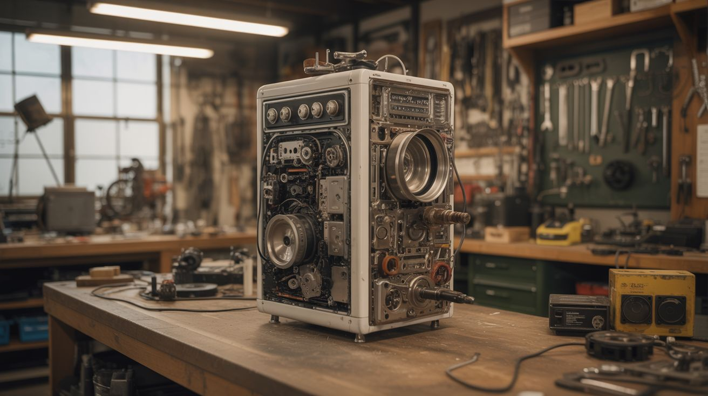

# #332 — Dead Appliance Rube Goldberg

  

> A massive chain-reaction machine built entirely from dead appliance guts — near-zero cost, one hundred percent junkyard spectacle.

## Ratings

     

## 🧪 What Is It?

A Rube Goldberg machine — a comically overcomplicated chain-reaction device that performs a simple task through a long sequence of triggered mechanisms — built under one absolute constraint: every single part must come from dead household appliances. No hardware store trips. No purchased fasteners. No fresh lumber. Everything is salvaged. The washing machine agitator becomes a lever. The dryer drum becomes a rolling track. The blender blade spins a flag. The desk fan blows over dominoes. The microwave turntable rotates a platform. The toaster spring launches a marble. The printer's paper feed rollers transport a ball bearing. The vacuum hose becomes a marble chute. Fridge shelf rails become tracks. The constraint is not a limitation — it is the entire point. The constraint IS the art.

The appeal of a Rube Goldberg machine is watching an absurd chain of cause and effect unfold in sequence — each stage barely, improbably triggering the next. The appeal of building one from dead appliances is that you're forced to see mechanisms where everyone else sees trash. A washing machine agitator is just a lever on a pivot. A dryer drum is a low-friction rolling surface. A microwave turntable motor is a slow, powerful rotary actuator with its own built-in gearbox. Every appliance is a collection of solved mechanical problems — bearings, springs, motors, levers, gears, rollers — just waiting to be recontextualized. The creative challenge is figuring out which salvaged mechanism can accomplish each stage of the chain.

This build is pure creative problem-solving. There is no schematic because no two machines will use the same appliances. The build steps below are a framework — how to design, salvage, prototype, and iterate a chain-reaction machine — not a specific blueprint. Your machine will be dictated by whatever dead appliances you can get your hands on. A busted ceiling fan suggests different stages than a dead treadmill. That's the fun. Budget: effectively zero. Time investment: massive. Glory: immeasurable.

<strong>🧰 Ingredients</strong>

- [ ] Washing machine — agitator (lever/pivot), drain pump (water feature), lid switch (trigger), timer cam (sequencer), suspension springs *(source: dead washer, free)*
- [ ] Dryer — drum (rolling surface/track), belt (long flexible connector), door switch (trigger), lint screen frame (ramp/slide), blower fan *(source: dead dryer, free)*
- [ ] Blender — blade assembly (spinner), motor (rotary drive), glass jar (container for marble catch) *(source: dead blender, free)*
- [ ] Desk fan — fan blades (wind source for pushing lightweight objects), oscillation mechanism (back-and-forth motion), motor *(source: dead fan, free)*
- [ ] Microwave — turntable motor (slow rotary actuator, ~3 RPM), glass turntable plate, door latch mechanism (spring-loaded trigger), magnetron magnets (strong permanent magnets for holding/releasing) *(source: dead microwave, free)*
- [ ] Toaster — spring mechanism (powerful launcher), bread rack lever, heating element frame (structural), crumb tray (ramp) *(source: dead toaster, free)*
- [ ] Inkjet printer — paper feed rollers (precision ball transport), stepper motor (controlled motion), guide rails (linear tracks), timing belt (power transmission) *(source: dead printer, free)*
- [ ] Vacuum cleaner — hose (marble/ball chute), extension tubes (structural), brush roller (conveyor), caster wheels (low-friction rolling) *(source: dead vacuum, free)*
- [ ] Refrigerator — shelf rails (tracks), crisper drawer (collection basin), door shelves (platforms), magnetic door gasket (trigger/switch) *(source: dead fridge, free)*
- [ ] Miscellaneous appliance hardware — screws, brackets, wire, springs, rubber feet, power cords (for lashing/tying) *(source: all of the above)*
- [ ] Steel ball bearings or glass marbles *(source: dead bearings from any appliance with a motor, or buy a bag for $3)*

## 🔨 Build Steps

1. **Design the chain on paper first.** Decide on the final action — what does the machine ultimately accomplish? Classic options: crack an egg, pour a drink, ring a bell, pop a balloon, turn on a lamp. Then work backward from the finale. Sketch each stage as a simple energy transfer: something falls, something tips, something rolls, something spins, something launches. Aim for 15-25 stages. Each stage should be visually distinct and use a different appliance part. Draw it as a side-view diagram with gravity flowing generally left-to-right and top-to-bottom.

2. **Salvage and catalog your mechanisms.** Tear down your dead appliances methodically. Sort every mechanism by what it does: levers, springs, rollers, motors, tracks, containers, triggers, flat surfaces. Label everything. The key insight is to think functionally, not by appliance of origin. A dryer lint screen frame is a ramp. A toaster lever is a catapult arm. A washing machine lid switch is a binary trigger. Lay out all your mechanisms on a table and stare at them until stage ideas emerge.

3. **Build the base frame and table.** Construct a long table or shelving unit to hold the machine. Use structural parts from the appliances themselves — fridge shelf rails as table rails, dryer drum brackets as supports, washing machine panels as platforms. The frame needs to be rock-solid. Vibrations from one stage will propagate through the whole structure and prematurely trigger downstream stages if the frame is wobbly. Bolt and screw everything — no friction-fit joints.

4. **Prototype each stage individually.** Before connecting anything, get each stage working in isolation on the table. Stage 1 (the trigger) needs to reliably start the chain with a light touch. Every subsequent stage needs to reliably activate from the energy output of the previous stage. The word "reliably" is doing heavy lifting here — 95% success rate per stage means a 25-stage machine only completes the full chain 28% of the time. Each stage needs to work 20 out of 20 attempts before you move on.

5. **Calibrate energy transfers between stages.** This is where most Rube Goldberg machines fail. The output of stage N must reliably trigger stage N+1. Too little energy and the next stage doesn't activate. Too much energy and it activates too violently, skipping or breaking the stage after that. Adjust heights, weights, ramp angles, and spring tensions at each connection point. A marble that rolls off a dryer drum track needs to land with enough force to tip the washing machine agitator lever — gravity and height are your tuning knobs.

6. **Connect stages sequentially.** Start from stage 1 and connect to stage 2. Test. Connect stage 2 to stage 3. Test stages 1 through 3 together. Continue adding one stage at a time, testing the full chain from the beginning each time. Yes, this means you will trigger stage 1 approximately 400 times before the machine is complete. This is the process. There is no shortcut.

7. **Add the electrical stages.** If you're using motorized stages (fan blowing dominoes, turntable rotating a platform, blender motor spinning a flag), wire each motor to a simple switch or relay that gets physically triggered by the previous stage. A marble landing on a lever that presses a microswitch is the classic approach. Use the 120V power cords from the dead appliances themselves to wire to outlet power, or rewire motors to run on low-voltage DC from a salvaged laptop charger for safety. The electrical trigger stages are the most reliable stages in the chain — motors don't care about calibration as much as gravity-dependent stages do.

8. **Full chain testing and debugging.** Run the complete machine start to finish. It will fail. Note which stage failed and why. Fix it. Run again. It will fail at a different stage. Fix that. Run again. Repeat approximately 50-100 times. You'll develop an intimate personal relationship with every stage. You will have dreams about stage 14. This is normal. The machine is done when it completes three consecutive successful full runs.

9. **Add visual polish.** Once the chain works reliably, make it look good. Clean and paint appliance parts in contrasting colors so each stage is visually distinct. Add labels or flags that identify the source appliance for each part ("this ramp was a dryer lint screen"). Paint the ball bearings bright colors so they're easy to track visually. The machine should be as fun to watch as it was maddening to build.

10. **Film it properly.** A Rube Goldberg machine that isn't filmed might as well not exist. Set up a camera (or multiple cameras) that can see the entire chain in one shot — a wide side view. Film at least 10 takes to get one clean full run on camera. Slow-motion for the finale. Good lighting on every stage. If filming with a phone, prop it steady and landscape mode. Upload it to the internet. Collect your rightfully earned clout.

## ⚠️ Safety Notes

> [!WARNING]
> **Pinch points are everywhere.** Springs, levers, and falling weights create dozens of finger-grabbing hazards. Keep hands clear of any loaded mechanism. Reset stages with a stick or dowel, not your fingers, especially toaster springs and loaded levers.
- **Electrical stages need proper wiring.** If you're running any stage on mains voltage (120V/240V), use appliance-rated wire, proper insulation, and keep all connections in enclosed junction boxes. A bare 120V wire on an open table is a serious shock hazard. Low-voltage DC (12V from a laptop brick) is strongly preferred for motorized stages.
- **Falling objects.** Heavy items like the dryer drum or a weighted lever can fall if a stage misfires. Don't lean over the machine during testing. Stand to the side, trigger stage 1 with a long stick, and watch from a safe distance until you've confirmed nothing launches sideways.
- **Appliance teardown hazards.** Microwaves contain high-voltage capacitors that can hold a lethal charge even when unplugged. Discharge the capacitor before touching anything inside a microwave — short the terminals with an insulated screwdriver. CRT TVs have similar hazards. Refrigerators contain refrigerant that shouldn't be vented. Tear down appliances with awareness of what's inside them.

## 🔗 See Also

- [Musical Marble Machine](../mechanical-and-kinetic/181-musical-marble-machine.md) — another precision mechanical build driven by gravity and patience
- [Chain Fountain](../mechanical-and-kinetic/184-chain-fountain.md) — a simpler chain-reaction physics demo with spectacular results
