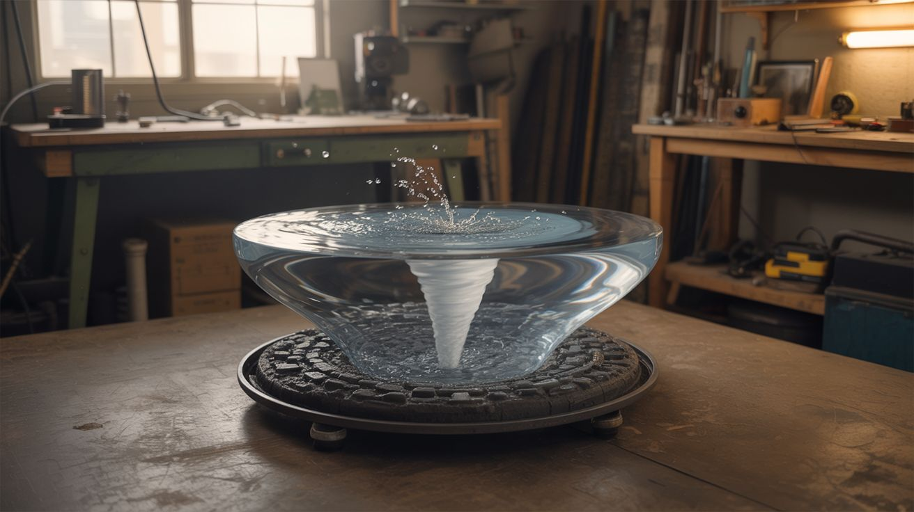

# #334 — Water Vortex Table

  

> A coffee table with a permanent underwater tornado spinning inside it — the centerpiece that ends every conversation and starts a better one.

## Ratings

     

## 🧪 What Is It?

A clear-topped coffee table with a sealed water chamber inside. A salvaged aquarium pump drives water through angled inlet nozzles around the perimeter of a cylindrical chamber, creating a stable, continuously spinning vortex — an underwater tornado that never stops. LED strips mounted underneath illuminate the spinning column, making the vortex core glow with color.

The physics are simple: tangential inlets push water into circular flow. The water spirals inward and downward, forming a visible funnel. A central drain at the bottom feeds back to the pump, creating a closed loop. The vortex is self-sustaining as long as the pump runs — and it runs silent, because aquarium pumps are designed to be inaudible.

People will sit on your couch and stare at this thing for twenty minutes straight without saying a word. It's the most hypnotic piece of furniture you can own, and it costs less than a trip to IKEA.

<strong>🧰 Ingredients</strong>

- [ ] Aquarium or pond pump — 200-400 GPH, submersible *(source: dead aquarium setup, thrift store, ~$5-$10)*
- [ ] Clear acrylic cylinder — 8-12" diameter, 6-8" tall, 1/4" wall thickness *(plastics supplier, ~$15-$25)*
- [ ] Clear acrylic sheet — 1/4" thick, for top and bottom plates *(plastics supplier or hardware store, ~$10)*
- [ ] Silicone tubing — 1/2" ID, ~4ft *(hardware store or aquarium supplier)*
- [ ] Barbed fittings and bulkhead connectors — for inlet nozzles *(hardware store, aquarium supplier)*
- [ ] LED strip — waterproof RGB, 12V *(source: dead electronics, holiday lights, or ~$8 new)*
- [ ] LED controller or Arduino — for color cycling *(source: salvaged LED remote kit, or ~$5)*
- [ ] Scrap wood — 2x4s, plywood, or reclaimed lumber for the table frame *(source: pallets, construction scraps — free)*
- [ ] Acrylic cement / solvent weld glue *(hardware store, ~$5)*
- [ ] Silicone sealant — aquarium-safe *(hardware store)*
- [ ] Distilled water + a drop of dish soap *(reduces surface tension for a tighter vortex)*
- [ ] Food coloring or fluorescent dye (optional) *(grocery store / online)*

## 🔨 Build Steps

1. **Design the vortex chamber.** The chamber is a clear acrylic cylinder capped top and bottom with acrylic discs. The key geometry: 3-4 inlet holes drilled tangentially around the cylinder wall near the top, and one central drain hole in the bottom disc. "Tangentially" means the holes aim along the wall, not toward the center — this is what creates the spin. Sketch it out before cutting anything.

2. **Build the acrylic cylinder assembly.** Cut the top and bottom acrylic discs to match the cylinder's outer diameter. Drill the tangential inlet holes in the cylinder wall — angle each one at 15-20° tangent to the inner wall circumference (not aimed at the center), all pushing in the same rotational direction (e.g., all clockwise when viewed from above). Drill the central drain hole in the bottom disc, sized to match your tubing. Solvent-weld the bottom disc to the cylinder. Leave the top disc removable (sealed with an O-ring or silicone gasket) for filling and maintenance.

3. **Install the inlet nozzles.** Fit barbed bulkhead connectors into each tangential inlet hole. These connect to silicone tubing that runs from the pump's output. The nozzles should be angled slightly downward (5-10 degrees) in addition to being tangential — this pulls the vortex downward and tightens the funnel shape.

4. **Plumb the pump circuit.** Mount the submersible pump in a small reservoir below the chamber (a sealed box or second container hidden inside the table frame). Connect the pump outlet to a manifold that splits into 3-4 lines — one for each inlet nozzle. Connect the central bottom drain back to the pump reservoir. The loop is: pump → manifold → tangential inlets → vortex chamber → bottom drain → reservoir → pump.

5. **Test the vortex before building the table.** Fill the system with distilled water, power the pump, and watch. A visible vortex funnel should form within seconds. If it's wobbly or off-center, check that all inlets are pushing in the same direction and at equal flow rates. Add a drop of dish soap to reduce surface tension — this makes the vortex core narrower and more defined. Adjust pump speed (use an inline valve or PWM pump controller) until the vortex is stable and photogenic.

6. **Install the LED lighting.** Wrap a waterproof RGB LED strip around the outside bottom of the cylinder, or mount it underneath the bottom disc shining upward. The light refracts through the spinning water and concentrates in the vortex core — the funnel glows while the surrounding water stays darker. Wire the LEDs to a controller for slow color cycling. Blue and cyan look the most natural; purple and green look the most alien.

7. **Build the table frame.** Construct a four-legged coffee table frame from scrap wood at standard coffee table height (16-18"). The top surface has a cutout sized to drop the vortex chamber in, with the acrylic top disc sitting flush with the table surface. The pump, reservoir, and wiring hide inside the frame below the chamber. Route the power cable discreetly out the back of one leg.

8. **Seal, fill, and tune.** Seat the vortex chamber into the table, connect all plumbing, fill with distilled water, and bleed any air bubbles. Seal the top disc. Power on the pump and LEDs. Fine-tune the vortex by adjusting individual inlet flow (pinch clamps on the tubing) until the funnel is centered and stable. For extra visual punch, add a tiny amount of fluorescent dye — under UV LEDs, the vortex becomes a glowing plasma column.

## ⚠️ Safety Notes

> [!WARNING]
> **Water and electricity coexist here — respect the boundary.** The pump is submersible and designed for water contact, but all other electrical connections (LEDs, controller, power supply) must stay dry and outside the water path. Use GFCI-protected outlets. Silicone-seal every wire pass-through.

- Check seals periodically. A slow leak inside a wooden table frame leads to mold and rot before you notice the water level dropping. Clear finishes on the wood help, but the real defense is proper silicone sealing on every joint.
- Distilled water inhibits algae growth, but over months you may see buildup. Add a tiny amount of aquarium algaecide or a few drops of hydrogen peroxide to keep the water crystal clear. Plan for occasional drain-and-refill access.

## 🔗 See Also

- [Anti-Gravity Water Fountain](../art-and-installation/044-antigravity-water-fountain.md) — another water illusion build, uses strobe light to freeze falling drops
- [Fog Waterfall Table](../humidifier-and-water/086-fog-waterfall-table.md) — similar table concept but with cascading fog instead of water

**References:**

- [Appliance Teardown Guide](../../docs/reference/appliance-teardown-guide.md)
