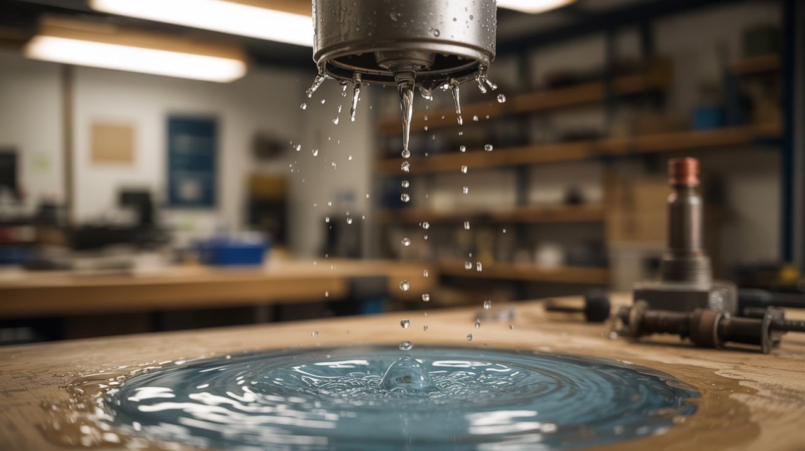

# #336 — Water Droplet Time Fountain

  

> Precisely timed strobes make falling water droplets freeze in mid-air, drift in slow motion, or flow straight back up — you broke physics.

## Ratings

     

## 🧪 What Is It?

A time fountain uses a strobe light synchronized to the drip rate of falling water droplets to create a persistence-of-vision illusion. When the strobe frequency exactly matches the drip frequency, each flash catches the next droplet in the same position as the last — your brain sees a single droplet hanging motionless in the air. Offset the strobe slightly slower than the drip rate and the droplets appear to rise. Slightly faster and they fall in cinematic slow motion. The water is doing nothing unusual. Your eyes are being lied to.

The effect relies on three things working together: a consistent stream of uniform individual droplets (not a continuous pour), a strobe LED bright enough to be the dominant light source in the room, and an Arduino controlling both the drip valve and the strobe so their frequencies stay locked. A solenoid valve from a dead washing machine or dishwasher pulses water through a nozzle at a precise rate. The same microcontroller drives a high-power LED through a MOSFET, flashing it with a short duty cycle for razor-sharp frozen drops.

In a dark room, visitors wave their hands through the "frozen" droplets and completely lose it. The drops splash on contact — confirming they're real water, really falling — but they look absolutely stationary. Add UV LEDs and tonic water (the quinine fluoresces blue) and you get glowing alien rain that defies gravity.

<strong>🧰 Ingredients</strong>

- [ ] Small water pump — aquarium pump or windshield washer pump *(source: pet store, junkyard car, ~$5-10)*
- [ ] Solenoid valve — 12V, normally closed *(source: dead washing machine or dishwasher — free from appliance graveyard)*
- [ ] Silicone or vinyl tubing — 1/4" ID, 2-3 feet *(source: hardware store, ~$3)*
- [ ] Nozzle tip — syringe needle tip or small brass barb fitting for uniform droplet formation *(source: pharmacy, hardware store)*
- [ ] Arduino Nano or Uno *(source: online, ~$5)*
- [ ] High-power white LED — 3W-10W, or an LED strip segment *(source: dead flashlight, online, ~$3)*
- [ ] N-channel MOSFET (IRLZ44N or similar) — for switching the LED at strobe frequency *(source: electronics supplier, ~$1)*
- [ ] Potentiometer — 10K, for fine-tuning strobe offset *(source: old stereo equipment, electronics bin)*
- [ ] Catch basin — bowl, tray, or plastic container *(source: kitchen)*
- [ ] Frame or stand — holds nozzle 12"-24" above the basin *(source: scrap wood, PVC pipe, or 3D print)*
- [ ] 12V power supply — for pump and solenoid *(source: dead laptop charger, router power brick)*
- [ ] Optional: UV LEDs + tonic water for fluorescent effect *(source: online, grocery store)*

## 🔨 Build Steps

1. **Build the reservoir and pump circuit.** Place the pump in the catch basin. Run tubing from the pump output up to the nozzle mounted on the frame, then route a return path so water drips back into the basin. This creates a closed-loop system — no water supply needed. Fill the basin with enough water that the pump never runs dry.

2. **Install the solenoid drip valve.** Splice the solenoid valve into the tubing between the pump and the nozzle. The solenoid acts as a fast-acting gate — when the Arduino pulses it open for a few milliseconds, a single droplet squeezes through the nozzle. The nozzle tip diameter controls droplet size — use a 16-18 gauge syringe needle tip (1.2-0.8mm ID) for uniform droplets. Larger openings produce irregular drips that break the illusion.

3. **Write the Arduino timing code.** Program the Arduino to pulse the solenoid at a steady frequency — start around 20 Hz (20 drops per second). Each pulse should be 10-30 ms long (just enough to release one clean droplet). Simultaneously, drive the MOSFET gate to pulse the LED at a frequency controlled by a potentiometer. The pot lets you sweep the strobe frequency around the drip frequency in real time.

4. **Build the LED strobe circuit.** Connect the high-power LED through the MOSFET. The Arduino digital pin drives the MOSFET gate. Use a current-limiting resistor sized for your LED. The duty cycle should be short — 5-10% of the period — so each flash is a brief, sharp pulse. Longer pulses blur the droplets; shorter pulses freeze them crisper.

5. **Calibrate the frequency match.** Darken the room. Turn on the pump, start the solenoid pulsing, and fire up the strobe. Slowly sweep the potentiometer. At the exact frequency match, droplets snap into a frozen hovering position. Mark this pot position. Tiny adjustments from here produce slow-motion forward, slow-motion reverse, or complete freeze.

6. **Build the frame and enclosure.** Mount the nozzle pointing straight down from a crossbar. The frame needs to be rigid — any vibration translates to wobbly droplet paths that break the illusion. PVC pipe, scrap wood, or aluminum angle stock all work. A dark backdrop behind the drop path improves contrast dramatically.

7. **Tune drip rate vs. strobe for best effect.** The drop spacing matters. Too close together and they merge into a stream — no distinct frozen droplets. Too far apart and the effect is sparse. Adjust the solenoid pulse duration and pump pressure together until you get 6-10 distinct droplets visible in the drop path at any moment.

8. **Add color LEDs for rainbow drops.** Replace the single white LED with RGB LEDs or multiple colored LEDs aimed at the drop path from different angles. Each droplet acts as a tiny lens, refracting the colored light. You can also cycle colors in sync with the drip rate so successive droplets glow different colors — frozen rainbow rain.

9. **Set up for display.** The room needs to be dark for the effect to work — ambient light destroys the illusion because your eyes see the real motion between flashes. A black-painted enclosure with a viewing window works for well-lit spaces. Position the viewing angle so guests look through the drop curtain, not at it from the side.

## ⚠️ Safety Notes

> [!WARNING]
> **Water and electronics in close proximity.** Everything near the water path runs on 12V or less — no mains voltage near the wet zone. Keep the power supply and Arduino on the dry side of the frame. Use GFCI protection on the outlet powering the system.

- **Strobe warning.** Frequencies between 15-25 Hz can trigger photosensitive epileptic seizures. The operating range of this build overlaps that zone. Warn viewers before demonstrating, and avoid prolonged operation at those frequencies.
- **Pump protection.** If the basin runs low, the pump burns out fast. Mark a minimum water line and check it before each session.

## 🔗 See Also

- [Anti-Gravity Water Fountain](../art-and-installation/044-antigravity-water-fountain/) — same core physics, different build approach with speaker-driven droplet formation
- [POV Globe](../light-and-visual/019-pov-globe/) — another persistence-of-vision build, but with LEDs instead of water

