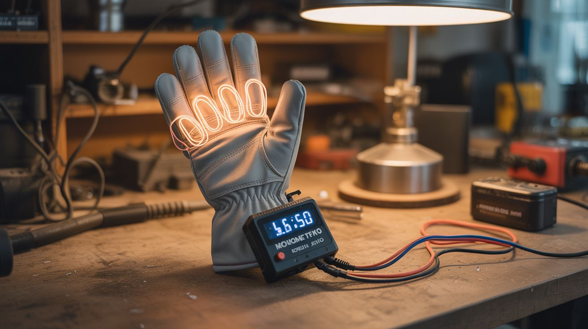

# #243 — Nichrome Wire Heated Gloves

  

> Nichrome wire loops stitched into glove fingers, powered by a LiPo battery with MOSFET PWM temperature control. Three hours of toasty warmth when it's freezing outside. Take that, $150 commercial heated gloves.

## Ratings

     

## 🧪 What Is It?

Your fingers go numb first when it's cold because your body sacrifices extremity circulation to keep your core warm. Commercial heated gloves solve this with embedded heating elements and rechargeable batteries, but they cost $80-200 and the heating elements are proprietary — when they break (and they always break), the whole glove is trash. DIY heated gloves use nichrome wire — the same resistance wire in toasters and hair dryers — stitched along the back of each finger. Run current through the wire and it heats up. Control the current with a MOSFET and PWM signal from a microcontroller and you get precise, adjustable temperature control.

Nichrome wire is the ideal heating element material because it has high electrical resistance (meaning it converts electricity to heat efficiently), it doesn't oxidize at operating temperatures (so it lasts forever), and it's flexible enough to be sewn into fabric without breaking. A few feet of 30-32 gauge nichrome wire, looped along each finger and across the back of the hand, draws about 1-2 amps at 7.4V (two 18650 LiPo cells in series). That's 7-15 watts of heat — plenty to keep your fingers warm in sub-freezing temperatures. A pair of 3000mAh 18650 cells gives you 3+ hours of continuous heat.

The MOSFET PWM control is what separates this from wrapping wire around your hand and hoping for the best. A small microcontroller (ATtiny85 or even just a 555 timer) generates a PWM signal that switches the MOSFET on and off rapidly. The duty cycle (percentage of time the MOSFET is on) controls the average power delivered to the nichrome wire. A potentiometer or button lets you adjust the duty cycle from 20% (mild warmth) to 100% (full blast). This prevents overheating, extends battery life, and gives you the same adjustability as the expensive commercial gloves.

<strong>🧰 Ingredients</strong>

- [ ] Work gloves or winter gloves — inner liner gloves with some thickness for insulation *(existing or dollar store, ~$3)*
- [ ] Nichrome wire — 30-32 gauge, about 6 feet per glove *(online, ~$5 for 25 feet)*
- [ ] 18650 LiPo cells — 2 per glove, 3000mAh+ *(salvage from old laptop batteries or online, ~$3-5 each)*
- [ ] 18650 battery holder — 2-cell series holder *(online, ~$2)*
- [ ] N-channel MOSFET — IRLZ44N or similar logic-level gate *(online, ~$1)*
- [ ] ATtiny85 microcontroller — or a 555 timer IC for simpler control *(online, ~$2)*
- [ ] Small potentiometer — 10kΩ for temperature adjustment *(~$1)*
- [ ] Thin silicone-coated wire — 24 AWG, for power routing *(online, ~$3)*
- [ ] Needle and thread — for stitching nichrome into the gloves *(sewing kit, existing)*
- [ ] Heat shrink tubing — for insulating connections *(~$2)*
- [ ] Small project box — to house the battery and controller on the wrist *(~$2)*
- [ ] Velcro straps — to secure the battery box to the wrist or forearm *(~$2)*

## 🔨 Build Steps

1. **Calculate the wire length.** Nichrome wire resistance depends on gauge and length. 32-gauge nichrome has about 10.3 ohms per foot. For a 7.4V supply (two 18650s in series) and a target power of ~8 watts per glove, you need about 7 ohms of resistance — roughly 8 inches of wire per finger loop, totaling about 5-6 feet per glove when wired in parallel loops. Use Ohm's law: P = V²/R. More resistance = less heat. Less resistance = more heat but shorter battery life.

2. **Stitch the heating loops.** Thread the nichrome wire through a large needle. Stitch a serpentine pattern along the back of each finger and across the back of the hand. Keep the wire on the back (dorsal) side — the palm side needs to grip things and wire there would be uncomfortable. Stitch through the fabric to anchor the wire but don't pull it tight — leave slight slack so the wire can flex without breaking when you bend your fingers. Leave wire leads at the wrist end of the glove.

3. **Wire the finger loops.** Connect all finger heating loops in parallel at the wrist — positive leads together, negative leads together. Parallel wiring ensures each finger heats independently and a break in one loop doesn't kill the others. Solder the connections carefully and insulate with heat shrink.

4. **Build the controller circuit.** On a small piece of perfboard, wire the ATtiny85 (or 555 timer) to drive the gate of the IRLZ44N MOSFET. The MOSFET's drain connects to the negative bus of the heating loops; the source connects to battery negative. The ATtiny85 reads the potentiometer on an analog input and outputs a corresponding PWM signal on a digital pin to the MOSFET gate. Program the ATtiny85 with a simple PWM sketch — analogRead the pot, map the value to a PWM duty cycle, analogWrite to the MOSFET gate pin.

5. **Mount the battery and controller.** Put the 18650 battery holder and controller board in a small project box. Mount the potentiometer knob on the outside of the box for easy adjustment through outer gloves. Attach a Velcro strap so the box can be secured to your wrist or forearm. Route the power wires from the box into the glove through a grommet or reinforced hole at the wrist opening.

6. **Add a thermal safety cutoff.** Stick a small self-resetting thermal fuse (PTC thermistor rated at 50°C) in series with the power line, positioned against the nichrome wire at the hottest point (usually the middle finger loop). If the glove temperature exceeds 50°C (way too hot for comfort), the PTC trips and cuts power until it cools. This prevents burns if the controller fails or the pot gets bumped to max.

7. **Test carefully.** Connect the battery and start the pot at minimum. Slowly increase power while wearing the glove. You should feel gentle warmth within 30 seconds. At 50% power, the glove should be comfortably warm. At 100%, it should be noticeably hot but not painful. If any spot feels too hot, that loop has too little resistance — add more wire length to that finger.

8. **Insulate and weatherproof.** Wear these gloves as an inner liner under a regular winter glove or mitten. The outer layer traps heat and protects the nichrome wiring from snags. Tuck the battery box inside your jacket sleeve. The system is low voltage (7.4V) so there's no shock hazard, even in wet conditions.

## ⚠️ Safety Notes

- LiPo/Li-ion batteries can be dangerous if shorted, punctured, or overcharged. Use cells with built-in protection circuits (most salvaged 18650s have them). Never short the battery terminals. Store cells in a fireproof bag when not in use.
- The nichrome wire operates at temperatures that can cause burns if the controller malfunctions. The thermal fuse (PTC) is an essential safety component, not optional. Test the thermal cutoff before relying on these gloves.
- Inspect nichrome wire stitching regularly for breaks. A broken wire could create a hot spot at the break point or leave a sharp wire end that pokes through the fabric.
- Do not wash the gloves in a machine. Hand wash only with the electronics removed (use connectors at the wrist to make the electronics detachable).

## 🔗 See Also

- [Sound-Reactive LED Jacket](242-led-jacket.md)
- [GPS Treasure Hunt Watch](247-gps-treasure-watch.md)
