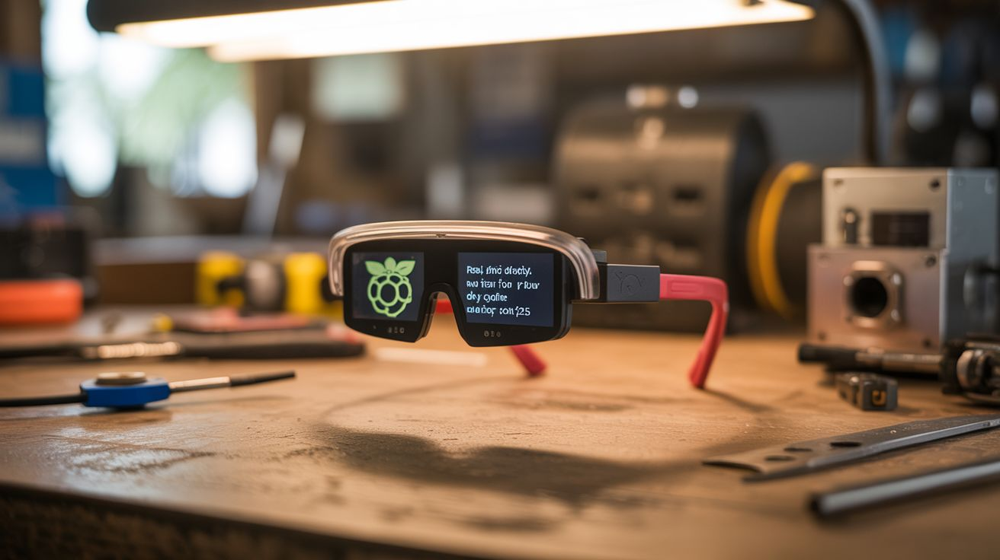

# #245 — Heads-Up Display Glasses

  

> A micro OLED display, a prism reflector, and a 3D-printed frame turn a Raspberry Pi Zero into DIY Google Glass. Real-time data floating in your field of view for about $25.

## Ratings

     

## 🧪 What Is It?

Google Glass launched in 2013 at $1,500, became a cultural phenomenon, and then died because it was overpriced, underpowered, and made everyone around you uncomfortable. The core concept, though — a transparent heads-up display floating data in your field of vision — is genuinely useful and genuinely cool. The technology behind it is surprisingly simple: a tiny display projects an image onto an angled semi-reflective surface (a beam splitter or prism) positioned in front of your eye. You see the real world through the transparent surface AND the projected image reflected on it. Fighter pilots have had this since the 1950s. You’re building one from a $5 OLED display and a dollar-store magnifying glass.

The key optical component is the beam splitter. A piece of clear acrylic or glass angled at 45 degrees in front of one eye acts as a partial mirror — it reflects the OLED image into your eye while still transmitting most of the light from the real world. The OLED display sits above or beside the beam splitter, facing down onto the reflective surface. You see the OLED content superimposed on reality. A small fresnel lens or magnifying lens between the OLED and the beam splitter focuses the image at optical infinity, so your eye doesn’t have to refocus to read the display. Without the lens, you’d be trying to focus on something an inch from your eyeball — uncomfortable and blurry.

A Raspberry Pi Zero (or ESP32 for lighter weight) drives the display. It can show anything: time, date, weather, notifications, GPS coordinates, step count, heart rate from a Bluetooth sensor, incoming text messages, even turn-by-turn navigation. The Pi Zero W has built-in WiFi and Bluetooth, so it can pull data from the internet and pair with your phone. Mount everything in a 3D-printed glasses frame (or hack apart a pair of cheap safety glasses) and you have a $25 heads-up display that does 80% of what Google Glass did for 2% of the price.

<strong>🧰 Ingredients</strong>

- [ ] Micro OLED display — 0.96" SSD1306, 128x64 pixels, I2C interface *(online, ~$4)*
- [ ] Raspberry Pi Zero W — or ESP32 for lighter weight *(online, ~$5-10)*
- [ ] Small fresnel lens — or a lens from a dollar-store magnifying glass *(dollar store, ~$1)*
- [ ] Beam splitter — clear acrylic rectangle, ~1" x 1.5", or microscope slide *(craft store or lab supply, ~$2)*
- [ ] 3D-printed frame — or modified safety glasses *(3D printer or safety glasses from hardware store, ~$3)*
- [ ] LiPo battery — 500-1000mAh, small form factor *(online, ~$5)*
- [ ] LiPo charging board — TP4056 module *(online, ~$1)*
- [ ] Micro SD card — for Pi Zero OS *(existing or ~$5)*
- [ ] Thin ribbon cable — for connecting OLED to Pi *(included with OLED or ~$2)*
- [ ] Hot glue and epoxy — for mounting optics *(existing)*
- [ ] Black paint or tape — to block stray light from the OLED housing *(existing)*

## 🔨 Build Steps

1. **Design the optical path.** The OLED display faces downward (or sideways). Its image hits the beam splitter at 45 degrees and reflects into your eye. Between the OLED and the beam splitter, place the fresnel lens to collimate the image (make the light rays parallel so the image appears focused at infinity). The beam splitter sits in front of one eye. Experiment with the lens-to-OLED distance on a bench before building the frame — you want the OLED image sharp and in focus when you look through the beam splitter at the wall behind it.

2. **Prepare the beam splitter.** Cut a piece of clear acrylic (1mm thick) to approximately 1" x 1.5". The acrylic should be clean, flat, and free of scratches. It doesn’t need any special coating — plain clear acrylic reflects about 4% of light at 45 degrees, which is enough for an OLED image to be visible without blocking your view of the real world. A microscope glass slide works even better.

3. **Build or modify the frame.** If you have a 3D printer, design a frame that holds the OLED module above one eye, the lens in front of the OLED, and the beam splitter at 45 degrees in front of the eye. If no 3D printer, start with a pair of cheap safety glasses. Remove one lens and attach the beam splitter at 45 degrees using epoxy and a small bracket made from bent aluminum or thick wire. Mount the OLED on the temple arm above the beam splitter.

4. **Mount the optics.** Secure the OLED display to the frame with hot glue, screen facing toward the beam splitter. Position the fresnel lens between the OLED and beam splitter at the focal distance you determined in step 1 (usually 15-30mm from the OLED, depending on the lens). Secure the beam splitter at 45 degrees to the line of sight. Build a small shroud from black tape or cardboard around the OLED to block stray light from reaching your eye directly — all light from the OLED should bounce off the beam splitter, not leak around it.

5. **Wire the electronics.** Connect the OLED to the Pi Zero via I2C (SDA, SCL, 3.3V, GND). Mount the Pi Zero on the temple arm behind your ear — it’s small enough to sit flat against the frame. Connect the LiPo battery through the TP4056 charging board to the Pi Zero’s 5V input. Route wires along the frame, secured with small cable clips or glue.

6. **Set up the Pi Zero software.** Flash Raspberry Pi OS Lite to the SD card. Install Python 3 and the Adafruit SSD1306 library. Write a Python script that renders text and simple graphics to the OLED: current time, date, battery level, and whatever data you want to display. For WiFi-connected data (weather, notifications), use APIs. For phone notifications, use Bluetooth AMAP or a phone companion app. The 128x64 pixel OLED fits about 4 lines of readable text.

7. **Optimize the display content.** Less is more on a HUD. Display only what you need at a glance: time, one line of current notification, and a status icon. Use high-contrast text (white on black) for readability against the real-world background. Implement a button (on the temple arm) to cycle through screens: clock, weather, notifications, GPS coordinates, blank (display off to save power).

8. **Calibrate and test.** Put the glasses on and adjust the beam splitter angle until the OLED image is centered in your field of view and appears at a comfortable reading distance. The image should be visible but not distracting — you should be able to read it with a glance upward without it obscuring your forward vision. Adjust the OLED brightness in software so it’s visible indoors without being washed out outdoors. A brightness sensor (LDR on an ADC pin) can auto-adjust.

## ⚠️ Safety Notes

- Do not wear these while driving, cycling, or operating machinery. The HUD occupies part of your visual field and creates a distraction. This is for walking, standing, or sitting use only.
- The beam splitter can produce reflections and glare in bright sunlight that may temporarily impair vision in that eye. Add a small visor or tint if using outdoors.
- The LiPo battery is near your face. Use a battery with built-in protection circuit and mount it securely. Inspect for swelling regularly. A shorted or punctured LiPo near your face is a serious burn risk.
- The OLED display emits light very close to your eye. While the brightness is low, prolonged use may cause eye strain. Take breaks every 30-60 minutes.
- Be mindful of social settings — people may assume you’re recording them (the Google Glass problem). Be transparent about what the device does.

## 🔗 See Also

- [Sound-Reactive LED Face Mask](244-led-mask.md)
- [GPS Treasure Hunt Watch](247-gps-treasure-watch.md)

**References:**
- [Electronics & Microcontrollers Guide](../../reference/electronics-and-microcontrollers.md)
