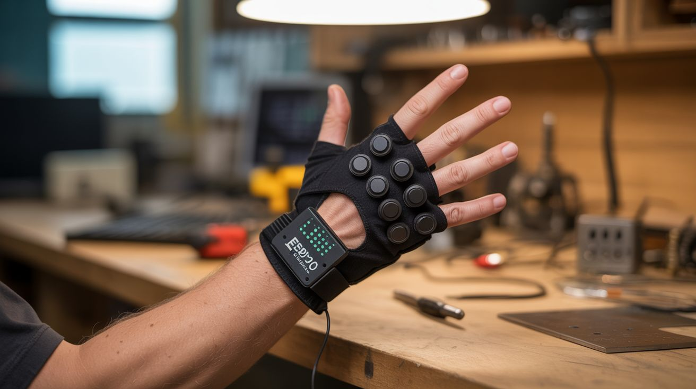

# #246 — Motion Capture MIDI Glove

  

> Flex sensors on each finger, an MPU6050 on the wrist, and an ESP32 brain. Bend your fingers to play notes, tilt your wrist for pitch bend. Air guitar is finally real.

## Ratings

     

## 🧪 What Is It?

Imagine playing a synthesizer with nothing but hand gestures. No keyboard, no pads, no strings — just your fingers bending in the air. Each finger controls a different note or parameter. Curl your index finger and a bass note sounds. Straighten your pinky and a hi-hat triggers. Tilt your whole wrist left and the pitch bends down. Roll it right and a filter opens up. This is a motion capture MIDI glove, and it turns your hand into a musical instrument that would make a theremin jealous.

The sensing is done by two types of components working together. Flex sensors — thin resistive strips that change resistance when bent — are mounted along the back of each finger. When you curl a finger, the flex sensor bends, its resistance changes, and the ESP32 reads that change on an analog input. The MPU6050 is a 6-axis inertial measurement unit (accelerometer + gyroscope) mounted on the back of the hand that tracks wrist orientation — pitch, roll, and yaw. Together, five flex sensors and one IMU give you 8+ continuous control axes from a single hand. That’s more real-time expressiveness than most hardware MIDI controllers.

The ESP32 reads all the sensors, maps them to MIDI messages, and sends those messages over USB or Bluetooth to a computer running any DAW (Ableton, FL Studio, Logic, GarageBand). In the DAW, you map the incoming MIDI CC messages to whatever parameters you want: notes, volume, filter cutoff, reverb depth, sample triggers. The mapping is entirely up to you. The glove is the interface; the software is the instrument. Together they’re a performance tool that looks like magic to anyone watching.

<strong>🧰 Ingredients</strong>

- [ ] Flex sensors — 4.5" resistive flex sensor, quantity 5 (one per finger) *(online, ~$8-10 each, or ~$35 for a pack)*
- [ ] MPU6050 module — 6-axis accelerometer/gyroscope breakout *(online, ~$3)*
- [ ] ESP32 dev board — for sensor reading and Bluetooth MIDI *(online, ~$5-8)*
- [ ] Thin glove — lycra or spandex workout glove for a snug fit *(existing or dollar store, ~$3)*
- [ ] 10k ohm resistors — 5 pieces, for flex sensor voltage dividers *(~$1)*
- [ ] Thin ribbon cable or magnet wire — for routing sensor wires along fingers *(~$3)*
- [ ] Heat shrink tubing — for insulating connections *(~$2)*
- [ ] Small LiPo battery — 500-1000mAh for wireless operation *(online, ~$5)*
- [ ] TP4056 charging module — for LiPo charging *(online, ~$1)*
- [ ] Perfboard — small piece for the voltage divider network *(~$1)*
- [ ] Fabric glue or thread — for securing sensors to the glove *(existing)*
- [ ] Velcro — for securing the ESP32 enclosure to the wrist *(~$2)*

## 🔨 Build Steps

1. **Prepare the flex sensors.** Each flex sensor is a strip that reads about 10k ohms when flat and 20-40k ohms when fully bent at 90 degrees. To read this with the ESP32’s ADC, build a voltage divider for each sensor: one leg of a 10k fixed resistor to 3.3V, the other leg to the flex sensor and to an ESP32 analog pin. The flex sensor’s other terminal goes to ground. As the sensor bends, the voltage at the ADC pin changes. Wire all 5 dividers on a small perfboard.

2. **Mount sensors on the glove.** Lay each flex sensor along the back of a finger, from knuckle to fingertip. The sensor should cross the main knuckle joint — that’s where the bending happens. Secure with fabric glue, small stitches through the sensor’s mounting holes, or by sliding the sensors into narrow fabric channels sewn onto the glove back. The sensors must bend with the fingers but not bunch up or shift position.

3. **Mount the IMU.** Attach the MPU6050 breakout board to the back of the hand, centered between the knuckles and wrist. Use Velcro or a fabric pocket so it stays flat against the hand. Connect it to the ESP32 via I2C (SDA to GPIO21, SCL to GPIO22, VCC to 3.3V, GND to GND). The IMU provides roll, pitch, and yaw of the hand, giving you 3 additional control axes beyond the 5 flex sensors.

4. **Route the wiring.** Run thin wires from each flex sensor along the back of the hand to the perfboard at the wrist. Use ribbon cable or magnet wire for the cleanest routing. Tack the wires down with fabric glue or small stitches every inch to prevent snagging. All wires should converge at the wrist where the ESP32 and perfboard sit. Keep wiring on the back of the hand — palm-side wires interfere with grip.

5. **Mount the ESP32.** Put the ESP32 dev board and the voltage divider perfboard in a small enclosure (3D-printed case or a piece of heat-formed plastic) and strap it to the wrist/forearm with Velcro. Connect the LiPo battery through the TP4056 charging module. The ESP32’s USB port should be accessible for charging and firmware updates.

6. **Program the firmware.** Flash the ESP32 with code that reads all 5 flex sensor ADC values and the MPU6050 orientation at 100Hz. Map each sensor reading to a MIDI Control Change (CC) message: flex sensor 1 (thumb) = CC1, flex sensor 2 (index) = CC2, etc. Map IMU roll to CC11, pitch to CC12. Send MIDI over Bluetooth using the ESP32-BLE-MIDI library — the glove appears as a Bluetooth MIDI device to any computer or phone. Calibrate the sensor ranges in firmware: read the ADC values with fingers flat (min) and fully curled (max), then map that range to 0-127 MIDI values.

7. **Set up the DAW mapping.** Connect the glove to your computer via Bluetooth MIDI. In your DAW, open the MIDI learn/assign function. Bend each finger and assign the incoming CC to a parameter: index finger controls note C3, middle finger controls D3, ring finger controls E3, etc. Map wrist tilt to pitch bend or filter cutoff. The mapping possibilities are infinite — triggers, continuous controls, sample launching, effects parameters.

8. **Calibrate and perform.** Play with the glove for 15 minutes and note any dead zones or jumpy readings. Adjust the voltage divider resistor values if a particular sensor’s range is too narrow. Add smoothing in firmware (running average of the last 4-8 readings) to eliminate jitter. Once calibrated, the glove should feel natural — you think about the music, not the technology.

## ⚠️ Safety Notes

- All voltages are 3.3-5V from a small LiPo. No shock hazard.
- Flex sensors are fragile — they can crack if bent sharply backward (opposite direction) or if creased. Always bend them in the direction they’re designed for. Replace cracked sensors immediately, as the broken edges can poke through the glove.
- The LiPo battery should have a protection circuit to prevent over-discharge and short circuits. Don’t crush or puncture the battery.
- Extended wear of a tight glove with sensors can restrict circulation. Take the glove off periodically and flex your hand. If your fingers tingle or go numb, the glove is too tight.

## 🔗 See Also

- [Sound-Reactive LED Jacket](242-led-jacket.md)
- [Heads-Up Display Glasses](245-hud-glasses.md)

**References:**
- [Appliance Teardown Guide](../../reference/appliance-teardown-guide.md)
- [Technical Glossary](../../reference/glossary.md)
- [Electronics & Microcontrollers Guide](../../reference/electronics-and-microcontrollers.md)
