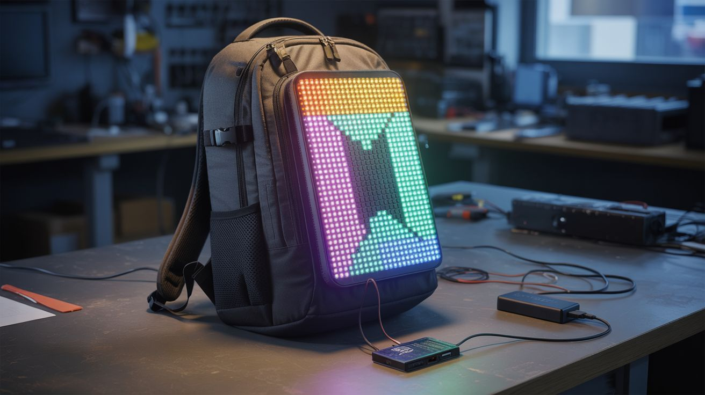

# #322 — LED Matrix Backpack Display

  

> A scrollable LED message board on your back. Custom text, animations, or live data — the billboard goes where you go.

## Ratings

     

## 🧪 What Is It?

A flat LED matrix panel mounted to the back of a backpack, driven by an ESP32 that displays scrolling text, pixel art animations, live clocks, step counters, or anything else you can code. You are a walking billboard. Change the message from your phone in real-time via WiFi. The display is visible from 30+ feet in daylight and absolutely commanding at night. This build takes old commercial signage hardware — the same LED panels that scroll "OPEN" in restaurant windows — and straps it to your body. The result is attention-grabbing in a way that a printed t-shirt can only dream about.

The cheapest path is salvaging a P10 LED panel from an old commercial scrolling sign — these are 32x16 pixel red or RGB modules about 12 inches by 6 inches, and they show up at e-waste recyclers, thrift stores, and dumpsters behind businesses that just upgraded their signage. They already have the LED driver chips built in (HUB75 interface), so all you need is an ESP32 to send pixel data via SPI. If you can't find a P10 module, build your own matrix from WS2812B addressable LED strips: cut strips into equal-length segments and arrange them in serpentine rows on a flat board. A 16x16 WS2812B matrix gives you 256 individually addressable RGB pixels — enough for legible scrolling text, colorful animations, and recognizable pixel art. The FastLED library handles all the LED communication with a single data wire.

The ESP32 pulls double duty as both the display driver and a WiFi access point. It hosts a tiny web server with a text input field — connect to the ESP32's WiFi network from your phone, type a message, and it immediately starts scrolling across your back. Program preset animations: a rainbow wave, a pixel art heart, a bouncing ball, the current time, your step count (via an accelerometer module), or live weather data pulled from an API when connected to the internet. Add a diffuser — a sheet of thin white acrylic or a stretched piece of white fabric — over the LED matrix to soften the individual pixel dots into a smooth, professional-looking display. Powered by a USB power bank in the backpack's main compartment, the system runs for 4-8 hours at moderate brightness. Mount the matrix with velcro strips so you can pop it off and use the backpack normally. Total cost if you salvage the LED panel: under $15. Total cost if you buy a WS2812B matrix new: about $25. Total strangers who will stop you to ask about it: dozens per outing.

<strong>🧰 Ingredients</strong>

- [ ] LED matrix panel — salvaged P10 module from a commercial scrolling sign (e-waste, thrift store — free to $10) or WS2812B 16x16 flexible LED matrix (~$15 new) *(e-waste or electronics supplier)*
- [ ] ESP32 dev board — WiFi-enabled microcontroller for display driving and remote control *(electronics supplier, ~$5)*
- [ ] USB power bank — 5V, 2A+ output; 10,000mAh recommended for all-day use *(already own or electronics supplier, ~$10)*
- [ ] Backpack with a flat back panel — the display surface; messenger bags and rigid-frame packs work best *(closet — free)*
- [ ] Rigid mounting board — foam core, thin plywood, or corrugated plastic, cut to fit the backpack's back panel *(craft store or scrap bin, ~$2)*
- [ ] Diffuser material — thin white acrylic sheet, white fabric, or tracing paper *(craft store, ~$3)*
- [ ] Velcro strips — for removable mounting of the display to the backpack *(hardware store, ~$3)*
- [ ] Hookup wire + connectors — for wiring the ESP32 to the LED panel *(junk drawer or electronics supplier, ~$2)*
- [ ] USB cable — micro-USB or USB-C depending on ESP32 board, for power *(junk drawer — free)*
- [ ] Optional: accelerometer module (MPU6050) — for step counting display *(electronics supplier, ~$2)*
- [ ] Optional: ambient light sensor — for auto-brightness adjustment *(electronics supplier, ~$1)*

## 🔨 Build Steps

1. **Prepare the LED matrix.** If using a salvaged P10 module, identify the HUB75 input connector — it's a 16-pin ribbon cable header. Map the pinout (standard HUB75: R1, G1, B1, R2, G2, B2, A, B, C, D, CLK, LAT, OE, GND). If using a WS2812B matrix, arrange the LED strips on a flat board in serpentine rows (first row left-to-right, second row right-to-left, etc.) and connect the data-out of each row to the data-in of the next. Secure strips with hot glue or adhesive backing. The total pixel count for a 16x16 matrix is 256 LEDs drawing up to 15A at full white brightness — you won't run full white, but keep power consumption in mind.

2. **Wire the ESP32 to the matrix.** For P10/HUB75: connect the 16 HUB75 pins to ESP32 GPIO pins using jumper wires. Use the ESP32-HUB75-MatrixPanel-I2S-DMA library — it handles the complex multiplexed scanning that HUB75 panels require. For WS2812B: connect the data-in wire of the first LED to an ESP32 GPIO pin (GPIO 13 or 27 work well), and connect the LED strip's 5V and GND to the power bank via a USB cable with the data wires cut. The ESP32 gets its own power from a second USB port on the power bank, or splice into the same 5V line.

3. **Program the basic display.** Install the appropriate library — FastLED or NeoPixelBus for WS2812B, or the HUB75 DMA library for P10 panels. Write a scrolling text function: render each character of a message as a pixel font (5x7 or 8x8), shift the entire framebuffer one pixel to the left each frame, and draw the next column of the next character as it scrolls in from the right. Set the scroll speed to about 50ms per pixel shift for comfortable reading.

4. **Add WiFi remote control.** Configure the ESP32 as a WiFi access point (e.g., SSID: "BackpackDisplay"). Host a simple HTML page with a text input field and a submit button. When you connect your phone to the ESP32's WiFi and load the page (usually 192.168.4.1), you can type any message and it immediately replaces the current scrolling text. Add buttons for preset messages and animation modes. The web interface stays responsive because the display rendering runs on the ESP32's second core.

5. **Build preset animations.** Program a library of display modes: rainbow color cycle, bouncing pixel, expanding rings, pixel art sprites (heart, skull, smiley face, music notes), real-time clock display, and a bar graph equalizer animation. Add a mode-switch button on the web interface or a physical button on the ESP32 to cycle through presets. Each animation is just a function that writes to the pixel framebuffer — the main loop calls the active animation function, then pushes the buffer to the LEDs.

6. **Mount the matrix to the backpack.** Cut the rigid mounting board to fit inside or against the backpack's back panel. Attach the LED matrix to the board with hot glue, screws, or double-sided tape. Attach velcro strips to the back of the mounting board and corresponding strips to the backpack's exterior back panel. Press the board onto the backpack — the velcro holds it firmly but allows removal when you want a normal backpack. Route the power and data cables through a small gap at the top of the backpack into the main compartment where the power bank lives.

7. **Install the diffuser.** Cut the diffuser material (white acrylic, fabric, or tracing paper) to the same dimensions as the LED matrix. Mount it 5-10mm in front of the LED surface using spacers (foam strips, small standoffs). The gap between the LEDs and the diffuser determines how much the individual pixels blend — too close and you still see dots, too far and the image gets blurry. Test at different distances. Secure the diffuser to the mounting board frame with tape or small clips.

8. **Power management.** Connect the ESP32 and LED matrix to the USB power bank. At moderate brightness (about 30% duty cycle), a 16x16 WS2812B matrix draws about 1-2A. A 10,000mAh power bank at 5V gives roughly 25Wh — enough for 5-10 hours depending on brightness and animation complexity. Add a brightness control to the web interface. For extended use, carry a second power bank. If using a P10 panel, it may need a separate 5V supply with higher current — some P10 modules draw 4A+ at full brightness.

9. **Weatherproofing (optional).** If you'll be wearing this in rain, seal the edges of the mounting board with silicone and cover the entire assembly with a clear plastic sheet or bag. The diffuser adds some splash protection for the LEDs. The ESP32 and connections should be inside the backpack, naturally protected. Avoid submerging the power bank — if conditions are truly wet, put everything in a gallon ziplock bag with just the display face exposed.

10. **Test in the field.** Walk around. Check visibility from different distances and angles. Adjust brightness for daytime vs. nighttime — nighttime brightness above 50% is blinding to people behind you and draws more power than necessary. Daytime brightness needs to be higher for visibility. The web interface should be responsive while walking — test that you can change messages without stopping. Note how many strangers comment on it. Adjust message content accordingly.

## ⚠️ Safety Notes

- At full brightness, the LED matrix can be uncomfortably bright at close range, especially at night. Avoid looking directly at the matrix surface at full power. Keep nighttime brightness moderate — you want attention, not retinal burns for the person walking behind you.
- The power bank should be secured inside the backpack so it doesn't shift or fall out during movement. A loose power bank bouncing around can disconnect cables and cause intermittent display glitches or damage the USB port.
- The entire system runs on 5V USB power — there is no electrical shock hazard. However, a short circuit on the 5V line can cause the power bank to overheat. Use proper connectors, not bare twisted wires, for all power connections.
- If wearing the display while cycling or walking near traffic at night, be aware that the bright, moving display can distract drivers. Use solid colors or slow animations near roads — fast-flashing patterns are dangerous in traffic.
- Check local regulations for wearable displays in public spaces — some venues, events, or transit systems may prohibit illuminated signs.

## 🔗 See Also

- [LED Jacket](242-led-jacket.md)
- [LED Mask](244-led-mask.md)
- [HUD Glasses](245-hud-glasses.md)

**References:**
- [Appliance Teardown Guide](../../reference/appliance-teardown-guide.md)
- [Technical Glossary](../../reference/glossary.md)
- [Electronics & Microcontrollers Guide](../../reference/electronics-and-microcontrollers.md)
