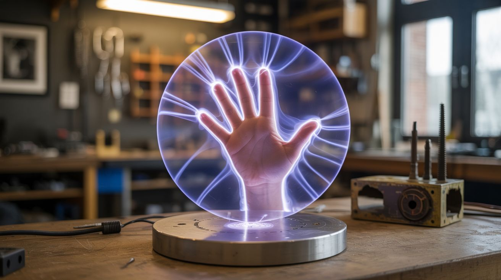

# #196 — Kirlian Photography

  

> High voltage + a metal plate + your hand = glowing corona discharge "aura" photos that look straight out of a paranormal documentary.

## Ratings

     

## 🧪 What Is It?

Kirlian photography captures the corona discharge that forms around objects placed on a charged metal plate. When high-frequency, high-voltage (but low-current) electricity is applied to a metal plate with an object on it, the air around the object ionizes and glows. Place a leaf, a coin, or your fingertip on the plate in a dark room, and you get halos of electric blue and purple light radiating outward — the object's electrical "aura."

Semyon Kirlian discovered this in 1939, and it immediately attracted mystical explanations (life force, chi, auras). The actual physics is straightforward corona discharge — the same effect you see on high-voltage power lines. But the photos are genuinely stunning, and the setup is surprisingly simple: a flyback transformer from an old CRT TV, a metal plate, and photographic film or a long-exposure digital camera.

<strong>🧰 Ingredients</strong>

- [ ] Flyback transformer from a dead CRT TV or monitor *(source: old TV — free from curb or electronics recycler)*
- [ ] 555 timer IC and driver transistor (MOSFET like IRF540 or IRFP250) *(source: electronics store or salvage — ~$5)*
- [ ] 12V power supply *(source: old laptop charger or battery)*
- [ ] Flat aluminum or copper plate, ~8x10 inches *(source: sheet metal from hardware store or cut from a baking pan — ~$5)*
- [ ] Glass plate or thin acrylic sheet, same size as the metal plate *(source: picture frame glass or hardware store)*
- [ ] Photographic film or paper (for traditional method) OR a DSLR/mirrorless camera capable of long exposure *(source: photography store or your camera)*
- [ ] Insulated wire for connections *(source: hardware store or junk drawer)*
- [ ] Wooden base for mounting *(source: scrap wood)*
- [ ] Electrical tape and heat-shrink tubing *(source: hardware store)*
- [ ] Dark room or light-tight box *(source: closet with towels under the door)*

## 🔨 Build Steps

1. **Salvage the flyback transformer.** Remove the flyback transformer from a dead CRT TV. It's the component with the thick red wire going to the CRT's suction cup connector. Desolder or clip it from the board. The flyback takes low-voltage DC and outputs 10-30kV at very low current — perfect for corona discharge.

2. **Build the driver circuit.** Wire a 555 timer as an oscillator running at 15-30 kHz. Use the 555 output to switch a MOSFET that drives the flyback transformer's primary winding. The exact frequency depends on your flyback — sweep the 555 frequency until you get the strongest output (loudest hiss and longest sparks from the HV output).

3. **Build the exposure plate.** Place the flat metal plate on the wooden base. Lay the glass plate directly on top of the metal plate. The glass acts as the dielectric barrier — objects go on top of the glass, the high voltage is applied to the metal plate underneath. The glass prevents direct contact with HV while allowing the electric field to ionize the air above.

4. **Connect the high voltage.** Run the flyback's high-voltage output wire to the metal plate. Solder it securely and insulate the connection heavily. Connect the flyback's ground return to an actual earth ground (metal water pipe or grounding rod). Good grounding is essential for clean, symmetrical corona patterns.

5. **Set up the camera.** Mount a DSLR or mirrorless camera on a tripod directly above the plate, looking down. Set it to manual mode: ISO 800-1600, aperture wide open, and shutter speed 5-30 seconds (experiment). Alternatively, lay photographic paper or film face-up on the glass plate for a direct contact exposure.

6. **Prepare the subject.** Good subjects for your first attempts: a leaf (fresh leaves produce great coronas because of their moisture content), a coin, a key, or your fingertip. Place the subject on the glass plate in a completely dark room.

7. **Expose.** Turn off all lights. Open the camera shutter (or start the film exposure timer). Power on the flyback driver. You should hear a faint hiss and see a blue-purple glow around the edges of the subject. Let it expose for 10-30 seconds. Power off the driver, close the shutter.

8. **Review and adjust.** Check the image. You should see a halo of branching, fractal-like discharge around the subject. If the corona is too faint, increase exposure time or flyback voltage. If it's too bright or arcing, back off the voltage. Different subjects produce different patterns — try everything.

9. **Experiment with variables.** Wet objects produce more dramatic coronas than dry ones. Try photographing the same leaf fresh and after it's dried — the corona changes dramatically. Try different colored backgrounds under the glass plate. Try stacking multiple objects.

## ⚠️ Safety Notes

> **Spicy Level 3 build.** Read the [Safety Guide](../../safety/README.md) before starting.

> [!WARNING]
> **High voltage.** The flyback output is 10-30kV. While the current is low (microamps to low milliamps), it can deliver a painful shock and cause involuntary muscle contraction. Never touch the metal plate or any exposed conductor while the driver is powered. Use a physical kill switch within arm's reach and always disconnect power before adjusting anything.
- **Ozone production.** Corona discharge produces ozone (O3), which is toxic in concentration. Work in a ventilated area. If you smell a sharp, chemical-clean odor, increase ventilation. Don't run the device continuously for more than a few minutes in an enclosed space.
- **Fire risk.** Sparks from the flyback can ignite paper, cloth, or solvents. Keep the work area clear of flammable materials. Don't use photographic chemicals near the energized plate.

## 🔗 See Also

- [Van de Graaff Generator](197-van-de-graaff-generator.md) — another high-voltage electrostatics build with dramatic visual results
- [DIY Electron Microscope](200-diy-electron-microscope.md) — taking electron manipulation to the extreme
