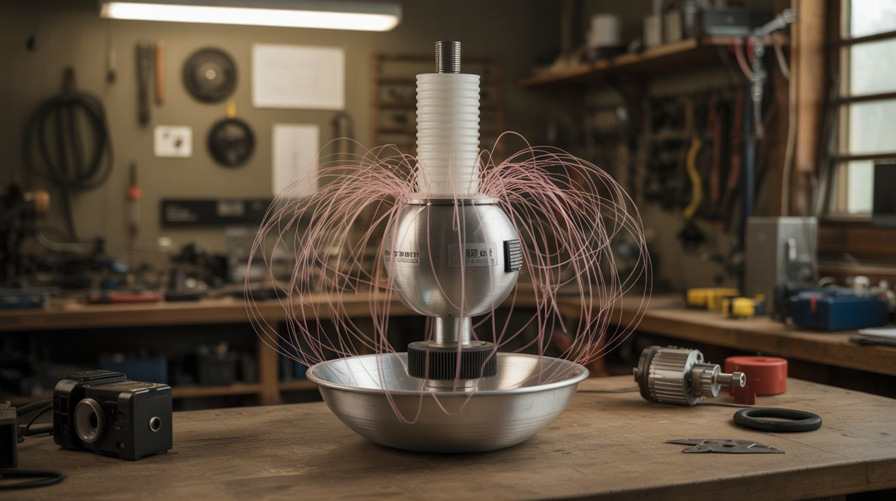

# #197 — Van de Graaff Generator

  

> PVC pipe, a rubber belt, a small motor, and an aluminum salad bowl — 100,000 volts of hair-raising static electricity.

## Ratings

| Jaw Drop Rating | Brain Melt Level | Wallet Damage | Spicy Level | Clout Potential | Time to Build |
|---|---|---|---|---|---|
| ⭐⭐⭐⭐ | ⭐⭐⭐ | ⭐ | ⭐⭐ | ⭐⭐⭐⭐⭐ | ⭐⭐⭐ |

## What Is It?

A Van de Graaff generator is an electrostatic machine that accumulates charge on a hollow metal sphere (or in our case, a salad bowl) by transporting it on a moving belt. A motor spins a rubber belt inside a PVC column. At the bottom, a comb-like electrode strips electrons from the belt. At the top, another comb collects the charge and transfers it to the metal dome. Charge builds up until the dome reaches tens or hundreds of thousands of volts — enough to make your hair stand on end, throw sparks several inches, and attract or repel lightweight objects.

Robert Van de Graaff built the first one in 1929 for nuclear physics research. The junkyard version uses the same principles and can hit 50,000-100,000 volts depending on dome size and humidity. The voltage sounds scary, but the current is negligible — the worst you'll get is a zappy static shock, like touching a doorknob in winter, just bigger and more theatrical.

## Ingredients

- [ ] PVC pipe, 3-4 inch diameter, 18-24 inches long, for the column *(source: hardware store — ~$5)*
- [ ] Aluminum salad bowl or large mixing bowl for the dome *(source: thrift store — ~$3)*
- [ ] Rubber band material or latex surgical tubing for the belt *(source: office supply or medical supply — ~$3)*
- [ ] Small DC motor (hobby motor or salvaged) *(source: dead toy, CD player, or hobby shop — free to $5)*
- [ ] Two PVC end caps or wooden discs for top and bottom rollers *(source: hardware store)*
- [ ] Aluminum foil for the charge combs *(source: kitchen)*
- [ ] Thin wire or fine-tooth metal comb for electrode points *(source: junk drawer)*
- [ ] Wooden base *(source: scrap wood)*
- [ ] 9V battery or small power supply for the motor *(source: junk drawer)*
- [ ] Hot glue, tape, and assorted hardware *(source: craft store)*

## Build Steps

1. **Build the column.** The PVC pipe is the main support and belt housing. It needs to be tall enough to separate the top and bottom rollers by at least 12 inches. Clean the inside and outside with rubbing alcohol — any grease will leak charge.

2. **Make the rollers.** The bottom roller (driven by the motor) should be made from a material that tends to give up electrons (like nylon or Teflon). The top roller should be made from a material that tends to grab electrons (like rubber or silicone). PVC end caps wrapped in different materials work well. Drill center holes for axles.

3. **Install the belt.** Stretch a rubber band or strip of latex tubing around both rollers, inside the PVC column. The belt should be snug but not so tight it strains the motor. It needs to run smoothly without slipping. This belt is the charge transporter — it picks up charge from the bottom roller and carries it to the top.

4. **Build the charge combs.** Cut two small strips of aluminum foil and attach fine wire points (or sharp comb teeth) facing the belt at both the top and bottom roller positions. The bottom comb connects to ground (the base). The top comb connects to the dome. These corona-point electrodes strip and deposit charge from/to the belt.

5. **Mount the motor.** Attach the small DC motor to the base so its shaft drives the bottom roller. You can use a direct coupling or a small belt/gear reduction for more torque. The motor needs to spin the belt at a steady, moderate speed — too fast and the belt whips; too slow and charge doesn't accumulate.

6. **Attach the dome.** Mount the aluminum bowl (open side down) on top of the PVC column. The top charge comb's wire must make electrical contact with the inside of the bowl. The bowl should be electrically isolated from the column and base — it sits on the PVC, which is an insulator.

7. **Ground the base.** Connect the bottom charge comb and the motor housing to a ground wire. An actual earth ground (metal water pipe or ground rod) works best. Without good grounding, the whole machine charges up and nothing interesting happens.

8. **Test it.** Power on the motor in a low-humidity environment (dry winter air is ideal; humid summer air kills the effect). After 10-20 seconds, bring your knuckle close to the dome. You should feel a tingle, then see and hear a small spark jump. If nothing happens, check belt tension, comb placement, and humidity.

9. **The hair demo.** Have someone (ideally with long, fine hair) stand on an insulating platform (rubber mat or plastic bin) and touch the dome while the motor runs. Their hair will stand on end as charge distributes to each strand and they repel each other. This is the photo op.

10. **Spark experiments.** Bring a grounded metal sphere (doorknob on a wire) near the dome to draw longer, more dramatic sparks. Try placing the generator near a fluorescent tube — the tube may light up from the electric field alone. Stack aluminum pie tins on the dome and watch them fly off one by one as charge repels them.

## Safety Notes

- **Pacemakers and electronic implants.** Anyone with a pacemaker or similar device should stay well away from the generator. The electric field can interfere with medical electronics.
- **Electronic devices.** The sparks from a Van de Graaff can damage sensitive electronics. Keep phones, laptops, and other devices several feet away during operation. Don't touch the dome and then touch your computer.
- **Static shock.** While not dangerous to healthy individuals, the sparks are startling and mildly painful. Warn spectators before demonstrations. People with heart conditions should not participate in the hair-raising demo.

## See Also

- [Kirlian Photography](196-kirlian-photography.md) — another high-voltage electrostatics project with visual results
- [Homopolar Motor](198-homopolar-motor.md) — electromagnetism at the other extreme — low voltage, high current
