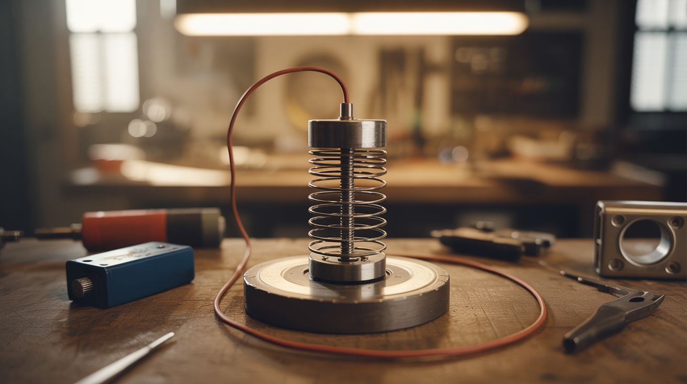

# #198 — Homopolar Motor

  

> Battery + magnet + wire = a spinning motor in 30 seconds flat. The simplest electric motor possible.

## Ratings

     

## 🧪 What Is It?

The homopolar motor is the oldest type of electric motor, first demonstrated by Michael Faraday in 1821. In its simplest form, you stick a neodymium magnet to the bottom of a battery, then touch a piece of copper wire from the top terminal to the magnet — and the wire spins. That's it. Three components, no moving parts other than the thing that moves, no commutator, no coils.

The physics: current flows through the wire, through the magnet's magnetic field. The Lorentz force (F = qv x B) pushes the wire sideways — tangentially — causing it to spin around the battery. It's the same force that drives every electric motor ever made, stripped down to the absolute fundamental interaction between current and magnetic field.

The "weird science" angle: you can bend the wire into any shape — a dancer, a heart, a spiral — and it will spin as long as the circuit is complete. The visual effect of a copper sculpture silently orbiting a battery is hypnotic and deeply counterintuitive to anyone who hasn't seen it.

<strong>🧰 Ingredients</strong>

- [ ] AA or AAA battery (fresh, fully charged) *(source: junk drawer)*
- [ ] Neodymium disc magnet, roughly battery diameter *(source: dead hard drive or Amazon — $3-5)*
- [ ] Copper wire, 14-18 gauge, bare or stripped, 12-18 inches *(source: scrap electrical wire — strip the insulation)*
- [ ] Optional: thinner copper wire for decorative shapes *(source: craft wire from craft store)*
- [ ] Needle-nose pliers for bending wire *(source: toolbox)*

## 🔨 Build Steps

1. **Attach the magnet.** Stick the neodymium magnet to the flat negative terminal of the AA battery. It should cling firmly. The magnet serves double duty: it's the magnetic field source AND the bottom electrical contact point.

2. **Shape the wire — basic version.** Bend a piece of copper wire into a rough U or V shape. The top of the shape needs to balance on the positive terminal's nub. The two bottom ends need to just barely brush against the magnet (or the side of the magnet). The wire must make contact top and bottom but be free to rotate.

3. **Test the basic spin.** Place the wire shape on the battery so it balances on the positive terminal and the bottom legs touch the magnet. If everything is making good contact, the wire should start rotating on its own. If it doesn't, adjust the bottom contact points — they should drag lightly on the magnet's surface, not press hard (friction kills the spin).

4. **Troubleshoot.** No spin? Check: Is the battery fresh? Is the magnet strong (neodymium, not ceramic)? Is the wire making contact at both top and bottom? Is the wire balanced so it can rotate freely? Bend the wire until the balance point is centered over the battery's positive nub.

5. **Shape the wire — artistic version.** Now that you know the constraints (top contact on positive terminal, bottom contact on magnet, balanced to rotate), bend wire into creative shapes. A stick figure, a heart, a spiral cone, a dancer. Each shape will spin at different speeds depending on how far the current-carrying sections are from the magnetic field center.

6. **Multi-wire version.** Bend two or three wire shapes and stack them on the same battery-magnet assembly. They'll spin independently at different speeds if they don't touch each other. This looks incredible in slow motion.

7. **The liquid metal version (advanced).** For a friction-free contact, put a small puddle of liquid mercury in a shallow dish, place the magnet-battery assembly standing up in the mercury, and touch a wire from the positive terminal through the mercury. The wire spins with zero friction, faster and smoother than any mechanical contact version. (Note: mercury is toxic — handle with extreme care, use gloves, work in ventilation. This variant is for experienced builders only.)

## ⚠️ Safety Notes

> [!WARNING]
> **Battery overheating.** The homopolar motor circuit is essentially a short circuit through very low resistance. The battery will drain fast and can get hot. Run the motor for no more than 30-60 seconds at a time. If the battery gets uncomfortably warm, disconnect immediately and let it cool.
- **Neodymium magnet handling.** Strong magnets snap together with force that can bruise or pinch. Keep spare magnets separated and away from electronics, credit cards, and medical implants.
- **Mercury (if using advanced version).** Mercury vapor is toxic and cumulative. Only use mercury outdoors or in a fume hood. Wear nitrile gloves. Have a mercury spill kit on hand. Never pour mercury down a drain. If you're not comfortable handling mercury safely, skip this variant entirely.

## 🔗 See Also

- [Ball Bearing Motor](../mechanical-and-kinetic/187-ball-bearing-motor.md) — the mechanical-and-kinetic category's take on the same Lorentz force principle
- [Van de Graaff Generator](197-van-de-graaff-generator.md) — electromagnetism at the other extreme: high voltage, zero current

**References:**
- [Appliance Teardown Guide](../../docs/reference/appliance-teardown-guide.md)
- [Technical Glossary](../../docs/reference/glossary.md)
