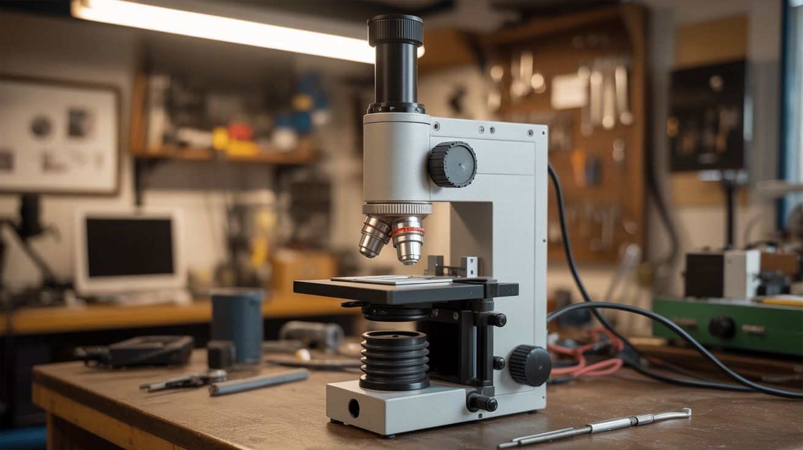

# #200 — DIY Electron Microscope

  

> A CRT electron gun, a vacuum chamber, and magnetic lenses — see things no optical microscope can resolve. The ultimate junkyard endgame build.

## Ratings

     

## 🧪 What Is It?

A scanning electron microscope (SEM) fires a focused beam of electrons at a sample and detects the secondary electrons that bounce back to build an image. The wavelength of electrons is thousands of times shorter than visible light, which means electron microscopes can resolve details that are physically impossible for any optical microscope to see — individual cells, crystal grain boundaries, insect compound eye facets, pollen grain surfaces.

Building one from scratch is the hardest project in this entire collection. You need a vacuum chamber, an electron source (salvaged from a CRT), electromagnetic lenses to focus the beam, scanning coils to raster the beam across the sample, a secondary electron detector, and software to reconstruct the image. It has been done by determined hobbyists, and the images they produce rival $100,000 commercial instruments at low magnification. This is the Mount Everest of junkyard builds.

<strong>🧰 Ingredients</strong>

- [ ] CRT (cathode ray tube) from a dead TV or oscilloscope — the electron gun assembly *(source: old TV or oscilloscope — free from electronics recycler)*
- [ ] Vacuum pump, capable of reaching at least 10^-3 torr (rotary vane pump minimum, turbomolecular pump ideal) *(source: surplus scientific equipment, eBay — $50-200)*
- [ ] Vacuum chamber — metal bell jar, modified pressure cooker, or welded steel chamber *(source: surplus lab equipment or DIY welding — $30-100)*
- [ ] O-rings and vacuum fittings (KF/NW type preferred) *(source: vacuum supply companies or eBay — ~$30)*
- [ ] Magnet wire for electromagnetic lenses, 28-32 gauge, several hundred feet *(source: dead transformer or buy a spool — ~$10)*
- [ ] Soft iron cores for the lens assemblies (iron plumbing fittings or transformer laminations) *(source: hardware store or scrap)*
- [ ] High-voltage power supply, adjustable 1-15kV *(source: modified CRT flyback circuit or lab surplus — $20-50)*
- [ ] Picoammeter or sensitive current amplifier for the detector *(source: DIY op-amp circuit or eBay lab surplus — $10-30)*
- [ ] Faraday cage material (copper mesh) *(source: Amazon or electronics supplier — ~$10)*
- [ ] Arduino or Raspberry Pi for scan control and image acquisition *(source: online — ~$25-35)*
- [ ] DAC (digital-to-analog converter) for scan coil drive *(source: electronics store — ~$10)*
- [ ] Sample stubs and conductive carbon tape *(source: eBay or microscopy supplier — ~$10)*

## 🔨 Build Steps

1. **Salvage the electron gun.** Carefully remove the neck of a CRT tube. The electron gun is the assembly in the narrow neck — it contains a heated cathode (electron source), a Wehnelt cylinder (beam control), and accelerating anodes. This is your beam source. Handle CRTs with extreme care — they are under vacuum and can implode violently. Score the neck with a glass cutter and break it in a controlled way, or use a diamond wheel.

2. **Build the vacuum chamber.** Construct or modify a metal chamber that can hold a rough vacuum (10^-3 torr minimum). A modified stainless steel pressure cooker with welded KF fittings works. You need ports for: the electron gun at the top, sample stage access on the side, vacuum pump connection at the bottom, and electrical feedthroughs for lens coils, scan coils, and detector signal.

3. **Build the electromagnetic lenses.** Wind coils of magnet wire (500-1000 turns) around soft iron pole pieces shaped to concentrate the magnetic field into a small gap. You need at least two lenses: a condenser lens (focuses the beam) and an objective lens (final focus onto the sample). The lens design is the most physics-intensive part — the focal length depends on coil current, number of turns, and pole piece geometry.

4. **Build the scan coils.** Wind two pairs of deflection coils oriented at 90 degrees to each other (X and Y deflection). These steer the electron beam in a raster pattern across the sample surface. Drive them with sawtooth waveforms from DACs connected to the Arduino/Pi. The scan rate determines image resolution and acquisition time.

5. **Build the detector.** The simplest secondary electron detector is a Faraday cup — a small metal cup biased at a few hundred volts positive to attract secondary electrons knocked off the sample. Connect it to a sensitive current amplifier (transimpedance amplifier using an op-amp like the OPA129). The output voltage corresponds to the number of secondary electrons from each point — your image signal.

6. **Assemble the column.** Stack the components vertically inside the vacuum chamber: electron gun at the top, condenser lens, scan coils, objective lens, and sample stage at the bottom. Alignment is critical — the electron beam must pass through the center of each lens. Use adjustment screws and shims to center everything.

7. **Wire the electronics.** Connect the high-voltage supply to the electron gun (cathode heater + accelerating voltage). Connect DC current supplies to the lens coils (adjustable for focusing). Connect the scan coil DACs to the Arduino/Pi. Connect the detector amplifier output to an ADC on the Arduino/Pi.

8. **Write the imaging software.** The Arduino/Pi needs to: output X/Y scan voltages to the DACs (raster pattern), read the detector signal from the ADC at each scan point, and assemble the readings into a 2D grayscale image. Start with a low-resolution scan (64x64 pixels) and work up. Display the image on a connected monitor or save to file.

9. **Pump down and test.** Seal the chamber, start the vacuum pump, and wait until pressure stabilizes (this can take hours for a first pump-down as surfaces outgas). Power up the electron gun — you should see a faint glow at the cathode. Energize the lenses and scan a conductive sample (a coin works well for initial testing). Adjust lens currents until you see recognizable features in the scan image.

10. **Optimize and image.** Once you have a basic image, spend time optimizing: adjust accelerating voltage (higher = better resolution but more sample damage), fine-tune lens currents for sharpest focus, slow down the scan rate for cleaner images. Try biological samples coated with a thin layer of gold or carbon (sputter coating) for best results. When you see the hexagonal facets of a fly's eye or the surface of a pollen grain, you've officially done something extraordinary.

## ⚠️ Safety Notes

> **Spicy Level 4 build.** Read the [Safety Guide](../../docs/safety/README.md) before starting.

> [!CAUTION]
> **CRT implosion.** CRT tubes are under hard vacuum and can implode with violent force, sending glass shrapnel in all directions. Always wear a full face shield and heavy gloves when cutting or breaking CRT glass. Work in a contained area. Never strike or drop a CRT.
- **High voltage.** The electron gun operates at 1-15kV. The flyback transformer can produce 30kV. These voltages are lethal. Never reach into the chamber or touch any electrical connection while the system is powered. Use a discharge stick on all capacitors before servicing. Work with one hand (keep the other in your pocket) to prevent current paths across your chest.
- **X-ray emission.** Accelerated electrons striking a metal target produce X-rays. At voltages above 5kV, X-ray production becomes significant. The metal vacuum chamber provides shielding, but verify with a dosimeter if possible. Never operate the electron gun outside of a shielded enclosure. Limit exposure time during testing.

## 🔗 See Also

- [Kirlian Photography](196-kirlian-photography.md) — another project that reveals invisible electromagnetic phenomena visually
- [Van de Graaff Generator](197-van-de-graaff-generator.md) — high-voltage electrostatics on a more accessible scale

**References:**
- [Electronics & Microcontrollers Guide](../../docs/reference/electronics-and-microcontrollers.md)
