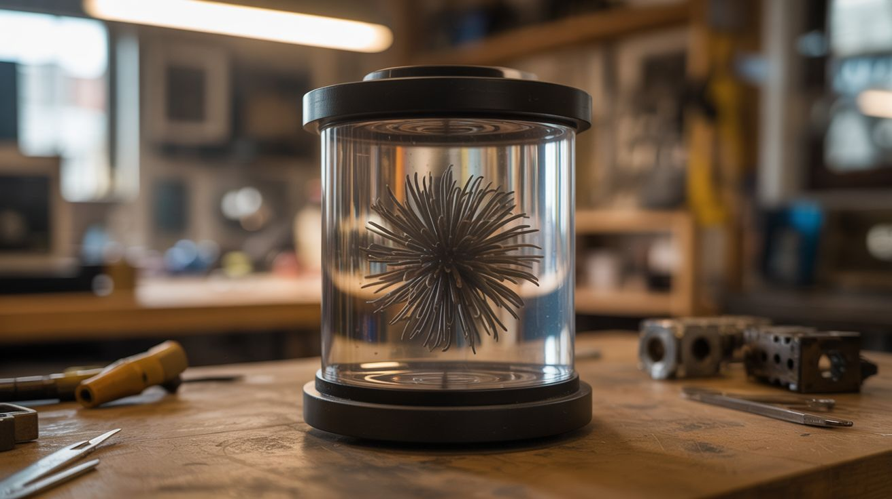

# #310 — Magnetic Field Viewer

  

> A sealed chamber of ferrofluid that turns invisible magnetic fields into writhing, spiky, real-time sculptures you can manipulate with your hands.

## Ratings

     

## 🧪 What Is It?

Magnetic field lines are one of the most fundamental things in physics, and you can't see them. Every textbook draws them as neat curves arcing from north to south, but those diagrams are abstractions — nobody has ever looked at a magnetic field with their eyes. Iron filings on paper get you a flat, static snapshot. Ferrofluid gets you the real thing: a three-dimensional, dynamic, visceral display of magnetic force that responds to every movement in real time.

Ferrofluid is a colloidal suspension of nanoscale magnetite (Fe3O4) particles in a carrier oil. Each particle is about 10 nanometers across — small enough that Brownian motion keeps them permanently suspended. When a magnetic field is present, the particles align along the field lines and the fluid physically deforms to follow them, sprouting spikes and ridges that trace the field geometry in three dimensions. The spike pattern is a balance between magnetic force (pulling fluid along field lines) and surface tension (trying to keep the fluid smooth). Stronger field = taller, sharper spikes.

Seal ferrofluid in a flat, transparent chamber and you've got a permanent, mess-free magnetic field visualizer. Slide a magnet underneath and the field appears as a living pattern of spikes and valleys. Move the magnet and the pattern follows. Bring two magnets close and watch the fields merge, repel, or twist around each other. It's a physics instrument and a desk toy and a conversation starter, all built in under an hour.

<strong>🧰 Ingredients</strong>

- [ ] Ferrofluid, 50-100ml *(source: Amazon or educational science supplier — $10-15 for a bottle)*
- [ ] Two sheets of glass or clear acrylic, roughly 6x6 inches *(source: picture frame glass or hardware store — $3-5)*
- [ ] Silicone sealant or epoxy rated for oil contact *(source: hardware store — $5)*
- [ ] Spacer material — rubber gasket sheet, foam tape, or thin acrylic strips, 2-3mm thick *(source: hardware store — $3)*
- [ ] Neodymium magnets, assorted shapes — disc, ring, bar, sphere *(source: Amazon or dead hard drives — $5-15)*
- [ ] Binder clips or small clamps for assembly *(source: office supply drawer)*
- [ ] Isopropyl alcohol and lint-free cloth for cleaning glass *(source: pharmacy)*
- [ ] Optional: white acrylic sheet for a backlight-friendly background *(source: hardware store)*
- [ ] Optional: LED strip for backlighting *(source: Amazon — $5)*

## 🔨 Build Steps

1. **Prepare the glass.** Clean both glass sheets thoroughly with isopropyl alcohol and a lint-free cloth. Any dust, fingerprints, or smudges will be sealed inside forever and visible against the dark ferrofluid. Work in a clean area. Handle by the edges only. Clean them again — you missed a spot.

2. **Build the spacer gasket.** Cut the spacer material into a U-shape or rectangular frame that matches the glass dimensions, leaving a gap at the top for filling. The spacer thickness determines the chamber depth — 2-3mm is ideal. Too thin and the ferrofluid can't form proper spikes. Too thick and you need more fluid and the viewing angle suffers. Stick the spacer to one glass sheet using its own adhesive or a thin bead of silicone.

3. **Place the second glass sheet.** Press the second glass sheet onto the spacer, creating a sandwich with a thin cavity between the sheets. Clamp the assembly together with binder clips around the edges. Make sure the spacer creates a complete seal on three sides with the open top accessible for filling.

4. **Fill with ferrofluid.** Working over newspaper (ferrofluid stains everything it touches permanently — everything), slowly pour or inject ferrofluid into the chamber through the open top. Fill to about 60-70% capacity. You want enough fluid to form good spike patterns but enough air space for the fluid to move freely. Tilt and rotate the chamber to spread the fluid evenly and work out air bubbles trapped along the edges.

5. **Seal the chamber.** Run a bead of silicone sealant or epoxy along the open top edge. Clamp it shut and let it cure fully — 24 hours for silicone, per-label for epoxy. A good seal is non-negotiable. Ferrofluid leaking out of the chamber will ruin whatever surface it lands on. The stain is permanent. The smell is unpleasant. The cleanup is impossible. Seal it right.

6. **Test with a single disc magnet.** Hold a neodymium disc magnet flat against the underside of the viewer. The ferrofluid should immediately respond — a circular hedgehog pattern of spikes will form directly above the magnet, perfectly mapping the field geometry. Move the magnet slowly and watch the pattern follow. Pull the magnet away gradually and watch the spikes shrink and collapse. You're watching magnetic flux density change in real time.

7. **Explore magnet geometries.** Try a ring magnet — you'll see a donut-shaped spike pattern with a calm center (the field cancels at the axis of symmetry in a ring). Try a bar magnet and see the classic dipole field — spikes concentrated at the poles, curving lines connecting them. Try a Halbach array (alternating magnet orientations) if you have enough magnets — the field will be dramatically stronger on one side than the other, and the viewer will show it.

8. **Two-magnet interactions.** Hold two magnets under the viewer, a few inches apart, with the same poles facing each other (repulsion). Move them closer. The ferrofluid will show the field lines bending away from each other, forming a visible boundary where neither magnet dominates. Flip one magnet (attraction) and the field lines bridge between them — the ferrofluid will stretch toward the gap and try to connect the two magnets through the glass. This is what field superposition actually looks like.

9. **Visualize dynamic fields.** Place the viewer on top of a small DC motor or an electromagnetic coil. Power it on. The ferrofluid responds to the changing magnetic field of the spinning rotor or the energized coil. Wire a coil to a variable power supply and slowly increase current — watch the spike pattern grow from nothing to fully formed as the field strengthens. This is a real-time magnetometer you can see from across the room.

10. **Add backlighting (optional).** Mount a white LED strip behind or around the viewer for dramatic effect. The ferrofluid is opaque and nearly black, so backlighting creates a high-contrast silhouette of the spike patterns. For photography or video, this is the difference between a cool demo and content that goes viral. Side-lighting creates depth shadows on the spikes that reveal their three-dimensional structure.

11. **Build a display stand.** Mount the sealed viewer at a slight angle on a wooden or acrylic stand. Attach a magnet to a handle or wand that viewers can wave underneath. Label the different magnets by type. This makes an excellent interactive science fair display — people will play with it for twenty minutes straight and still not get bored.

## ⚠️ Safety Notes

> [!WARNING]
> **Ferrofluid stains permanently.** It's magnetite nanoparticles in oil. It will stain skin (temporary), clothing (permanent), wood (permanent), and countertops (permanent). Work over disposable coverings. Wear gloves and old clothes during assembly. Keep paper towels within reach. If it gets on something valuable, you're too late.
- **Neodymium magnet safety.** Large neodymium magnets (N52 grade especially) snap together with enough force to break fingers. They shatter on impact, sending sharp fragments flying. Handle one at a time, store them in separate padded containers, and keep them away from anyone with pacemakers or other implanted medical devices.
- **Glass breakage.** If using real glass (not acrylic), the viewer can shatter if dropped, releasing ferrofluid onto whatever surface it hits. Acrylic is safer but scratches more easily. If you build with glass, consider wrapping the edges with a bumper of rubber or silicone tubing.

## 🔗 See Also

- [Homopolar Motor](198-homopolar-motor.md) — magnetic fields put to work spinning copper wire
- [Lenz's Law Slow-Mo Magnet](199-lenzs-law-slow-mo-magnet.md) — invisible magnetic fields made visible through their braking force on falling magnets

**References:**
- [Appliance Teardown Guide](../../reference/appliance-teardown-guide.md)
- [Technical Glossary](../../reference/glossary.md)
