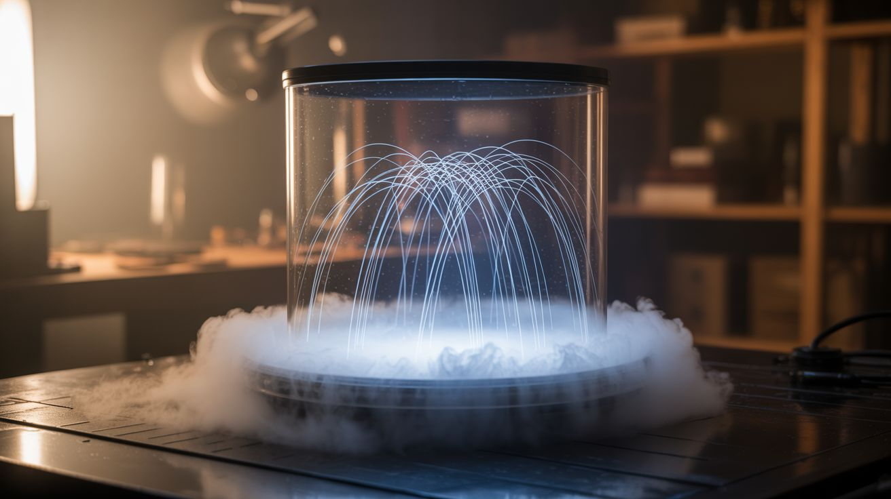

# Weird Science

  

> The builds that make people ask "wait, is that even legal?" (It is. Probably.)

This category is for projects that demonstrate bizarre, counterintuitive, or downright spooky physics. The kind of stuff that looks like movie magic but is actually just electromagnetics, optics, and thermodynamics being their weird selves.

**Common salvage sources:** CRT monitors and TVs, hard drive magnets, copper pipe, dead transformers, microwave oven parts, old camera flashes.

## Builds

| # | Build | Jaw Drop | Brain Melt | Wallet | Spicy | Clout | Time |
|---|---|---|---|---|---|---|---|
| 196 | [Kirlian Photography](196-kirlian-photography.md) | ⭐⭐⭐⭐⭐ | ⭐⭐⭐ | ⭐⭐ | ⭐⭐⭐ | ⭐⭐⭐⭐⭐ | ⭐⭐⭐ |
| 197 | [Van de Graaff Generator](197-van-de-graaff-generator.md) | ⭐⭐⭐⭐ | ⭐⭐⭐ | ⭐ | ⭐⭐ | ⭐⭐⭐⭐⭐ | ⭐⭐⭐ |
| 198 | [Homopolar Motor](198-homopolar-motor.md) | ⭐⭐⭐⭐ | ⭐ | ⭐ | ⭐ | ⭐⭐⭐⭐ | ⭐ |
| 199 | [Lenz's Law Slow-Mo Magnet](199-lenzs-law-slow-mo-magnet.md) | ⭐⭐⭐⭐⭐ | ⭐ | ⭐⭐ | ⭐ | ⭐⭐⭐⭐⭐ | ⭐ |
| 200 | [DIY Electron Microscope](200-diy-electron-microscope.md) | ⭐⭐⭐⭐⭐ | ⭐⭐⭐⭐⭐ | ⭐⭐⭐ | ⭐⭐⭐⭐ | ⭐⭐⭐⭐⭐ | ⭐⭐⭐⭐⭐ |
| 309 | [DIY Spectroscope](309-diy-spectroscope.md) | ⭐⭐⭐⭐ | ⭐⭐ | ⭐ | ⭐ | ⭐⭐⭐⭐ | ⭐ |
| 310 | [Magnetic Field Viewer](310-magnetic-field-viewer.md) | ⭐⭐⭐⭐⭐ | ⭐⭐ | ⭐⭐ | ⭐ | ⭐⭐⭐⭐⭐ | ⭐ |
| 311 | [Foucault Pendulum](311-foucault-pendulum.md) | ⭐⭐⭐⭐⭐ | ⭐⭐⭐ | ⭐⭐ | ⭐ | ⭐⭐⭐⭐⭐ | ⭐⭐ |

---

### Suggested Build Order

Start with accessible demos and work toward advanced instrumentation:

1. **[#198 — Homopolar Motor](198-homopolar-motor.md)** — Battery + magnet + wire. The 5-minute build.
2. **[#309 — DIY Spectroscope](309-diy-spectroscope.md)** — CD + cardboard. See light decomposed.
3. **[#199 — Lenz's Law Slow-Mo Magnet](199-lenzs-law-slow-mo-magnet.md)** — Copper pipe + magnet. Physics in slow motion.
4. **[#310 — Magnetic Field Viewer](310-magnetic-field-viewer.md)** — Ferrofluid + glass. See invisible fields.
5. **[#311 — Foucault Pendulum](311-foucault-pendulum.md)** — Prove the Earth rotates. Needs height.
6. **[#197 — Van de Graaff Generator](197-van-de-graaff-generator.md)** — Electrostatics. Hair-raising demo.
7. **[#196 — Kirlian Photography](196-kirlian-photography.md)** — High voltage + film. Eerie corona discharge.
8. **[#200 — DIY Electron Microscope](200-diy-electron-microscope.md)** — The endgame. Electron beam imaging.

### Related Categories

- [Mad Scientist](../mad-scientist/) — More high-voltage and extreme physics
- [Light & Visual](../light-and-visual/) — Optics, lasers, and visual phenomena
- [Art & Installation](../art-and-installation/) — When science becomes art
