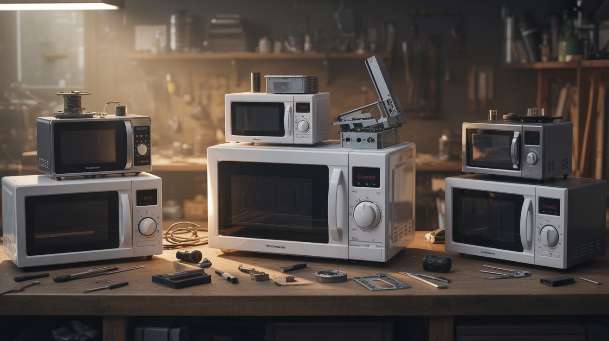

# You Just Scored a Dead [X] — Here Are 5 Things to Make

  

> Every dead appliance is a donor body. Here's what to build with each one — from first cut to final project.

You just scored a dead microwave from the curb. Now what? This guide gives you the fast answer: what's inside, and the five best builds you can make from each major appliance. Think of it as a choose-your-own-adventure for salvaged junk.

For detailed teardown instructions, see the [Appliance Teardown Guide](appliance-teardown-guide.md).

---

## Microwave Oven

The undisputed king of salvage. A single dead microwave can fuel half a dozen builds.

### What's Inside
- Microwave oven transformer (MOT) — 2,000V output, heavy iron core
- High-voltage capacitor — oil-filled, ~2,100V
- Magnetron with ceramic magnets
- Turntable motor (3-5 RPM synchronous)
- Cooling fan (120V AC)
- Door interlock switches
- Sheet metal housing

### Five Best Builds

| # | Build | Difficulty | Wow Factor | Key Part Used |
|---|---|---|---|---|
| 1 | [#001 -- Plasma Tornado Lamp](../../categories/fire-and-plasma/001-plasma-tornado-lamp.md) | Intermediate | Insane | MOT |
| 2 | [#002 -- Lichtenberg Wood Burner](../../categories/fire-and-plasma/002-lichtenberg-wood-burner.md) | Intermediate | Insane | MOT |
| 3 | [#027 -- Spot Welder](../../categories/functional-machines/027-spot-welder.md) | Intermediate | High | MOT (rewound) |
| 4 | [#034 -- Jacob's Ladder](../../categories/mad-scientist/034-jacobs-ladder.md) | Intermediate | Insane | MOT |
| 5 | [#042 -- Grape Plasma](../../categories/mad-scientist/042-grape-plasma.md) | Beginner | High | The entire microwave (intact!) |

**Bonus parts:** The magnetron's ceramic magnets are strong neodymium-class magnets useful across dozens of builds. The turntable motor makes a great display turntable or slow-rotation drive. The cooling fan is a ready-made 120V fan for ventilating anything. The sheet metal housing is raw material for enclosures and brackets.

**What to strip first:** Always discharge the capacitor before touching anything inside. See the [Safety Guide](../safety/) for MOT capacitor discharge procedures. This is not optional — MOT capacitors can kill you.

---

## Refrigerator / Mini Fridge

Heavy, awkward, and full of thermal engineering gold.

### What's Inside
- Hermetically sealed compressor (motor + pump)
- Condenser coils (copper or aluminum tubing)
- Evaporator coils
- Thermostat
- Condenser fan motor + evaporator fan motor
- Peltier module (mini fridges only)
- Shelving (tempered glass, plastic bins)

### Five Best Builds

| # | Build | Difficulty | Wow Factor | Key Part Used |
|---|---|---|---|---|
| 1 | [#039 -- Vacuum Chamber](../../categories/mad-scientist/039-vacuum-chamber.md) | Intermediate | High | Compressor (as vacuum pump) |
| 2 | [#031 -- Silent Compressor](../../categories/functional-machines/031-silent-compressor.md) | Intermediate | Moderate | Compressor |
| 3 | [#092 -- Fermentation Chamber](../../categories/fridge-and-cooling/092-fermentation-chamber.md) | Intermediate | Moderate | Peltier module / compressor |
| 4 | [#041 -- Cloud Chamber](../../categories/mad-scientist/041-cloud-chamber.md) | Intermediate | Insane | Peltier module (cold plate) |
| 5 | [#093 -- Fog Chiller](../../categories/fridge-and-cooling/093-fog-chiller.md) | Intermediate | High | Compressor + coils |

**Bonus parts:** Fridge compressors run silently for decades — they're the most reliable motors you'll ever salvage. Copper tubing from the coils is useful for heat exchangers, chemistry setups, and plumbing. The thermostat is a ready-made temperature switch. Fan motors are quiet and durable. Shelving glass can be repurposed for display cases or workbench surfaces.

**Safety note:** Older fridges contain refrigerant (R-134a or R-22) under pressure. Don't puncture the sealed system. If you need the compressor, cut the lines carefully and let any remaining refrigerant vent outdoors. Never vent indoors.

---

## Printer (Inkjet / Laser)

The most underrated salvage appliance on the planet. Precision motion components for the price of carrying it home.

### What's Inside
- 2-4 stepper motors (NEMA 17 equivalent)
- Precision linear rails / guide rods
- Timing belts and pulleys (GT2 style)
- Optical position sensors (photointerrupters)
- Laser diode (laser printers / DVD drives)
- Scanner CCD/CIS sensor with LED bar
- Regulated power supply (5V, 12V, 24V)
- DC motors for paper feed
- Optical encoder strips

### Five Best Builds

| # | Build | Difficulty | Wow Factor | Key Part Used |
|---|---|---|---|---|
| 1 | [#069 -- Printer Stepper CNC](../../categories/printer-and-scanner/069-printer-stepper-cnc.md) | Advanced | High | Steppers + rails + belts |
| 2 | [#072 -- Pen Plotter](../../categories/printer-and-scanner/072-pen-plotter.md) | Intermediate | Moderate | Steppers + rails |
| 3 | [#071 -- DVD Laser Engraver](../../categories/printer-and-scanner/071-dvd-laser-engraver.md) | Intermediate | High | Laser diode + stepper sleds |
| 4 | [#135 -- MIDI Stepper Organ](../../categories/pi-and-arduino/135-midi-stepper-organ.md) | Intermediate | High | Stepper motors (the more the better) |
| 5 | [#129 -- Printer Robot Arm](../../categories/pi-and-arduino/129-printer-robot-arm.md) | Advanced | High | Steppers + gears + rails |

**Bonus parts:** 2-3 dead printers supply enough stepper motors, rails, and belts to build a complete CNC machine. The regulated power supplies are useful for powering any project. Optical encoder strips teach you about feedback systems. Laser printers also contain a fuser assembly (heating element + pressure roller) perfect for heat-press projects and a polygon mirror for laser light shows.

**Pro tip:** Hoard dead printers. They're the most common free item on Craigslist and Facebook Marketplace. Most people will pay YOU to take them away.

---

## Old Laptop

The densest concentration of useful components in consumer electronics. Screens, batteries, cameras, fans — all in one package.

### What's Inside
- LCD/LED display panel (often 1080p IPS)
- 18650 lithium battery cells (3-9 per pack)
- Webcam module (USB)
- Keyboard (USB/PS2 matrix)
- WiFi/Bluetooth card (Mini PCIe or M.2)
- Cooling fan (5V DC, quiet)
- Hard drive or SSD
- Speakers (small but functional)
- Trackpad (capacitive sensor)
- Hinges with built-in cable routing

### Five Best Builds

| # | Build | Difficulty | Wow Factor | Key Part Used |
|---|---|---|---|---|
| 1 | [#061 -- Laptop Screen Monitor](../../categories/computer-and-phone/061-laptop-screen-monitor.md) | Beginner | Moderate | LCD panel + controller board |
| 2 | [#052 -- DIY Powerwall](../../categories/power-and-energy/052-diy-powerwall.md) | Advanced | High | 18650 battery cells |
| 3 | [#067 -- Laptop Battery Power Bank](../../categories/computer-and-phone/067-laptop-battery-power-bank.md) | Beginner | Moderate | 18650 cells |
| 4 | [#062 -- Laptop Screen Light Table](../../categories/computer-and-phone/062-laptop-screen-light-table.md) | Beginner | Low | LCD panel backlight |
| 5 | [#056 -- Hard Drive Speaker](../../categories/computer-and-phone/056-hard-drive-speaker.md) | Beginner | Moderate | Hard drive voice coil + platter |

**Bonus parts:** Write down the LCD panel's model number (on the back label) before you do anything else — you'll need it to order the matching LVDS/eDP controller board ($10-15 on AliExpress) to turn it into a standalone monitor. Hard drive platters are mirror-smooth — great for [#058 HDD Platter Wind Chimes](../../categories/computer-and-phone/058-hdd-platter-wind-chimes.md) and [#057 Hard Drive POV Clock](../../categories/computer-and-phone/057-hard-drive-pov-clock.md).

**Battery warning:** Laptop battery packs contain 18650 lithium cells. These are incredibly useful, but they can catch fire if short-circuited or physically damaged. Test each cell individually with a multimeter. Discard any cell below 2.5V or with visible swelling.

---

## Old Phone / Tablet

Don't tear these apart — use them whole. They're more powerful intact than any of their individual components.

### What's Inside
- Accelerometer, gyroscope, magnetometer, barometer, proximity sensor, ambient light sensor
- Front + rear cameras (often 8-48 MP with autofocus)
- High-resolution touchscreen display
- Lithium polymer battery (3.7V)
- WiFi, Bluetooth, GPS, and sometimes NFC
- Vibration motor
- Speaker and microphone

### Five Best Builds

| # | Build | Difficulty | Wow Factor | Key Part Used |
|---|---|---|---|---|
| 1 | [#063 -- Phone Macro Photography](../../categories/computer-and-phone/063-phone-macro-photography.md) | Beginner | High | Rear camera + lens mod |
| 2 | [#064 -- Phone Sensor Network](../../categories/computer-and-phone/064-phone-sensor-network.md) | Beginner | Moderate | All sensors (running apps) |
| 3 | [#066 -- Phone IR Camera](../../categories/computer-and-phone/066-phone-ir-camera.md) | Beginner | Moderate | Camera (IR filter removed) |
| 4 | [#065 -- Tablet Picture Frame](../../categories/computer-and-phone/065-tablet-ai-picture-frame.md) | Beginner | Moderate | Whole device as display |
| 5 | [#171 -- Pepper's Ghost Hologram](../../categories/light-and-visual/171-peppers-ghost-hologram.md) | Beginner | High | Phone screen as display source |

**Bonus parts:** A "dead" phone with a cracked screen often still has a working camera, sensors, and WiFi. Load a sensor app and it becomes a remote data collection node without any teardown. Old tablets make excellent dedicated controllers for [#149 Voice Home Automation](../../categories/python-projects/149-voice-home-automation.md) or wall-mounted dashboards for [#132 ESP32 Weather Station](../../categories/pi-and-arduino/132-esp32-weather-station.md).

**Don't scrap it too fast:** An old phone running Android can serve as a security camera, baby monitor, media player, earthquake sensor, or remote sensor station without removing a single component. Install a free app and repurpose the whole device first.

---

## Washing Machine

The beefiest motors and heaviest mechanical parts in any household appliance.

### What's Inside
- Motor (1/2 HP+ brushed or variable-speed brushless DC)
- Stainless steel drum
- Water pump (AC or DC, continuous duty)
- Heavy-duty sealed bearings
- Concrete counterweight (20-40 lbs)
- Solenoid water inlet valves
- Control board (with relays, triacs, microcontroller)
- Springs and shock absorbers (suspension system)

### Five Best Builds

| # | Build | Difficulty | Wow Factor | Key Part Used |
|---|---|---|---|---|
| 1 | [#024 -- Electric Go-Kart](../../categories/functional-machines/024-electric-go-kart.md) | Advanced | Insane | Motor |
| 2 | [#088 -- Electric Skateboard](../../categories/scooter-and-motor/088-electric-skateboard.md) | Advanced | High | Motor (brushless models) |
| 3 | [#050 -- Bicycle Generator](../../categories/power-and-energy/050-bicycle-generator.md) | Intermediate | Moderate | Motor (used as generator) |
| 4 | [#005 -- Desktop Foundry](../../categories/fire-and-plasma/005-desktop-foundry.md) | Intermediate | High | Drum (as forge body) |
| 5 | [#045 -- Scrap Metal Sculpture](../../categories/art-and-installation/045-scrap-metal-sculpture.md) | Intermediate | High | Drum + metal housing |

**Bonus parts:** The sealed bearings alone are worth the teardown — new ones cost $15-30 each. The counterweight doubles as a light anvil for hammering. Solenoid water valves are perfect for [#127 Auto Plant Watering](../../categories/pi-and-arduino/127-auto-plant-watering.md). The drain pump is a self-priming water pump that runs on 120V AC. The door latch mechanism is a solenoid-controlled lock useful for prop and prank builds.

---

## CRT Television

Mostly extinct in the wild, but if you find one, it's a treasure chest of high-voltage components that don't exist in modern electronics.

### What's Inside
- Flyback transformer (10,000-30,000V output)
- Deflection yoke (precision electromagnetic coils)
- CRT tube (under vacuum, leaded glass, phosphor coated)
- High-voltage anode (stores charge for weeks)
- Full-range speaker
- Power supply board
- Assorted high-voltage capacitors and diodes

### Five Best Builds

| # | Build | Difficulty | Wow Factor | Key Part Used |
|---|---|---|---|---|
| 1 | [#008 -- Plasma Speaker](../../categories/sound-and-music/008-plasma-speaker.md) | Advanced | Insane | Flyback transformer |
| 2 | [#033 -- Musical Tesla Coil](../../categories/mad-scientist/033-musical-tesla-coil.md) | Advanced | Insane | Flyback transformer |
| 3 | [#048 -- CRT Electromagnetic Art](../../categories/art-and-installation/048-crt-electromagnetic-art.md) | Intermediate | High | Whole CRT + yoke |
| 4 | [#021 -- CRT Oscilloscope Visualizer](../../categories/light-and-visual/021-crt-oscilloscope-visualizer.md) | Advanced | High | Whole CRT + yoke |
| 5 | [#196 -- Kirlian Photography](../../categories/weird-science/196-kirlian-photography.md) | Advanced | Insane | Flyback transformer |
| 6 | [#335 -- CRT Electron Art Array](../../categories/visual-showstoppers/335-crt-electron-art-array.md) | Advanced | High | Whole CRTs + magnets + audio amp |

**Bonus parts:** CRT TVs also contain the [#015 Giant Plasma Globe](../../categories/light-and-visual/015-giant-plasma-globe.md) ingredients — the flyback is the heart of that build too. The deflection yoke coils contain fine-gauge enameled copper wire useful for winding your own transformers and coils. The speakers are often surprisingly good full-range units.

**DANGER:** CRT televisions can literally kill you. The anode holds 25,000+ volts for weeks after unplugging. Read the [CRT teardown safety section](appliance-teardown-guide.md) and the [Safety Guide](../safety/) before touching one. This is not a "read it later" situation.

---

## You Scored a Dead Hair Dryer

**What's inside:** Nichrome heating element (the main prize), small DC fan motor, thermal fuse, power switch, sometimes a second motor speed setting.

**Parts to salvage:** Nichrome wire (high-resistance alloy that glows red-hot), fan motor (small but capable), power switch, coiled nichrome element.

| # | Build | Difficulty | Spicy | Key Part Used |
|---|---|---|---|---|
| 1 | [#243 -- Heated Gloves](../../categories/wearable-tech/243-heated-gloves.md) | Beginner | Low | Nichrome wire |
| 2 | [#006 -- Atmospheric Reentry Simulator](../../categories/fire-and-plasma/006-atmospheric-reentry-simulator.md) | Intermediate | High | Nichrome wire |
| 3 | [#276 -- Chemical Smoke Screen Machine](../../categories/alchemist-cookbook/276-chemical-smoke-screen-machine.md) | Beginner | Medium | Nichrome element |
| 4 | [#005 -- Desktop Foundry](../../categories/fire-and-plasma/005-desktop-foundry.md) | Intermediate | High | Nichrome wire |
| 5 | [#028 -- Powder Coating Oven](../../categories/functional-machines/028-powder-coating-oven.md) | Intermediate | Medium | Heating element |

**Bonus parts:** The fan motor can be repurposed as a small blower for smoke machines or forge blowers. The thermal fuse is useful as a safety cutoff in any heating build.

---

## You Scored a Dead Toaster / Toaster Oven

**What's inside:** Multiple nichrome heating elements (flat ribbon or coiled wire), spring-loaded carriage mechanism, thermal timer, crumb tray (useful as a small metal sheet), sometimes a convection fan.

**Parts to salvage:** Nichrome elements (multiple, in better condition than a hair dryer), thermostat/timer, small metal enclosure, chrome wire racks.

| # | Build | Difficulty | Spicy | Key Part Used |
|---|---|---|---|---|
| 1 | [#260 -- Toaster Reflow Oven](../../categories/kitchen-hacks/260-toaster-reflow-oven.md) | Intermediate | Medium | Entire toaster oven |
| 2 | [#276 -- Chemical Smoke Screen Machine](../../categories/alchemist-cookbook/276-chemical-smoke-screen-machine.md) | Beginner | Medium | Nichrome element |
| 3 | [#005 -- Desktop Foundry](../../categories/fire-and-plasma/005-desktop-foundry.md) | Intermediate | High | Nichrome elements |
| 4 | [#243 -- Heated Gloves](../../categories/wearable-tech/243-heated-gloves.md) | Beginner | Low | Nichrome wire |
| 5 | [#225 -- Seat Heater Sous Vide](../../categories/junkyard-auto/225-seat-heater-sous-vide.md) | Intermediate | Low | Heating element + thermostat concept |

**Bonus parts:** Toaster ovens are the ideal platform for [#260 Toaster Reflow Oven](../../categories/kitchen-hacks/260-toaster-reflow-oven.md) — you use the entire appliance as the starting point. The metal enclosure is a ready-made heat chamber.

---

## You Scored a Dead Humidifier

**What's inside:** Ultrasonic transducer disc (the main prize — a piezoelectric element vibrating at 1.7MHz), small fan, water level sensor, reservoir, power supply board.

**Parts to salvage:** Ultrasonic transducer (creates fog from water), fan motor, float switch, plastic reservoir (useful as a project enclosure).

| # | Build | Difficulty | Spicy | Key Part Used |
|---|---|---|---|---|
| 1 | [#084 -- Ultrasonic Fog Machine](../../categories/humidifier-and-water/084-ultrasonic-fog-machine.md) | Beginner | Low | Ultrasonic transducer |
| 2 | [#086 -- Fog Waterfall Table](../../categories/humidifier-and-water/086-fog-waterfall-table.md) | Beginner | Low | Ultrasonic transducer |
| 3 | [#087 -- Nebula Lamp](../../categories/humidifier-and-water/087-nebula-lamp.md) | Beginner | Low | Ultrasonic transducer |
| 4 | [#085 -- Ultrasonic Parts Cleaner](../../categories/humidifier-and-water/085-ultrasonic-parts-cleaner.md) | Beginner | Low | Ultrasonic transducer |
| 5 | [#010 -- Ultrasonic Levitator](../../categories/sound-and-music/010-ultrasonic-levitator.md) | Intermediate | Low | Ultrasonic transducers (need 2) |

**Bonus parts:** The fan motor works for small ventilation projects. The float switch is a free water level sensor for auto-watering or aquarium builds. The reservoir is a clean, food-safe plastic container.

---

## Quick Reference: Appliance to Build Count

| Appliance | Builds in This Repo | Difficulty Range | Best First Build |
|---|---|---|---|
| Microwave | 10+ | Beginner - Advanced | [#042 Grape Plasma](../../categories/mad-scientist/042-grape-plasma.md) (just grapes!) |
| Fridge | 9+ | Beginner - Advanced | [#093 Fog Chiller](../../categories/fridge-and-cooling/093-fog-chiller.md) |
| Printer | 6+ | Intermediate - Advanced | [#072 Pen Plotter](../../categories/printer-and-scanner/072-pen-plotter.md) |
| Laptop | 8+ | Beginner - Advanced | [#061 Laptop Screen Monitor](../../categories/computer-and-phone/061-laptop-screen-monitor.md) |
| Phone/Tablet | 5+ | Beginner - Intermediate | [#063 Macro Photography](../../categories/computer-and-phone/063-phone-macro-photography.md) |
| Washing Machine | 5+ | Intermediate - Advanced | [#050 Bicycle Generator](../../categories/power-and-energy/050-bicycle-generator.md) |
| CRT TV | 5+ | Intermediate - Advanced | [#048 CRT Art](../../categories/art-and-installation/048-crt-electromagnetic-art.md) |
| Vacuum | 4+ | Beginner - Advanced | [#078 Leaf Blower](../../categories/vacuum-cleaner/078-vacuum-leaf-blower.md) |
| Scooter | 5+ | Intermediate - Advanced | [#089 Camera Slider](../../categories/scooter-and-motor/089-motorized-camera-slider.md) |
| Drone | 8 | Intermediate - Advanced | [#204 Wind Turbine](../../categories/drone-salvage/204-drone-motor-wind-turbine.md) |
| Car parts | 8 | Beginner - Intermediate | [#222 Wiper Motor Rotisserie](../../categories/junkyard-auto/222-wiper-motor-rotisserie.md) |
| Hair Dryer | 5+ | Beginner - Intermediate | [#243 Heated Gloves](../../categories/wearable-tech/243-heated-gloves.md) |
| Toaster | 5+ | Beginner - Intermediate | [#260 Reflow Oven](../../categories/kitchen-hacks/260-toaster-reflow-oven.md) |
| Humidifier | 5+ | Beginner - Intermediate | [#084 Ultrasonic Fog](../../categories/humidifier-and-water/084-ultrasonic-fog-machine.md) |

---

## The Teardown Mindset

Don't look at a dead appliance and see garbage. Look at it and see a parts list.

Every motor was designed by an engineer who specified bearings, shaft diameters, RPM ranges, and torque ratings. Every transformer was wound to precise specifications. Every sensor was calibrated at the factory. All of that engineering is free — you just have to take it apart.

Strip it. Sort it. Label it. Bag it. The build will come later. Right now, harvest everything.
